# IMPORTANT

Congratulations on your new Jackery Explorer 500. Please read this manual carefully before using the product, particularly the relevant precautions to ensure proper use. Keep this manual in an accessible place for frequent reference.

In compliance with laws and regulations, the right of final interpretation of this document and all related documents of this product resides with the Company.

Please kindly notice that no further notifications will be given in case of any update, revision or termination.

# SAFETY PRECAUTIONS

Warning

Always follow these basic precautions when using this product.

- Read all the instructions before using the product.

- Do not allow children to play on the product. Close supervision of children is necessary when the product is used near children.

- Risk of electric shock may occur if using accessories that are not recommended or sold by professional product manufacturers.

- When the product is not in use, unplug the power plug from the product\'s socket.

- Do not dismantle the product, as this may lead to unpredictable risks such as fire, explosion, or electric shock.

- Do not use the product with damaged cords, plugs, or output cables, as this may cause electric shock.

- To ensure proper air circulation, keep the product vents uncovered. The area where the product is used must have adequate airflow in a cool, dry environment to prevent overheating.

  - Charging in damp or poorly ventilated spaces may cause safety hazards.

  - Water can cause short circuits or damage to the charger, leading to safety risks.

- Do not expose the product to fire, high temperatures, direct sunlight, or high-heat environments such as inside a parked vehicle. Such exposure may result in fire or explosion.

## USER MAINTENANCE INSTRUCTIONS

During the lifecycle of energy storage products, a certain degree of capacity and energy degradation is expected. As the number of charge and discharge cycles increases and storage time extends, this degradation will gradually intensify, which is a normal phenomenon consistent with the natural aging of battery cells.

# MEANING OF SYMBOLS

<figure aria-label="MEANING OF SYMBOLS" class="hb-symbol-signal-composition" data-component-id="HB-TABLE-SYMBOL-SIGNAL"><table class="hb-symbol-signal-table"><colgroup><col class="hb-symbol-signal-col-label"/><col class="hb-symbol-signal-col-meaning"/></colgroup><thead><tr><th class="hb-symbol-signal-label-heading" scope="col">
Symbol
</th><th class="hb-symbol-signal-meaning-heading" scope="col">
Meaning
</th></tr></thead><tbody><tr><td class="hb-symbol-signal-label-cell">⚠⚠
WARNING</td><td class="hb-symbol-signal-meaning-cell">
Hazardous practices that may result in severe injury, death, and/or property damage.
</td></tr><tr><td class="hb-symbol-signal-label-cell">⚠⚠
CAUTION</td><td class="hb-symbol-signal-meaning-cell">
Hazardous practices that may result in personal injury and/or property damage.
</td></tr><tr><td class="hb-symbol-signal-label-cell">⚠⚠
NOTE</td><td class="hb-symbol-signal-meaning-cell">
Hazardous practices that may result in equipment damage, data loss, performance deterioration, or unanticipated results.
</td></tr><tr><td class="hb-symbol-signal-label-cell">⚠⚠
TIP</td><td class="hb-symbol-signal-meaning-cell">
Supplements the important information or operation tips in the text.
</td></tr></tbody></table></figure>

# WHAT\'S IN THE BOX

<figure aria-label="WHAT'S IN THE BOX" class="hb-inbox-composition" data-card-count="3" data-component-id="HB-SPECIAL-INBOX" data-inbox-variant="three-card-responsive"><ol class="hb-inbox-grid"><li class="hb-inbox-card" data-item-number="1">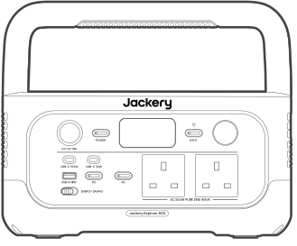

<strong>Jackery Explorer 500</strong>

</li><li class="hb-inbox-card" data-item-number="2">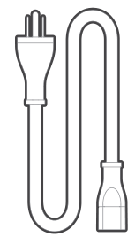

<strong>AC Charging Cable</strong>

</li><li class="hb-inbox-card" data-item-number="3">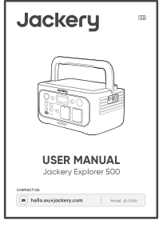

<strong>User Manual</strong>

</li></ol></figure>

Tip

The car charging cable is not included but is available for purchase separately on our website. For assistance, please contact Jackery Customer Support.

# PRODUCT OVERVIEW

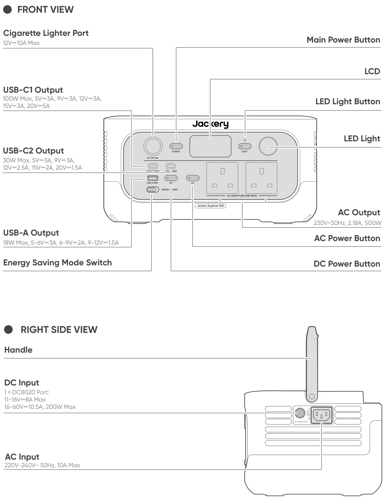

# LCD DISPLAY

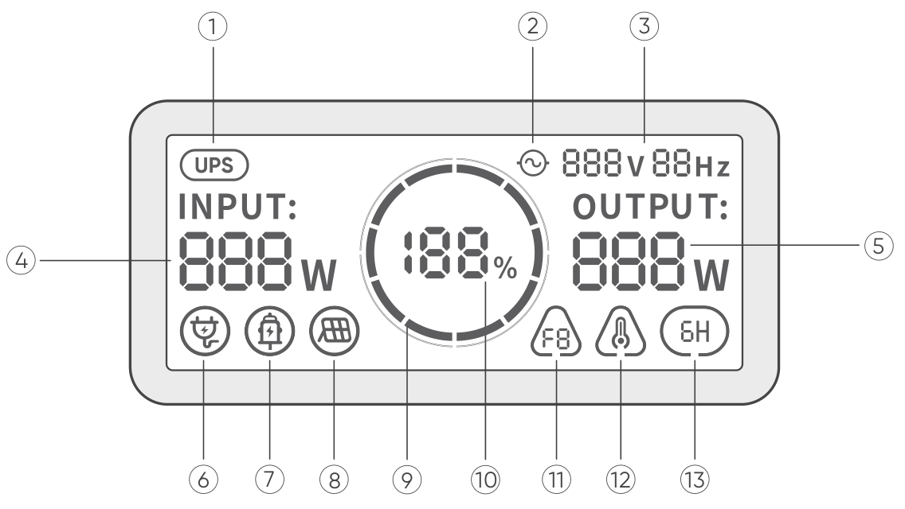

<figure class="hb-reference-composition hb-reference-lcd-legend" aria-label="LCD DISPLAY" data-component-id="HB-TABLE-REFERENCE" data-component-variant="lcd-legend" tabindex="0">
<table class="hb-reference-table">
<thead>
<tr>
<th scope="col">
No.
</th>
<th scope="col">
Indicator
</th>
<th scope="col">
Description
</th>
</tr>
</thead>
<tbody>
<tr>
<td>
1
</td>
<td>
UPS
</td>
<td>
<strong>On:</strong> The product is in bypass mode, during which the switchover time from grid power to battery power is 10 ms. <strong>Off:</strong> The product is not in bypass mode.
</td>
</tr>
<tr>
<td>
2
</td>
<td>
AC Power Indicator
</td>
<td>
The AC output (pure sine wave) is on.
</td>
</tr>
<tr>
<td>
3
</td>
<td>
Output Voltage and Frequency
</td>
<td>
Displays the output voltage and frequency.
</td>
</tr>
<tr>
<td>
4
</td>
<td>
Input Power
</td>
<td>
Displays the input power in watts.
</td>
</tr>
<tr>
<td>
5
</td>
<td>
Output Power
</td>
<td>
Displays the output power in watts.
</td>
</tr>
<tr>
<td>
6
</td>
<td>
AC Wall Charging Indicator
</td>
<td>
The product is charged via the AC Input using grid power.
</td>
</tr>
<tr>
<td>
7
</td>
<td>
Car Charging Indicator
</td>
<td>
The product is charged via the DC Input (DC8020) using DC 12V (car charging).
</td>
</tr>
<tr>
<td>
8
</td>
<td>
Solar Charging Indicator
</td>
<td>
The product is charged via the DC Input (DC8020) using solar panel(s).
</td>
</tr>
<tr>
<td>
9
</td>
<td>
Battery Power Indicator
</td>
<td>
When the product is being charged, the orange circle around the battery percentage will light up in sequence. When charging other devices, the orange circle will stay on.
</td>
</tr>
<tr>
<td>
10
</td>
<td>
Remaining Battery Percentage
</td>
<td>
Displays the remaining battery percentage.
</td>
</tr>
<tr>
<td>
11
</td>
<td>
Fault Code
</td>
<td>
A product error has occurred. Please refer to the Troubleshooting section for details.
</td>
</tr>
<tr>
<td>
12
</td>
<td>
High Temperature Indicator
</td>
<td>
High temperature protection is triggered. The product may stop functioning until its temperature returns to the normal operating range.
</td>
</tr>
<tr>
<td>
12
</td>
<td>
Low Temperature Indicator
</td>
<td>
Low temperature protection is triggered. The product may stop functioning until its temperature returns to the normal operating range.
</td>
</tr>
<tr>
<td>
13
</td>
<td>
Energy Saving Mode
</td>
<td>
<strong>On:</strong> The Energy Saving Mode is enabled. <strong>Off:</strong> The Energy Saving Mode is disabled.
</td>
</tr>
</tbody>
</table>
</figure>

# OPERATIONS

## POWER ON/OFF

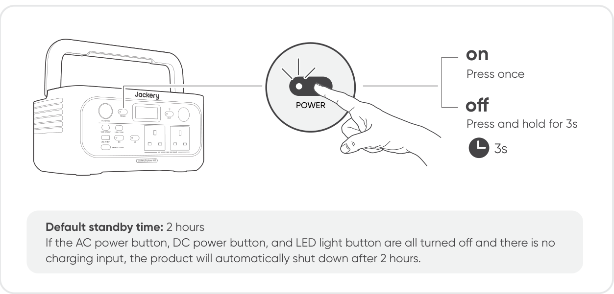

Note

When Energy Saving Mode is enabled and either the AC or DC power button is turned on, the system will automatically turn off all outputs and shut down if there is no charging or discharging activity, or if the power consumption of connected devices remains below the defined thresholds for 6 hours (25W or less on the AC output, and 2W or less on the USB ports and cigarette lighter port).

## AC OUTPUT ON/OFF

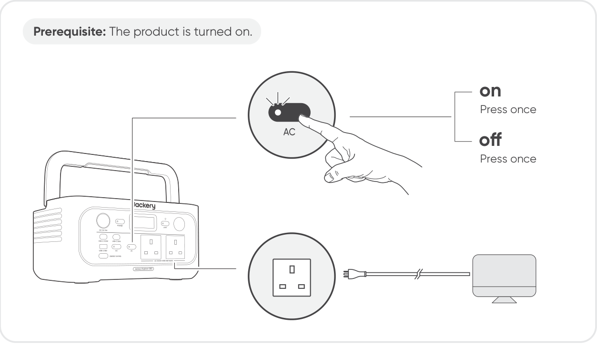

## DC/USB OUTPUT ON/OFF

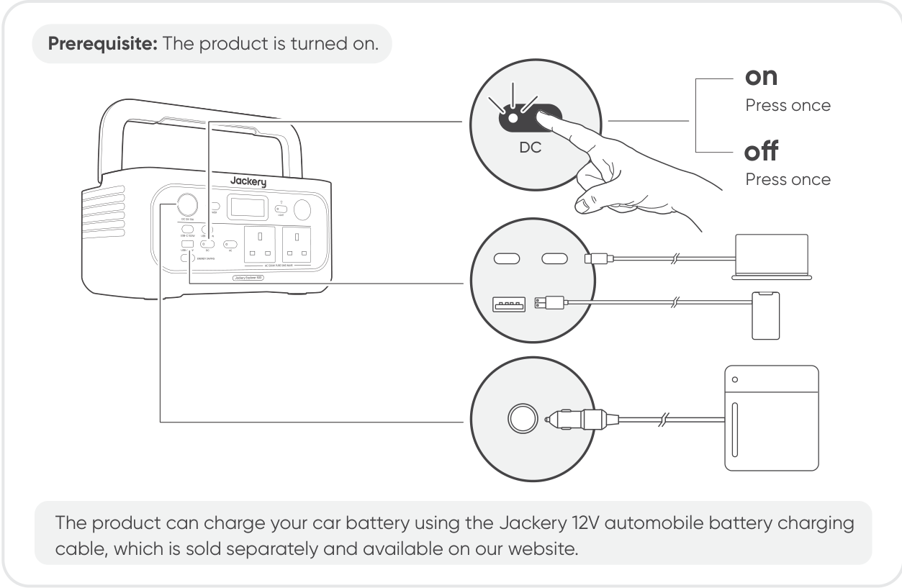

Caution!

- The cigarette lighter port is only compatible with 12V car batteries and is not suitable for 24V systems.

- Do not start the car while the product is charging the car battery through the 12V DC output port (cigarette lighter port), as this may damage the product.

- This feature is intended for emergency use only and cannot charge a dead or damaged car battery.

## ENERGY SAVING MODE

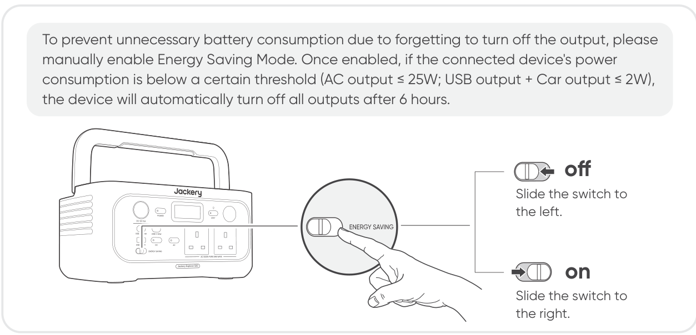

## LED LIGHT ON/OFF

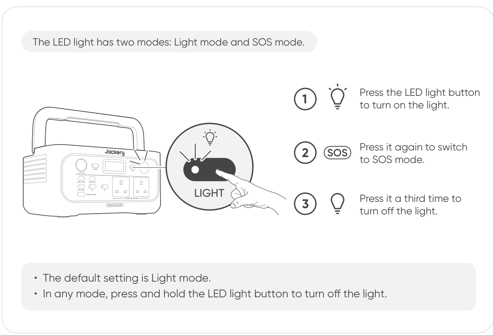

## LCD SCREEN ON/OFF

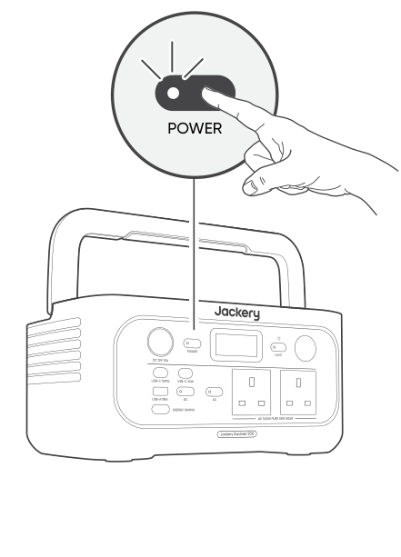

<figure class="hb-reference-composition hb-reference-lcd-actions" aria-label="LCD SCREEN ON/OFF" data-component-id="HB-TABLE-REFERENCE" data-component-variant="lcd-actions" tabindex="0">
<table class="hb-reference-table">
<thead>
<tr>
<th scope="col">
Mode
</th>
<th scope="col">
Action
</th>
<th scope="col">
Result
</th>
</tr>
</thead>
<tbody>
<tr>
<td>
LCD Screen
</td>
<td>
Turn on
</td>
<td>
Press the Main Power Button, or the screen turns on when the product is charging.
</td>
</tr>
<tr>
<td>
LCD Screen
</td>
<td>
Turn off
</td>
<td>
Press the Main Power Button.
</td>
</tr>
<tr>
<td>
LCD Screen
</td>
<td>
Auto-off
</td>
<td>
The LCD turns off automatically and enters sleep mode after 2 minutes of inactivity.
</td>
</tr>
<tr>
<td>
Always-on Display Mode (under charging or discharging state)
</td>
<td>
Turn on
</td>
<td>
Double-click the Main Power Button when the LCD screen is ON.
</td>
</tr>
<tr>
<td>
Always-on Display Mode (under charging or discharging state)
</td>
<td>
Turn off
</td>
<td>
Press the Main Power Button.
</td>
</tr>
<tr>
<td>
Always-on Display Mode (under charging or discharging state)
</td>
<td>
Auto-off
</td>
<td>
The Always-on Display Mode turns off automatically after 2 hours of inactivity.
</td>
</tr>
</tbody>
</table>
</figure>

# UNINTERRUPTIBLE POWER SUPPLY (UPS)

Connect the product to a wall outlet with the AC charging cable, then press the AC output button and power your appliances at the same time.

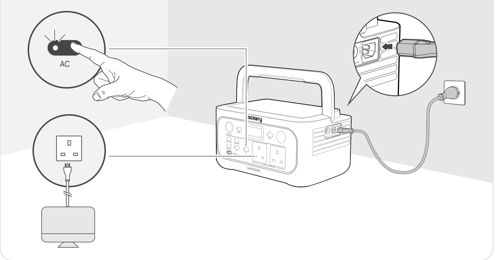

An uninterruptible power supply (UPS) is a type of continual power system that provides automated backup electric power to a load when the mains grid power fails.

In the event of a sudden loss of grid power, the Explorer 500 will automatically switch to stored power within 10 ms to keep your appliances running.

Warning

Do not use this product for applications such as data servers or medical devices, where a malfunction could endanger life or cause significant property damage.

For the following equipment, a loss of power supply during use could cause serious harm to personal safety or property:

- Medical devices and other equipment closely related to life safety.

- Critical equipment such as social infrastructure and public services.

- Business-critical enterprise equipment, etc.

Individuals who wear a cardiac pacemaker (pacemaker implant recipients) must not use this product.

Caution!

- This product does not support 0 ms switching. Do not connect it to equipment that requires an uninterrupted power supply, such as data servers or workstations.

- Before use, please test compatibility with your device multiple times.

- It is recommended to connect one device at a time. Do not use multiple devices simultaneously, as this may trigger overload protection.

- The UPS function works only when a single unit is connected directly to a wall outlet. Do not connect multiple portable power stations in series (cascade connection). In a cascaded setup, the UPS function will not operate: the unit may fail to switch over during a power outage, causing connected devices to shut down.

# CHARGING

**Green energy first:** We advocate to use the green energy first. This product supports two modes of charging at the same time: solar charging and AC wall charging. When AC wall charging and solar charging are turned on at the same time, the product will give priority to solar charging and both methods will be used to charge the battery at the maximum permissible power.

**Fully charge the product before its first use.**

Note

- The recommended charging temperature for the product ranges from -20°C to 45°C, and the discharging temperature ranges from -20°C to 45°C. Operating the product beyond this temperature range may restrict its charging and discharging capabilities, or even prevent it from charging or discharging.

- The charging power and battery capacity of the product may vary due to temperature fluctuations.

## CHARGING VIA AC WALL OUTLET

Connect the AC charging cable to the AC input port of the product and a wall outlet.

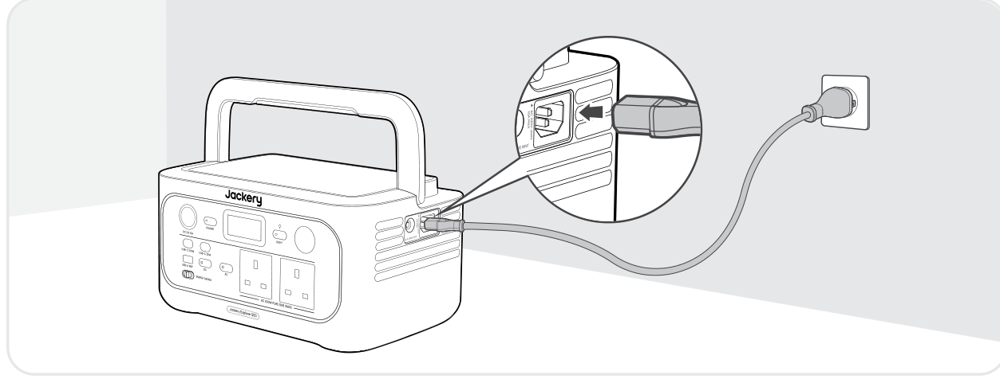

Caution!

Make sure the AC charging cable is fully and securely plugged into the AC input port. An incomplete connection may cause unstable current, overheating, poor contact, or device malfunction.

## CHARGING VIA SOLAR PANELS

The Jackery Explorer 500 has one DC8020 input port, which supports direct connection of either one 100W or one 200W solar panel. If you need to connect two 100W solar panels simultaneously to a DC8020 input port, please use a solar panel connector (sold separately, not included). Please refer to the diagram below for connection details.

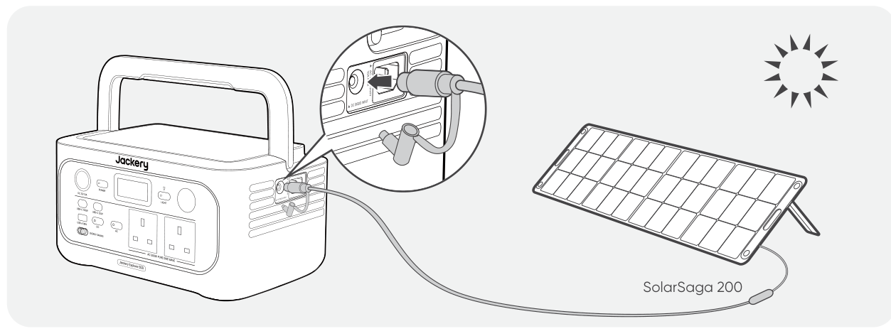 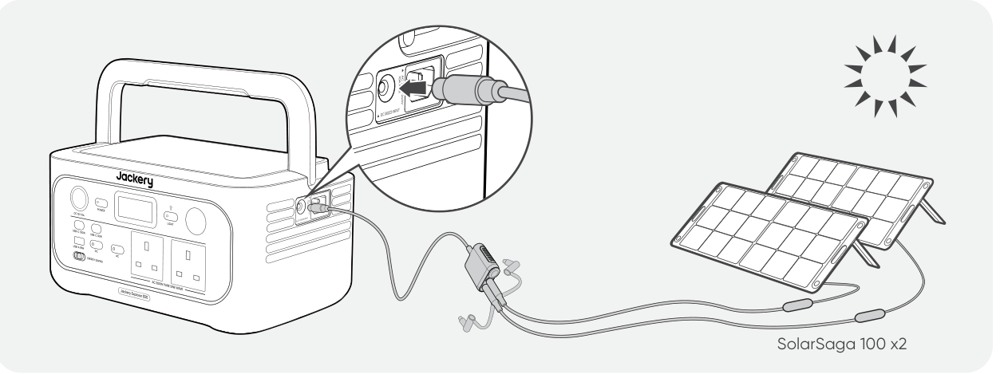

It is recommended to use the Jackery Solar Panel to charge the Explorer 500. Ensure that the open-circuit voltage (Voc) of the solar panel falls within the Jackery Explorer 500\'s DC input voltage range (16V-60V). Jackery is not responsible for any damage or loss resulting from the use of third-party solar panels.

Caution!

- A single DC8020 input port supports up to two solar panels.

- Only identical Jackery solar panel models should be used when connecting to the solar panel connector.

- Jackery is not responsible for any losses caused by using solar panels from other brands.

## CHARGING WITH A CAR CHARGE

This product can be charged using a 12V car charger. Ensure that the car charger and the car cigarette lighter provide a good connection.

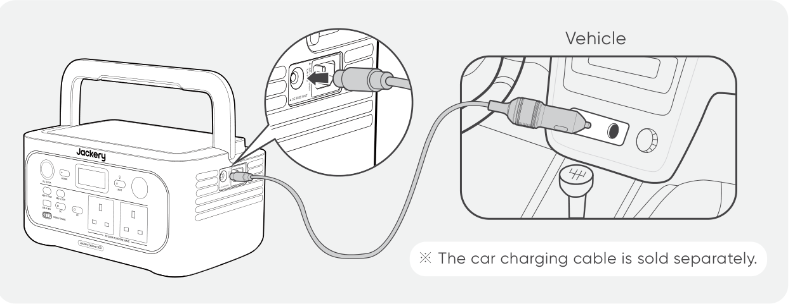

Caution!

- Please start the vehicle before charging your power station.

- If the vehicle is running on bumpy roads, it is forbidden to use the car charger in case it causes non-standard operation. The Company will not be responsible for any loss caused by non-standard operation.

- Vehicle charging is only applicable to vehicles with 12V DC, not 24V DC. Please do not charge this product in a 24V vehicle to avoid personal injury and property loss.

# STORAGE

Store the product in a dry, clean place with proper ventilation. Storage temperature and humidity:

- 1 month: -20°C to 45°C (0-60% RH)

- 3 months: 0°C to 45°C (0-60% RH)

- 12 months: 0°C to 25°C (0-60% RH)

If this product is stored for a long period of time (3 months - 6 months) with the power depleted, it may become unchargeable. To prevent this and maintain battery health, it is recommended to check and recharge the product every three months and perform a full charge and discharge cycle at least once every 6 to 12 months.

# TROUBLESHOOTING

If any of the following fault codes appear, follow the listed corrective actions to resolve the issue. If the fault persists, please contact Jackery Customer Support.

<figure aria-label="Error Code / Corrective Action" class="hb-troubleshooting-composition" data-component-id="HB-TABLE-TROUBLESHOOTING" tabindex="0"><table class="hb-troubleshooting-table"><colgroup><col class="hb-troubleshooting-col-code"/><col class="hb-troubleshooting-col-measures"/></colgroup><thead><tr><th class="hb-troubleshooting-code" scope="col">
Error Code
</th><th class="hb-troubleshooting-measures" scope="col">
Corrective Action
</th></tr></thead><tbody><tr><td class="hb-troubleshooting-code">
F0 / F1 / F2 / F3
</td><td class="hb-troubleshooting-measures">
Restart the product.
</td></tr><tr><td class="hb-troubleshooting-code">
F4
</td><td class="hb-troubleshooting-measures">
Connect the product to loads to discharge its battery until the fault disappears.
</td></tr><tr><td class="hb-troubleshooting-code">
F5
</td><td class="hb-troubleshooting-measures">
Charge the product via solar panels or AC wall outlet until the fault disappears.
</td></tr><tr><td class="hb-troubleshooting-code">
F6
</td><td class="hb-troubleshooting-measures"><ol class="arabic simple">
<li>
Wait for the grid to normalize before charging the product via AC wall outlet.
</li>
<li>
Check whether the air intake and exhaust vents are blocked; ensure 30 cm clearance on both sides of the product.
</li>
<li>
Place the product in a shaded, well-ventilated area where the ambient temperature is below 45°C.
</li>
<li>
Disconnect all loads from the product, keep it idle, and wait until the fault disappears.
</li>
<li>
Restart the product.
</li>
</ol></td></tr><tr><td class="hb-troubleshooting-code">
F7
</td><td class="hb-troubleshooting-measures"><ol class="arabic simple">
<li>
Remove all DC inputs from the product.
</li>
<li>
If you charge the product via a solar panel, check the open-circuit voltage (Voc) of the connected solar panel.
</li>
<li>
The product allows a maximum DC input voltage of 60V.
</li>
<li>
Restart the product and keep it idle. Wait until the fault disappears.
</li>
</ol></td></tr><tr><td class="hb-troubleshooting-code">
F8
</td><td class="hb-troubleshooting-measures">
Contact Jackery Customer Support.
</td></tr><tr><td class="hb-troubleshooting-code">
F9
</td><td class="hb-troubleshooting-measures">
Remove the load connected to the DC 12V/USB ports of the product. Wait until the fault disappears.
</td></tr></tbody></table></figure>

# SPECIFICATIONS

## GENERAL INFO

<figure aria-label="GENERAL INFO" class="hb-spec-table-composition"><table class="hb-source-specification hb-spec-table manual-table manual-spec-table"><colgroup><col class="hb-spec-col-label"/><col class="hb-spec-col-value"/></colgroup>

<tbody>
<tr><th class="manual-spec-label hb-spec-label" scope="row">
Product Name
</th>
<td class="manual-spec-value hb-spec-value">
Jackery Explorer 500
</td>
</tr>
<tr><th class="manual-spec-label hb-spec-label" scope="row">
Model No.
</th>
<td class="manual-spec-value hb-spec-value">
JE-500A
</td>
</tr>
<tr><th class="manual-spec-label hb-spec-label" scope="row">
Capacity
</th>
<td class="manual-spec-value hb-spec-value">
20Ah/25.6V DC (512 Wh)
</td>
</tr>
<tr><th class="manual-spec-label hb-spec-label" scope="row">
Cell Chemistry
</th>
<td class="manual-spec-value hb-spec-value">
LiFePO4
</td>
</tr>
<tr><th class="manual-spec-label hb-spec-label" scope="row">
Weight
</th>
<td class="manual-spec-value hb-spec-value">
About 12.57 lbs/5.7kg
</td>
</tr>
<tr><th class="manual-spec-label hb-spec-label" scope="row">
Dimensions
</th>
<td class="manual-spec-value hb-spec-value">
31.1×20.5×15.7 cm
</td>
</tr>
<tr><th class="manual-spec-label hb-spec-label" scope="row">
Cycle Life
</th>
<td class="manual-spec-value hb-spec-value">
6000 cycles to 70%+ capacity
</td>
</tr>
</tbody>
</table></figure>

## INPUT PORTS

<figure aria-label="INPUT PORTS" class="hb-spec-table-composition"><table class="hb-source-specification hb-spec-table manual-table manual-spec-table"><colgroup><col class="hb-spec-col-label"/><col class="hb-spec-col-value"/></colgroup>

<tbody>
<tr><th class="manual-spec-label hb-spec-label" scope="row">
Charge Mode AC Input
</th>
<td class="manual-spec-value hb-spec-value">
220-240V~ 50Hz, 10A Max
</td>
</tr>
<tr><th class="manual-spec-label hb-spec-label" scope="row">
1 × DC8020 Port
</th>
<td class="manual-spec-value hb-spec-value">
11V-16V⎓8A Max

16V-60V⎓10.5A, 200W Max

</td>
</tr>
</tbody>
</table></figure>

## OUTPUT PORTS

<figure aria-label="OUTPUT PORTS" class="hb-spec-table-composition"><table class="hb-source-specification hb-spec-table manual-table manual-spec-table"><colgroup><col class="hb-spec-col-label"/><col class="hb-spec-col-value"/></colgroup>

<tbody>
<tr><th class="manual-spec-label hb-spec-label" scope="row">
2 × AC Output
</th>
<td class="manual-spec-value hb-spec-value">
230V~ 50Hz, 2.18A
</td>
</tr>
<tr><th class="manual-spec-label hb-spec-label" scope="row">
AC Total Output
</th>
<td class="manual-spec-value hb-spec-value">
500W Rated, 1000W Surge peak
</td>
</tr>
<tr><th class="manual-spec-label hb-spec-label" scope="row">
AC Output in Bypass Mode (1)
</th>
<td class="manual-spec-value hb-spec-value">
230V~ 50Hz, 500W
</td>
</tr>
<tr><th class="manual-spec-label hb-spec-label" scope="row">
1 × USB-C1 Output
</th>
<td class="manual-spec-value hb-spec-value">
100W Max, 5V⎓3A, 9V⎓3A, 12V⎓3A, 15V⎓3A, 20V⎓5A
</td>
</tr>
<tr><th class="manual-spec-label hb-spec-label" scope="row">
1 × USB-C2 Output
</th>
<td class="manual-spec-value hb-spec-value">
30W Max, 5V⎓3A, 9V⎓3A, 12V⎓2.5A, 15V⎓2A, 20V⎓1.5A
</td>
</tr>
<tr><th class="manual-spec-label hb-spec-label" scope="row">
1 × USB-A Output
</th>
<td class="manual-spec-value hb-spec-value">
18W Max, 5-6V⎓3A, 6-9V⎓2A, 9-12V⎓1.5A
</td>
</tr>
<tr><th class="manual-spec-label hb-spec-label" scope="row">
Cigarette Lighter Port
</th>
<td class="manual-spec-value hb-spec-value">
12V⎓10A Max
</td>
</tr>
</tbody>
</table></figure>

## ENVIRONMENTAL OPERATING TEMPERATURE

<figure aria-label="ENVIRONMENTAL OPERATING TEMPERATURE" class="hb-spec-table-composition"><table class="hb-source-specification hb-spec-table manual-table manual-spec-table"><colgroup><col class="hb-spec-col-label"/><col class="hb-spec-col-value"/></colgroup>

<tbody>
<tr><th class="manual-spec-label hb-spec-label" scope="row">
Charge Temperature
</th>
<td class="manual-spec-value hb-spec-value">
-20°C to 45°C
</td>
</tr>
<tr><th class="manual-spec-label hb-spec-label" scope="row">
Discharge Temperature
</th>
<td class="manual-spec-value hb-spec-value">
-20°C to 45°C
</td>
</tr>
</tbody>
</table></figure>

※ USB Type-C® and USB-C® are registered trademarks of USB Implementers Forum.

**(1)** The product can charge the battery from the AC wall outlet while delivering power through the AC output ports.

# WARRANTY

We only provide our warranty to customers who purchase from the official Jackery website, Jackery-branded third-party platforms, or local authorized dealers.

*Warranty period and details may vary according to local laws, regulations, and authorized dealers.*

## Limited Warranty

Jackery warrants to the original consumer purchaser that the Jackery product will be free from defects in workmanship and material under normal consumer use during the applicable warranty period identified in the \"Warranty Period\" section below, subject to the exclusions set forth below.

This warranty statement sets forth Jackery\'s total and exclusive warranty obligation. We will not assume, nor authorize any person to assume for us, any other liability in connection with the sale of our products.

## Warranty Period

**3 YEARS - Standard Warranty**

The standard warranty period for Jackery Explorer 500 is 36 months. In each case, the warranty period is measured starting on the date of purchase by the original consumer purchaser. The sales receipt from the first consumer purchase, or other reasonable documentary proof, is required in order to establish the start date of the warranty period.

**2 YEARS - Extended Warranty**

To activate the Warranty Extension, you must register your product online or contact our customer service team at <a href="mailto:hello.eu@jackery.com" class="reference external">hello.eu@jackery.com</a> to extend the standard warranty runtime.

## Exchange

Jackery will replace (at Jackery\'s expense) any Jackery product that fails to operate during the applicable warranty period due to a defect in workmanship or material. A replacement product assumes the remaining warranty of the original product.

## Limited to Original Consumer Buyer

The warranty on Jackery\'s product is limited to the original consumer purchaser and is not transferable to any subsequent owner.

## Exclusions

Jackery\'s warranty does not apply to:

- Misused, abused, modified, damaged by accident, or used for anything other than normal consumer use as authorized in Jackery\'s current product literature.

- Attempted repair by anyone other than an authorized facility.

- Any product purchased through an online auction house.

- Jackery\'s warranty does not apply to the battery cell unless the battery cell is fully charged by you within seven days after you purchase the product and at least once every 6 months thereafter.

## Interpretation Rights

Jackery reserves the right to final interpretation of the above customers\' after-sales policy.

# EU Regulations

RED Declaration of Conformity

Shenzhen Hello Tech Energy Co., Ltd. hereby declares that this: Jackery Explorer 500 with JE-500A is in compliance with the essential requirements and other relevant provisions of the LVD Directive 2014/35/EU, EMC Directive 2014/30/EU and ROHS Directive 2011/65/EU as amended by 2015/863/EU. The full text of the EU declaration of conformity is available at the following internet address:

<a href="https://de.jackery.com/pages/user-guides" class="reference external">https://de.jackery.com/pages/user-guides</a>

MANUFACTURER: SHENZHEN HELLO TECH ENERGY CO., LTD.

<a href="mailto:sales@hello-tech.com" class="reference external">sales@hello-tech.com</a>

Address: F2-3, Bldg. 7, Jiaanda Science and technology industrial park factory, the east side of Huafan Road, Tongsheng Community, Dalang Street, Longhua District, Shenzhen, Guangdong, China

+86 400 668 9293

www.hello-tech.com
