# Jackery HomePower 3600 Plus User Manual

(jhp3600a-safety)=
## IMPORTANT SAFETY INFORMATION

<div class="table-wrapper">
<table class="manual-callout-table">
<tbody>
<tr>
<td class="manual-callout-label"></td>
<td class="manual-callout-body"><p><strong>INSTRUCTIONS PERTAINING TO RISK OF FIRE, ELECTRIC SHOCK, OR INJURY TO PERSONS</strong></p></td>
</tr>
</tbody>
</table>
</div>

<div class="table-wrapper">
<table class="manual-callout-table">
<tbody>
<tr>
<td class="manual-callout-label"></td>
<td class="manual-callout-body"><p><strong>Always follow these basic precautions when using this product.</strong></p></td>
</tr>
</tbody>
</table>
</div>

- Read all the instructions before using the product.
- Do not allow children to play on the product. Close supervision of children is necessary when the product is used near children.
- Avoid placing hands or fingers inside the product.
- Stop using the product immediately if it has been physically damaged or modified. Improper use of the product may cause unpredictable behavior, leading to fire, explosion, or injury.
- If any of the following are observed, including but not limited to overheats, emits unusual odors or smoking, leaks, or burns, stop using the product immediately and contact the dealer or our Customer Support.
- Never attempt to open, repair, or modify the product. Any tampering, reassembly, or modification of the product can result in electric shock, fire, or battery damage.
- Be aware that liquid ejected from the product may cause irritation or burns. Inappropriate or abusive use may lead to battery leakage. Avoid direct contact with leaking liquid. If the liquid contacts your eyes, seek medical help immediately. If it contacts other body parts, flush with running water and consult a medical professional without delay.
- Do not expose the product to fire or excessive temperatures. Doing so may result in an explosion if the temperature exceeds 130°C (265°F).
- Any use of unrecommended or non-supplied materials or parts with the product may result in a risk of fire, electric shock, or personal injury.
- Do not leave the battery charging unattended for long periods. Always monitor the charging process to ensure safe operation.
- To reduce the risk of electric shock, unplug the product from any power source before attempting any technical service or troubleshooting.

(jhp3600a-operating)=
### OPERATING INSTRUCTIONS

**SAVE THESE INSTRUCTIONS**

- Stop using the product immediately if it shows signs of damage. Discontinue use and contact customer support for assistance.
- Do not charge the battery in extremely hot or cold environments and strictly adhere to the product's specified operating temperature ranges:
  - Charging temperature: -4°F to 113°F (-20°C to 45°C)
  - Discharging temperature: -4°F to 113°F (-20°C to 45°C)
- To ensure proper air circulation, keep the product vents uncovered. The area where the product is used must have adequate airflow in a cool, dry environment to prevent overheating.
  - Charging in damp or poorly ventilated spaces may cause safety hazards.
  - Water can cause short circuits or damage to the charger, leading to safety risks.
- Unplug the power cord from a power outlet during a storm.
- Immediately turn off the product by pressing the power button if it has fallen, been dropped, or exposed to vibrations.
- Ensure the device(s) are powered off before connecting them to the product.
- Do not charge the product using a damaged or broken charging cord or plug.
- Do not use the product to charge any device with a damaged or broken cable or plug.
- Always unplug the charging cord by pulling the plug, not the cord, to reduce the risk of damage.
- Ensure the product is properly secured when transporting it in a moving vehicle.
- DO NOT place the unit upside down or on its side during use or storage.
- DO NOT place the product on the floor or at a height less than 18 inches (457 mm) above the floor during operation in a workshop or repair facility.
- DO NOT use the product's accessories with other devices or equipment.
- Solar charge time depends on weather conditions. Place your solar panel where it will get as much direct sunlight as possible.

<div class="table-wrapper">
<table class="manual-callout-table">
<tbody>
<tr>
<td class="manual-callout-label"></td>
<td class="manual-callout-body"><p><strong>DANGER</strong></p><p>This device is intended for indoor use only (Please place this device in a similar indoor environment when using it outdoors, e.g. Home RVs, tents, cabins, etc.). ※ This device is not waterproof or dustproof. Keep away from rain and humid environments during use.</p></td>
</tr>
</tbody>
</table>
</div>

(jhp3600a-maintenance)=
### USER MAINTENANCE INSTRUCTIONS

During the lifecycle of energy storage products, a certain degree of capacity and energy degradation is expected. As the number of charge and discharge cycles increases and storage time extends, this degradation will gradually intensify, which is a normal phenomenon consistent with the natural aging of battery cells.

(jhp3600a-symbols)=
## MEANING OF SYMBOLS

<div class="table-wrapper">
<table>
<thead><tr><th>Symbol</th><th>Meaning</th></tr></thead>
<tbody>
<tr><td></td><td>Hazardous practices that may result in severe injury, death, and/or property damage.</td></tr>
<tr><td></td><td>Hazardous practices that may result in personal injury and/or property damage.</td></tr>
<tr><td></td><td>Hazardous practices that may result in equipment damage, data loss, performance deterioration, or unanticipated results.</td></tr>
<tr><td></td><td>Supplements the important information or operation tips in the text.</td></tr>
</tbody>
</table>
</div>

<div class="table-wrapper">
<table>
<thead><tr><th>Symbol</th><th>Meaning</th></tr></thead>
<tbody>
<tr><td></td><td>Warning and Caution Symbols. Must read to alert individuals to potential hazards or risks.</td></tr>
<tr><td></td><td>Read the user manual before operation.</td></tr>
<tr><td>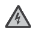</td><td>Risk of electric shock</td></tr>
<tr><td></td><td>Battery charging</td></tr>
<tr><td></td><td>Explosive material</td></tr>
<tr><td></td><td>Heavy object</td></tr>
<tr><td></td><td>Do not dismantle the product.</td></tr>
<tr><td></td><td>Keep the product away from fire.</td></tr>
<tr><td></td><td>Keep away from children.</td></tr>
<tr><td></td><td>This symbol indicates that a lithium-ion (Li-ion) battery is inside the product and should be disposed of or recycled properly.</td></tr>
<tr><td>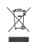</td><td>This symbol indicates that the product shall not be disposed of as household waste, and should be delivered to a designated collection facility for recycling. Proper disposal and recycling can help protect the environment. For more information about the disposal and recycling of this product, contact your local community, disposal service, or dealer.</td></tr>
</tbody>
</table>
</div>

(jhp3600a-fcc)=
### FCC Statement

This device complies with part 15 of the FCC Rules. Operation is subject to the following two conditions: (1) This device may not cause harmful interference, and (2) This device must accept any interference received, including interference that may cause undesired operation.

**NOTE:** This equipment has been tested and found to comply with the limits for a Class B digital device, pursuant to part 15 of the FCC Rules.

These limits are designed to provide reasonable protection against harmful interference in a residential installation. This equipment generates, uses, and can radiate radio frequency energy and, if not installed and used in accordance with the instructions, may cause harmful interference to communications. However, there is no guarantee that radio interference will not occur in a particular installation.

If this equipment does cause harmful interference to radio or television reception, which can be determined by turning the equipment off and on, the user is encouraged to try to correct the interference by one or more of the following measures:

- Reorient or relocate the receiving antenna.
- Increase the separation between the equipment and receiver.
- Connect the equipment into an outlet on a circuit different from that to which the receiver is connected.
- Consult the dealer or an experienced radio/TV technician for help.

**MODIFICATION:** Any changes or modifications not expressly approved by the grantee of this device could void the user's authority to operate the device.

(jhp3600a-box)=
## WHAT'S IN THE BOX

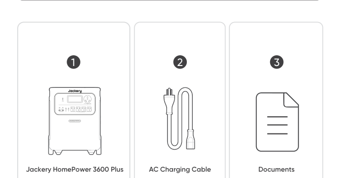

Jackery HomePower 3600 Plus, AC Charging Cable, Documents.

```{tip}
The car charging cable is not included but is available for purchase separately on our website. For assistance, please contact Jackery customer service.
```

(jhp3600a-overview)=
## PRODUCT OVERVIEW

(jhp3600a-overview-front)=
### FRONT VIEW

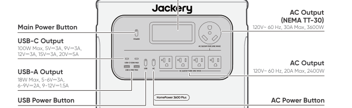

- Main Power Button
- USB-C Output: 100W Max, 5V⎓3A, 9V⎓3A, 12V⎓3A, 15V⎓3A, 20V⎓5A
- USB-A Output: 18W Max, 5-6V⎓3A, 6-9V⎓2A, 9-12V⎓1.5A
- USB Power Button
- LCD
- AC Output (NEMA TT-30): 120V~ 60 Hz, 30A Max, 3600W
- AC Output: 120V~ 60 Hz, 20A Max, 2400W
- AC Power Button

(jhp3600a-overview-right)=
### RIGHT SIDE VIEW

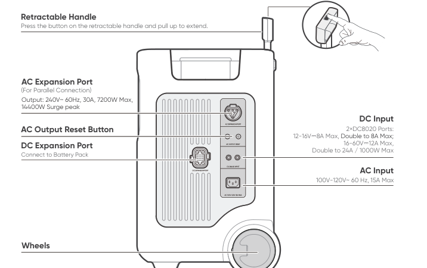

- Retractable Handle: Press the button on the retractable handle and pull up to extend.
- AC Expansion Port (For Parallel Connection): Output: 240V~ 60Hz, 30A, 7200W Max, 14400W Surge peak
- AC Output Reset Button
- DC Expansion Port: Connect to Battery Pack
- DC Input: 2×DC8020 Ports: 12-16V⎓8A Max, Double to 8A Max; 16-60V⎓12A Max, Double to 24A / 1000W Max
- AC Input: 100V-120V~ 60 Hz, 15A Max
- Wheels

(jhp3600a-lcd)=
## LCD DISPLAY

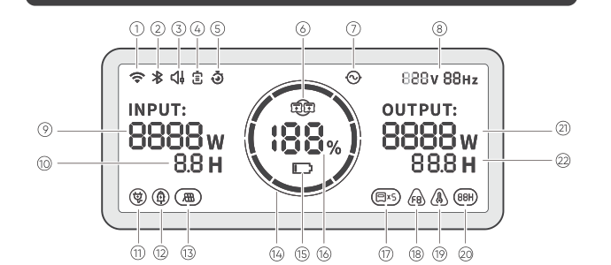

<div class="table-wrapper">
<figure aria-label="Meaning of the LCD display icons" class="hb-lcd-table-composition">
<table class="longtable hb-lcd-icon-table">
<colgroup><col class="hb-lcd-col-number"/><col class="hb-lcd-col-icon"/><col class="hb-lcd-col-name"/><col class="hb-lcd-col-description"/></colgroup>
<tbody>
<tr><td class="hb-lcd-number"><p>①</p></td>
<td class="hb-lcd-icon"></td>
<td class="hb-lcd-name"><p>Wi-Fi</p></td>
<td class="hb-lcd-description"><p>On: Wi-Fi connected. Blink: Ready to connect to Wi-Fi. Off: Wi-Fi disconnected.</p></td></tr>
<tr><td class="hb-lcd-number"><p>②</p></td>
<td class="hb-lcd-icon"></td>
<td class="hb-lcd-name"><p>Bluetooth</p></td>
<td class="hb-lcd-description"><p>On: Bluetooth Connected. Blink: Ready to connect to Bluetooth. Off: Bluetooth disconnected.</p></td></tr>
<tr><td class="hb-lcd-number"><p>③</p></td>
<td class="hb-lcd-icon"></td>
<td class="hb-lcd-name"><p>Quiet Charging Mode</p></td>
<td class="hb-lcd-description"><p>On: The noise during charging is significantly minimized, while the charging power is reduced and the charging speed slows down. Off: Quiet Charging Mode is disabled. Enable/disable this feature in the Jackery App. The setting is retained when the device is powered off.</p></td></tr>
<tr><td class="hb-lcd-number" rowspan="2"><p>④</p></td>
<td class="hb-lcd-icon"></td>
<td class="hb-lcd-name"><p>Battery Saving Mode</p></td>
<td class="hb-lcd-description"><p>On: Limits the maximum usable battery capacity to extend battery life. Off: Battery Saving Mode is disabled. Enable/disable this feature in the Jackery App. The setting is retained when the device is powered off.<br>Note 1: This feature is not available when the product is connected to battery pack(s).<br>Note 2: When this feature is enabled, the product occasionally performs a full charge and discharge cycle to calibrate the SOC.</p></td></tr>
<tr>
<td class="hb-lcd-icon"></td>
<td class="hb-lcd-name"><p>Self-powered Mode</p></td>
<td class="hb-lcd-description"><p>Maximizes the use of solar energy and reduces reliance on grid electricity by prioritizing stored solar energy, reducing electricity costs. The power station must be connected to both solar panels and the grid simultaneously, with load power limited by bypass power. Enable/disable this feature in the Jackery App. The setting is retained when the device is powered off.</p></td></tr>
<tr><td class="hb-lcd-number"><p>⑤</p></td>
<td class="hb-lcd-icon"></td>
<td class="hb-lcd-name"><p>Charging Plan</p></td>
<td class="hb-lcd-description"><p>Customizes the charging time of the Jackery HomePower 3600 Plus. Suitable for situations with fluctuating electricity prices, it allows for charging plans based on peak and off-peak electricity times, reducing electricity costs. Enable/disable this feature in the Jackery App. The setting is retained when the device is powered off.</p></td></tr>
<tr><td class="hb-lcd-number"><p>⑥</p></td>
<td class="hb-lcd-icon"></td>
<td class="hb-lcd-name"><p>Parallel</p></td>
<td class="hb-lcd-description"><p>Blink: AC Output is enabled and the parallel connection is not set up. On: AC Output is enabled and the parallel connection is set up successfully.</p></td></tr>
<tr><td class="hb-lcd-number"><p>⑦</p></td>
<td class="hb-lcd-icon"></td>
<td class="hb-lcd-name"><p>AC Power Indicator</p></td>
<td class="hb-lcd-description"><p>The AC output (pure sine wave) is on.</p></td></tr>
<tr><td class="hb-lcd-number"><p>⑧</p></td>
<td class="hb-lcd-icon"></td>
<td class="hb-lcd-name"><p>Output Voltage and Frequency</p></td>
<td class="hb-lcd-description"><p>Displays the output voltage and frequency when the AC output is turned on.</p></td></tr>
<tr><td class="hb-lcd-number"><p>⑨</p></td>
<td class="hb-lcd-icon"></td>
<td class="hb-lcd-name"><p>Input Power</p></td>
<td class="hb-lcd-description"><p>Displays the input power in watts.</p></td></tr>
<tr><td class="hb-lcd-number"><p>⑩</p></td>
<td class="hb-lcd-icon"></td>
<td class="hb-lcd-name"><p>Remaining Charge Time</p></td>
<td class="hb-lcd-description"><p>Displays the remaining charging time.</p></td></tr>
<tr><td class="hb-lcd-number"><p>⑪</p></td>
<td class="hb-lcd-icon"></td>
<td class="hb-lcd-name"><p>AC Wall Charging Indicator</p></td>
<td class="hb-lcd-description"><p>The product is charged via the AC Input using grid power.</p></td></tr>
<tr><td class="hb-lcd-number"><p>⑫</p></td>
<td class="hb-lcd-icon"></td>
<td class="hb-lcd-name"><p>Car Charging Indicator</p></td>
<td class="hb-lcd-description"><p>The product is charged via the DC Input (DC8020) using DC 12V (car charging).</p></td></tr>
<tr><td class="hb-lcd-number"><p>⑬</p></td>
<td class="hb-lcd-icon"></td>
<td class="hb-lcd-name"><p>Solar Charging Indicator</p></td>
<td class="hb-lcd-description"><p>The product is charged via the DC Input (DC8020) using solar panel(s).</p></td></tr>
<tr><td class="hb-lcd-number"><p>⑭</p></td>
<td class="hb-lcd-icon"></td>
<td class="hb-lcd-name"><p>Battery Power Indicator</p></td>
<td class="hb-lcd-description"><p>When the product is being charged, the orange circle around the battery percentage will light up in sequence. When charging other devices, the orange circle will stay on.</p></td></tr>
<tr><td class="hb-lcd-number"><p>⑮</p></td>
<td class="hb-lcd-icon"></td>
<td class="hb-lcd-name"><p>Low Battery Indicator</p></td>
<td class="hb-lcd-description"><p>On: The battery level is below 20%. Blink: The battery level is below 5%. Off: The battery level is not below 20% or the product is charging.</p></td></tr>
<tr><td class="hb-lcd-number"><p>⑯</p></td>
<td class="hb-lcd-icon"></td>
<td class="hb-lcd-name"><p>Remaining Battery Percentage</p></td>
<td class="hb-lcd-description"><p>Displays the remaining battery percentage.</p></td></tr>
<tr><td class="hb-lcd-number"><p>⑰</p></td>
<td class="hb-lcd-icon"></td>
<td class="hb-lcd-name"><p>Battery Pack Indicator and Number of Connected Batteries</p></td>
<td class="hb-lcd-description"><p>Displays the quantity of battery packs if any is connected.</p></td></tr>
<tr><td class="hb-lcd-number"><p>⑱</p></td>
<td class="hb-lcd-icon"></td>
<td class="hb-lcd-name"><p>Fault code</p></td>
<td class="hb-lcd-description"><p>A product error has occurred. Please refer to the Troubleshooting section for details.</p></td></tr>
<tr><td class="hb-lcd-number" rowspan="2"><p>⑲</p></td>
<td class="hb-lcd-icon"></td>
<td class="hb-lcd-name"><p>High Temperature Indicator</p></td>
<td class="hb-lcd-description"><p>High temperature protection is triggered. The product may stop functioning until its temperature returns to the normal operating range.</p></td></tr>
<tr>
<td class="hb-lcd-icon"></td>
<td class="hb-lcd-name"><p>Low Temperature Indicator</p></td>
<td class="hb-lcd-description"><p>Low temperature protection is triggered. The product may stop functioning until its temperature returns to the normal operating range.</p></td></tr>
<tr><td class="hb-lcd-number"><p>⑳</p></td>
<td class="hb-lcd-icon"></td>
<td class="hb-lcd-name"><p>Energy Saving Mode</p></td>
<td class="hb-lcd-description"><p>When the AC or USB output is turned on by pressing the AC or USB power button: On: Energy Saving Mode is enabled. Off: Energy Saving Mode is disabled.</p></td></tr>
<tr><td class="hb-lcd-number"><p>㉑</p></td>
<td class="hb-lcd-icon">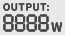</td>
<td class="hb-lcd-name"><p>Output Power</p></td>
<td class="hb-lcd-description"><p>Displays the output power in watts.</p></td></tr>
<tr><td class="hb-lcd-number"><p>㉒</p></td>
<td class="hb-lcd-icon"></td>
<td class="hb-lcd-name"><p>Remaining Discharge Time</p></td>
<td class="hb-lcd-description"><p>Displays the remaining discharging time.</p></td></tr>
</tbody>
</table>
</figure>
</div>

(jhp3600a-operations)=
## OPERATIONS

(jhp3600a-operations-power)=
### POWER ON/OFF

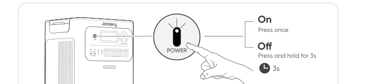

- On: Press once
- Off: Press and hold for 3s

```{note}
Default standby time: 2 hours. The product will automatically shut down after 2 hours of inactivity, with no charging or discharging. *The standby time can be set in the Jackery App.
```

```{note}
When Energy Saving Mode is enabled, the product will automatically shut down after 12 hours if the AC or USB power button is ON but the product is neither charging nor discharging.
```

(jhp3600a-operations-ac)=
### AC OUTPUT ON/OFF

**Prerequisite: The product is turned on.**

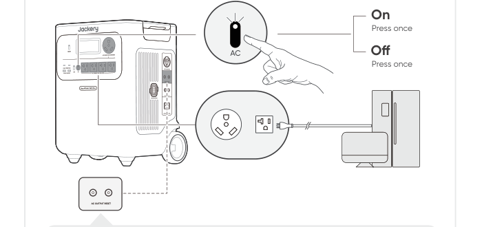

- On: Press once
- Off: Press once

```{note}
**AC Output Reset Button:** When the Reset Button pops up, you need to remove the load and press the Reset Button to reset.
```

(jhp3600a-operations-usb)=
### USB OUTPUT ON/OFF

**Prerequisite: The product is powered on.**

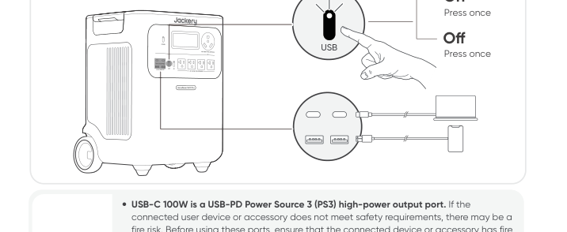

- On: Press once
- Off: Press once

```{caution}
- USB-C 100W is a USB-PD Power Source 3 (PS3) high-power output port. If the connected user device or accessory does not meet safety requirements, there may be a fire risk. Before using these ports, ensure that the connected device or accessory has fire safety protection.
- Only connect the Jackery HomePower 3600 Plus to devices or accessories that comply with clauses 6.3, 6.4, and 6.5 of IEC/EN/UL 62368-1 (or other equivalent standards).
- To obtain maximum output power, use the official Jackery USB-C to USB-C 5A cable (20V DC/5A, 100W).
```

(jhp3600a-operations-energy)=
### ENERGY SAVING MODE

To prevent unnecessary battery consumption from forgetting to turn off the output, the product enables Energy Saving Mode by default. If no device is connected or the connected device's power consumption is below a certain threshold (25W AC output or 2W USB output) for 12 hours, the product will automatically turn off the outputs.

To disable the energy saving mode, press and hold both the AC power button and main power button for more than 3 seconds. The product will not automatically turn off the AC or DC output.

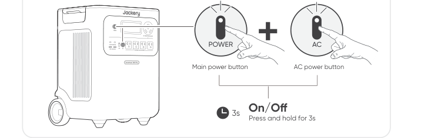

- On/Off: Press and hold for 3s

```{note}
Energy Saving Mode resumes previous state after power-on. Manual switching is required for mode changes.
```

(jhp3600a-lcd-screen)=
### LCD SCREEN

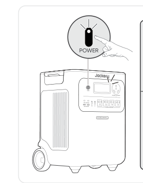

<div class="table-wrapper">
<table>
<tbody>
<tr><td rowspan="3">Shortly On</td><td>Turn on</td><td>Press the Main Power Button or when the product is charging.</td></tr>
<tr><td>Turn off</td><td>Press the Main Power Button.</td></tr>
<tr><td>Auto-off</td><td>The LCD turns off automatically and enters sleep mode after 2 minutes of inactivity.</td></tr>
<tr><td rowspan="3">Steady On (in charging or discharging state)</td><td>Turn on</td><td>Press the Main Power Button twice when the product is powered on.</td></tr>
<tr><td>Turn off</td><td>Press the Main Power Button.</td></tr>
<tr><td>Auto-off</td><td>The LCD turns off automatically after 2 hours of inactivity.</td></tr>
</tbody>
</table>
</div>

You can also set the screen display mode in the Jackery App.

(jhp3600a-keycombo)=
### KEY COMBINATION

| Buttons | Operation | Function |
| --- | --- | --- |
| Main power button + USB power button | Press and hold both for 3s | Reset Wi-Fi and Bluetooth |
| Main power button + AC power button | Press and hold both for 3s | Turn on/off the Energy Saving Mode |
| USB power button + AC power button | Press and hold both for 1s | Turn on/off Wi-Fi and Bluetooth |

(jhp3600a-ups)=
## UNINTERRUPTIBLE POWER SUPPLY (UPS)

Connect the product to a wall outlet with the AC charging cable, then press the AC power button and power your appliances at the same time.

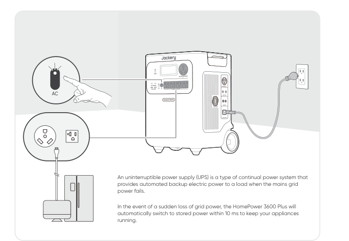

In UPS mode, the unit's peak output reaches 1440W before power outages. As simultaneous charging/discharging is enabled in Bypass Mode, the actual output power is lower than the rated output power in this mode but returns to rated output power during outages.

```{caution}
- This product does not support 0 ms switching. Do not connect it to equipment that requires a 0 ms switching power supply, such as data servers or workstations.
- Before use, please test compatibility with your device multiple times.
- Do not connect loads exceeding the maximum output power of the product. Otherwise, overload protection will be triggered.
```

(jhp3600a-connections)=
## CONNECTIONS

(jhp3600a-battery-pack)=
### CONNECT TO BATTERY PACK(S) (Sold Separately)

This product can support up to 5 battery packs to meet the need for large power capacity. For details on how to use it, please refer to the Jackery Battery Pack 3600 User Manual.

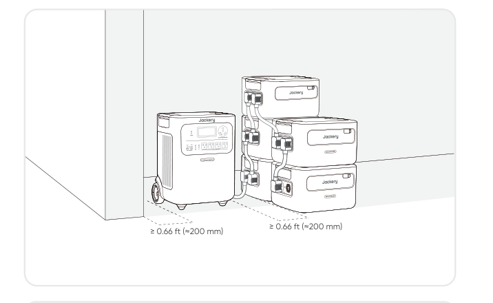

```{caution}
- Ensure all products are powered off before connecting the HomePower 3600 Plus to the Jackery Battery Pack 3600.
- To ensure proper operation of the product, make sure the air intake and exhaust vents on both sides are unobstructed. Leave at least 0.66 ft (≈200 mm) of space between the vents and any objects to allow for proper heat dissipation.
```

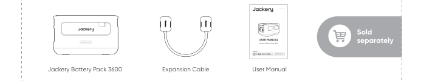

(jhp3600a-parallel)=
### CONNECT TWO UNITS IN PARALLEL

```{note}
- The Jackery Connector for parallel connection is sold separately and available on our official website.
- During parallel operation, the units can be charged via solar panels only. AC wall charging is not supported in this mode.
```

```{caution}
Before connecting the parallel cable, ensure that the AC output on both units is turned off (the AC power button indicator light should be off). Connecting while AC output is active may damage the units.
```

1. Ensure that both HP3600 Plus units are powered off.
2. Use one Jackery Connector to connect both units via the AC EXPANSION PORT.
3. Turn on both units.
4. Within 1 minute, press the AC power button on each unit in sequence to enable AC output.
   - If the connection is successful, the display will show a solid parallel icon.
   - If the setup fails, the display shows the **FA** code. Press the **AC** power button on each unit again in sequence.

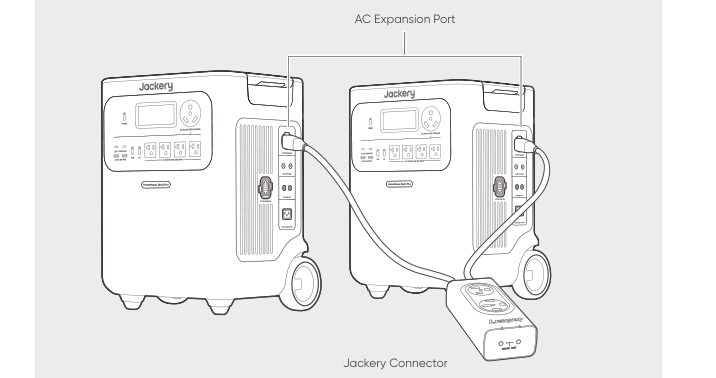

```{caution}
- After a successful parallel connection, do not disconnect the parallel cable while AC output is still active, as this may trigger overload protection in the other unit.
- Do not touch the parallel cable port when AC output is enabled (when the AC power button indicator light is on). This port carries 240V high voltage and poses a risk of electric shock.
```

If either unit's **AC** power button is pressed or AC output is interrupted due to a fault, both units will immediately stop AC output. The system automatically exits parallel mode. The other unit will display a blinking parallel icon and the **FA** code, indicating a parallel connection failure. To resume parallel output, rectify the issue and press the **AC** power button on each unit again in sequence.

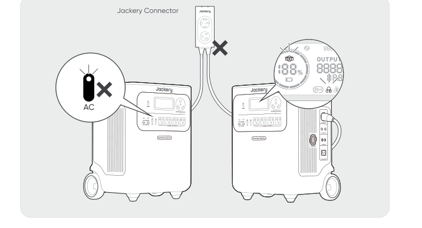

(jhp3600a-parallel-exit)=
### EXITING PARALLEL MODE

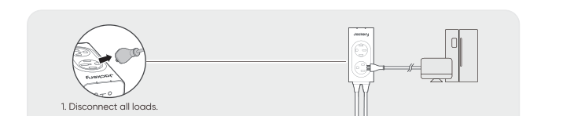

1. Disconnect all loads.

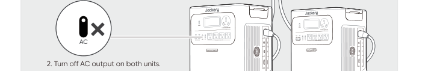

2. Turn off AC output on both units.

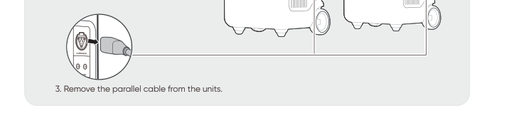

3. Remove the parallel cable from the units.

(jhp3600a-charging)=
## CHARGING

**Green energy first:** We advocate using the green energy first. This product supports two modes of charging at the same time: solar charging and AC wall charging. When AC wall charging and solar charging are turned on at the same time, the product will give priority to solar charging and both methods will be used to charge the battery at the maximum permissible power.

```{important}
Fully charge the product before its first use.
```

```{note}
- The recommended charging temperature for the product ranges from -4°F to 113°F (-20°C to 45°C), and the discharging temperature ranges from -4°F to 113°F (-20°C to 45°C). Operating the product beyond this temperature range may restrict its charging and discharging capabilities, or even prevent it from charging or discharging.
- The charging power and battery capacity of the product may vary due to temperature fluctuations.
```

(jhp3600a-charging-ac)=
### CHARGING VIA AC WALL OUTLET

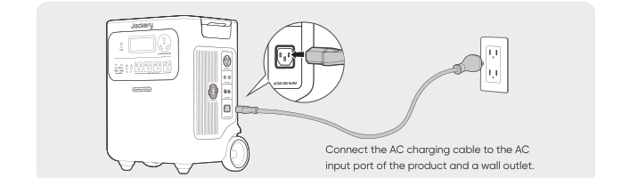

Connect the AC charging cable to the AC input port of the product and a wall outlet.

```{caution}
Make sure the AC charging cable is fully and securely plugged into the AC input port. An incomplete connection may cause unstable current, overheating, poor contact, or device malfunction.
```

(jhp3600a-charging-solar)=
### CHARGING VIA SOLAR PANELS (Sold Separately)

Jackery HomePower 3600 Plus has two DC8020 input ports and is compatible with the Jackery solar panels. If one DC8020 input port needs to connect two solar panels simultaneously, please refer to the figure below for charging through the solar panel connector (sold separately, not included as standard).

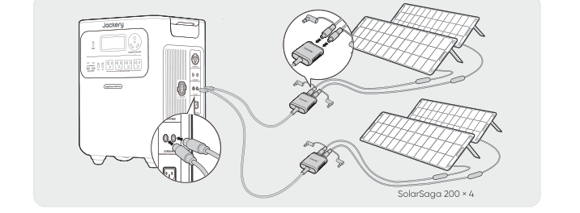

```{caution}
One DC8020 input port can be connected to at most two solar panels.
```

```{caution}
Ensure that the input voltage for both DC input ports is the same. Failure to do so may damage the product. For example:
- Use the same model of Jackery solar panels and the same number of panels when connecting solar panels to both DC8020 Input ports.
- Do not charge the product using both a car charger and a solar panel simultaneously. Doing so may blow the car fuse or result in charging failure.
```

It is recommended to use the Jackery solar panel to charge the product. Ensure that the open-circuit voltage of the solar panel is within the DC input range (16V-60V) of the HomePower 3600 Plus. Jackery is not responsible for any damage or loss resulting from the use of third-party solar panels.

(jhp3600a-charging-car)=
### CHARGING VIA A CAR CHARGER (Sold Separately)

This product can be charged using a 12V car charger. Ensure that the car charger and the 12V car power outlet (car cigarette lighter) provide a good connection.

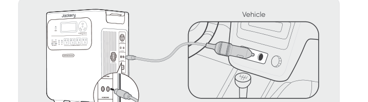

*The car charging cable is sold separately.*

```{caution}
- Please start the vehicle before charging your power station.
- If the vehicle is running on bumpy roads, it is forbidden to use the car charger in case it causes non-standard operation. The Company will not be responsible for any loss caused by non-standard operation.
- Vehicle charging is only applicable to vehicles with 12V DC, not 24V DC. Please do not charge this product in a 24V vehicle to avoid personal injury and property loss.
```

(jhp3600a-storage)=
## STORAGE

Store the product in a dry clean place with proper ventilation. Storage temperature and humidity:

- 1 month: -4°F to 113°F / -20°C to 45°C (0-60%RH)
- 3 months: 32°F to 113°F / 0°C to 45°C (0-60%RH)
- 12 months: 32°F to 77°F / 0°C to 25°C (0-60%RH)

If this product is stored for a long period of time (3 months - 6 months) with the power depleted, it may become unchargeable. To prevent this and maintain battery health, it is recommended to check and recharge the product every three months and perform a full charge and discharge cycle at least once every 6 to 12 months.

(jhp3600a-troubleshooting)=
## TROUBLESHOOTING

If any of the following fault codes appear, follow the listed corrective actions to resolve the issue. If the fault persists, please contact Jackery Customer Support.

<div class="table-wrapper">
<table>
<thead><tr><th>Error Code</th><th>Corrective Measures</th></tr></thead>
<tbody>
<tr><td>F0/F1<br>F2/F3</td><td>Restart the product.</td></tr>
<tr><td>F4</td><td>Connect the product to loads to discharge its battery until the fault disappears.</td></tr>
<tr><td>F5</td><td>Charge the product via solar panels or an AC wall outlet until the fault disappears.</td></tr>
<tr><td>F6</td><td><ol>
<li>Wait for the grid to normalize before charging the product via AC wall outlet.</li>
<li>Check whether the air intake and exhaust vents are blocked; ensure 0.66 ft (≈200 mm) clearance on both side of the product.</li>
<li>Disconnect all loads from the product. Keep the product idle and wait until the fault disappears.</li>
<li>Restart the product.</li>
</ol></td></tr>
<tr><td>F7</td><td><ol>
<li>Remove all DC inputs from the product.</li>
<li>Check the open-circuit voltage (Voc) of the connected solar panels. The product allows a maximum DC input voltage of 60V.</li>
<li>Restart the product and keep it idle. Wait until the fault disappears.</li>
</ol></td></tr>
<tr><td>F8</td><td>Contact Jackery Customer Support.</td></tr>
<tr><td>F9</td><td>Remove the load connected to the USB ports of the product. Wait until the fault disappears.</td></tr>
<tr><td>FA</td><td><ol>
<li>Turn off the AC output of both units.</li>
<li>Press the AC power button on each unit again within 1 minute.</li>
</ol></td></tr>
<tr><td>FC</td><td><ol>
<li>Restart the battery packs and the HP3600 Plus respectively.</li>
<li>If the fault persists, disconnect the battery pack from the HP3600 Plus and connect them again.</li>
</ol></td></tr>
</tbody>
</table>
</div>

(jhp3600a-spec)=
## SPECIFICATIONS

(jhp3600a-spec-general)=
### GENERAL INFO

<div class="table-wrapper">
<table>
<tbody>
<tr><td>Product Name</td><td>Jackery HomePower 3600 Plus</td></tr>
<tr><td>Model No.</td><td>JHP-3600A</td></tr>
<tr><td>Capacity</td><td>80Ah / 44.8V DC (3584 Wh)</td></tr>
<tr><td>Cell Chemistry</td><td>LiFePO₄</td></tr>
<tr><td>Weight</td><td>About 77.16 lbs/35 kg</td></tr>
<tr><td>Dimensions</td><td>15.2×12.2×19.3 in / 38.5×30.9×49.1 cm</td></tr>
<tr><td>Cycle Life</td><td>6000 cycles to 70%+ capacity</td></tr>
</tbody>
</table>
</div>

(jhp3600a-spec-input)=
### INPUT PORTS

<div class="table-wrapper">
<table>
<tbody>
<tr><td rowspan="2">1 × AC Input</td><td>Charge Mode: 100-120V~ 60Hz, 15A Max</td></tr>
<tr><td>Bypass Mode①: 120V~ 60Hz, 12A Max, 1440W</td></tr>
<tr><td>2 × DC8020 Ports</td><td>12-16V⎓8A Max, Double to 8A Max; 16-60V⎓12A Max, Double to 24A / 1000W Max</td></tr>
<tr><td>1 × DC Expansion Port</td><td>36.4V-50.4V⎓100A Max</td></tr>
</tbody>
</table>
</div>

(jhp3600a-spec-output)=
### OUTPUT PORTS

<div class="table-wrapper">
<table>
<tbody>
<tr><td>4 × AC Output (NEMA 5-20R)</td><td>120V~ 60Hz, 20A Max, 2400W, 3600W in Total</td></tr>
<tr><td>1 × AC Output (NEMA TT-30)</td><td>120V~ 60Hz, 30A Max, 3600W</td></tr>
<tr><td>AC Total Output②</td><td>3600W Rated, 7200W Surge peak</td></tr>
<tr><td>AC Output in Bypass Mode①</td><td>120V~ 60Hz, 12A Max, 1440W</td></tr>
<tr><td>2 × USB-C Output</td><td>100W Max, 5V⎓3A, 9V⎓3A, 12V⎓3A, 15V⎓3A, 20V⎓5A</td></tr>
<tr><td>2 × USB-A Output</td><td>18W Max, 5-6V⎓3A, 6-9V⎓2A, 9-12V⎓1.5A</td></tr>
<tr><td>1 × AC Expansion Port③</td><td>240V~ 60Hz, 30A, 7200W Max, 14400W Surge peak</td></tr>
<tr><td>1 × DC Expansion Port</td><td>36.4V-50.4V⎓60A Max</td></tr>
<tr><td>Maximum Short Circuit Current and Duration</td><td>1160A/860μs</td></tr>
</tbody>
</table>
</div>

(jhp3600a-spec-environmental)=
### ENVIRONMENTAL OPERATING TEMPERATURE

<div class="table-wrapper">
<table>
<tbody>
<tr><td>Charge Temperature</td><td>-4°F to 113°F / -20°C to 45°C</td></tr>
<tr><td>Discharge Temperature</td><td>-4°F to 113°F / -20°C to 45°C</td></tr>
</tbody>
</table>
</div>

※ USB Type-C® and USB-C® are registered trademarks of USB Implementers Forum.

① The product can charge the battery from the AC wall outlet while delivering power through the AC output ports.

② Indicates that two or more AC output ports work together.

③ Indicates the AC output during parallel operation of two units.

(jhp3600a-warranty)=
## WARRANTY

```{important}
We only provide our warranty to customers who purchase from the official Jackery website, Jackery-branded third-party platforms, or local authorized dealers.
```

*Warranty period and details may vary according to local laws, regulations, and authorized dealers.*

(jhp3600a-warranty-limited)=
### Limited Warranty

Jackery Inc. warrants to the original consumer purchaser that the Jackery product will be free from defects in workmanship and material under normal consumer use during the applicable warranty period identified in the 'Warranty Period' section below, subject to the exclusions set forth below.

This warranty statement sets forth Jackery's total and exclusive warranty obligation. We will not assume, nor authorize any person to assume for us, any other liability in connection with the sale of our products.

(jhp3600a-warranty-period)=
### Warranty Period

The standard warranty period for Jackery HomePower 3600 Plus is 36 months. In each case, the warranty period is measured starting on the date of purchase by the original consumer purchaser. The sales receipt from the first consumer purchase, or other reasonable documentary proof, is required in order to establish the start date of the warranty period.

**3 YEARS — Standard Warranty**

**2 YEARS — Extended Warranty**

To activate the Warranty Extension, you must register your product online or contact our customer service team at hello@jackery.com to extend the standard warranty runtime.

(jhp3600a-warranty-repair)=
### Repair or replacement

Jackery will repair or replace (at Jackery's expense) any Jackery product that fails to operate during the applicable warranty period due to a defect in workmanship or material. The repaired/replaced product assumes the remaining warranty of the original date of purchase.

(jhp3600a-warranty-buyer)=
### Limited to Original Consumer Buyer

The warranty on Jackery's product is limited to the original consumer purchaser and is not transferable to any subsequent owner.

(jhp3600a-warranty-exclusions)=
### Exclusions

Jackery's warranty does not apply to:

- Misused, abused, modified, damaged by accident, or used for anything other than normal consumer use as authorized in Jackery's current product literature.
- Attempted repair by anyone other than an authorized facility.
- Any product purchased through an online auction house.
- Jackery's warranty does not apply to the battery cell unless the battery cell is fully charged by you within seven days after you purchase the product and at least once every 6 months thereafter.

(jhp3600a-warranty-rights)=
### Interpretation Rights

Jackery reserves the right to final interpretation of the above customers' after-sales policy.

(jhp3600a-app)=
## APP SETUP

(jhp3600a-app-download)=
### 1. Download the App and log in

Search for "Jackery" in Google Play or App Store to install the App. After that, you can register and log in.


Alternatively, scan the QR code below to download and install the App.


(jhp3600a-app-add)=
### 2. Add device

2.1 Click the button + to add your device;

2.2 Press the POWER button on the device to turn on, the Wi-Fi and Bluetooth icons on the device flash to indicate that the device has entered the network configuring mode, tap the "Icon Flashed" button and allow the App to connect to nearby devices and open Bluetooth permissions.

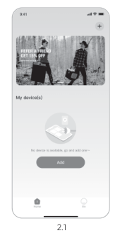
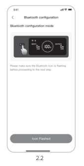

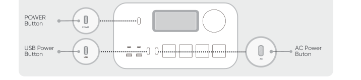

```{note}
After the device is turned on and not connected to the App within 2 hours, it will automatically turn off Wi-Fi and Bluetooth. Now, it is required to press and hold USB power button and AC power button to turn on Wi-Fi and Bluetooth again.
```

2.3 After tapping the searched device icon, the App automatically connects the device via Bluetooth.

```{note}
If "the device has been bound" is prompted during the binding process, the following two ways can be used for connection:

- The device owner will share this device with other users through the App.
- Press and hold the POWER button and USB power button for 3 seconds to reset the device, and then re-bind the device.
```

2.4 After the device is successfully connected, enter your Wi-Fi password and tap the OK button.

```{note}
Please select a Wi-Fi network in 2.4GHz band. The device does not support a Wi-Fi network in 5GHz band.
```

2.5 After the device is successfully added on the App, the Wi-Fi icon on the device will be always on.

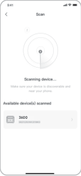
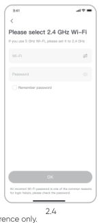
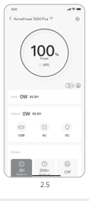

*The above screenshots are for reference only.*

```{caution}
The Jackery app can connect to only one power station via Bluetooth at a time. Returning to the device list automatically disconnects Bluetooth. Tap the power station in the list again to reconnect automatically.
```

(jhp3600a-app-unbind)=
### 3. Unbind the device

Click the Settings icon in the upper right corner of the main interface of the device to enter the settings page, and click the Unbind button at the bottom of the page to unbind the device.

(jhp3600a-app-notes)=
### 4. Notes

#### 4.1 To turn on Wi-Fi & Bluetooth

- Wi-Fi and Bluetooth are automatically turned on after the device is on, and the Wi-Fi and Bluetooth icons on the screen light up.
- Hold the USB power button and the AC power button at the same time until the Wi-Fi & Bluetooth icons on the screen light up.

#### 4.2 To turn off Wi-Fi & Bluetooth

- Hold the USB power button and AC power button at the same time until the Wi-Fi & Bluetooth icons on the screen are off.
- Wi-Fi and Bluetooth will be automatically turned off if no device is connected within 2 hours.

#### 4.3 To reset Wi-Fi & Bluetooth

Hold the POWER button and USB power button at the same time for 3 seconds to reset Wi-Fi & Bluetooth to factory settings and reboot the system. The connected App account will be unbound.
