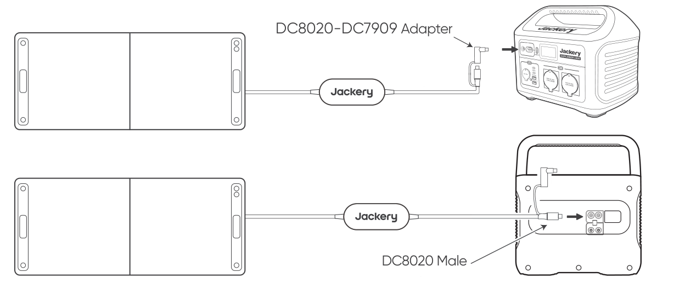
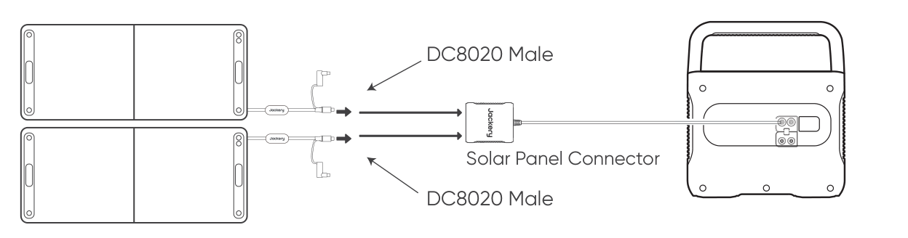
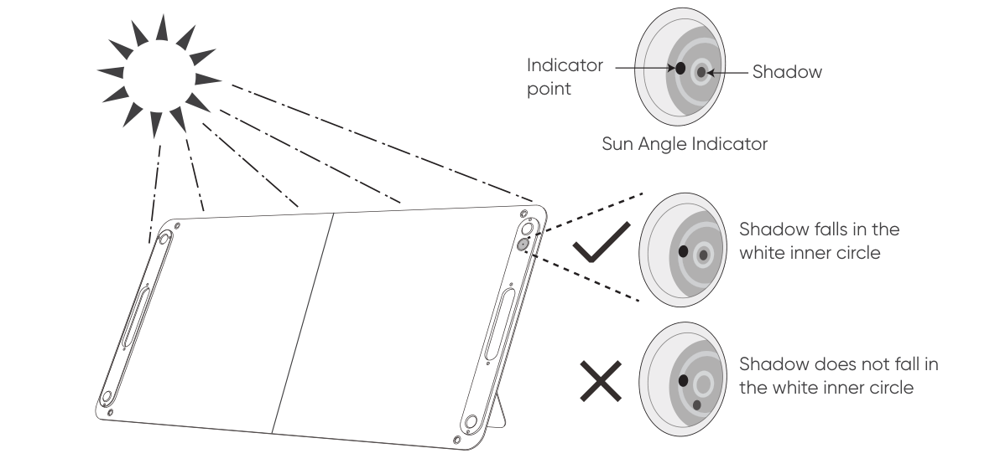
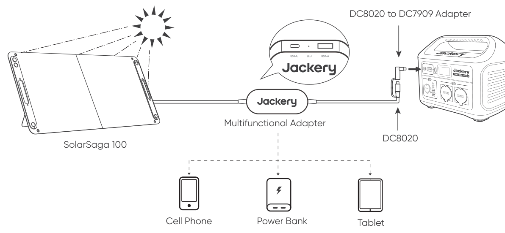

# SPECIFICATIONS

## BASIC INFORMATION

<figure aria-label="BASIC INFORMATION" class="hb-spec-table-composition"><table class="hb-spec-table manual-table manual-spec-table"><colgroup><col class="hb-spec-col-label"/><col class="hb-spec-col-value"/></colgroup>
<tbody>
<tr>
<th class="hb-spec-label manual-spec-label" scope="row">Product Name</th>
<td class="hb-spec-value manual-spec-value">Jackery SolarSaga 100</td>
</tr>
<tr>
<th class="hb-spec-label manual-spec-label" scope="row">Model No.</th>
<td class="hb-spec-value manual-spec-value">JS-100F</td>
</tr>
<tr>
<th class="hb-spec-label manual-spec-label" scope="row">Waterproof Level</th>
<td class="hb-spec-value manual-spec-value">IP68</td>
</tr>
<tr>
<th class="hb-spec-label manual-spec-label" scope="row">Operating Temperature Range</th>
<td class="hb-spec-value manual-spec-value">-20°C to 65°C (-4°F to 149°F)</td>
</tr>
<tr>
<th class="hb-spec-label manual-spec-label" scope="row">Dimensions (unfolded)</th>
<td class="hb-spec-value manual-spec-value">1220 × 552 × 20 mm</td>
</tr>
<tr>
<th class="hb-spec-label manual-spec-label" scope="row">Dimensions (folded)</th>
<td class="hb-spec-value manual-spec-value">610 × 552 × 35 mm</td>
</tr>
<tr>
<th class="hb-spec-label manual-spec-label" scope="row">Weight</th>
<td class="hb-spec-value manual-spec-value">3.6 kg ± 0.3 kg</td>
</tr>
</tbody>
</table></figure>

## ELECTRICAL DATA

<figure aria-label="ELECTRICAL DATA" class="hb-spec-table-composition"><table class="hb-spec-table manual-table manual-spec-table"><colgroup><col class="hb-spec-col-label"/><col class="hb-spec-col-value"/></colgroup>
<tbody>
<tr>
<th class="hb-spec-label manual-spec-label" scope="row">Peak Power (Pₘₐₓ)</th>
<td class="hb-spec-value manual-spec-value">STC*: 100 W ± 5 W / BNPI*: 104 W ± 5 W</td>
</tr>
<tr>
<th class="hb-spec-label manual-spec-label" scope="row">Open-Circuit Voltage (Vₒ꜀)</th>
<td class="hb-spec-value manual-spec-value">STC*: 24.8 V ± 5% / BNPI*: 25 V ± 5%</td>
</tr>
<tr>
<th class="hb-spec-label manual-spec-label" scope="row">Short-Circuit Current (Iₛ꜀)</th>
<td class="hb-spec-value manual-spec-value">STC*: 5.4 A ± 5% / BNPI*: 5.8 A ± 5%</td>
</tr>
<tr>
<th class="hb-spec-label manual-spec-label" scope="row">Power Voltage (Vₘₚ)</th>
<td class="hb-spec-value manual-spec-value">STC*: 20.0 V ± 5% / BNPI*: 20.1 V ± 5%</td>
</tr>
<tr>
<th class="hb-spec-label manual-spec-label" scope="row">Power Current (Iₘₚ)</th>
<td class="hb-spec-value manual-spec-value">STC*: 5.0 A ± 5% / BNPI*: 5.2 A ± 5%</td>
</tr>
<tr>
<th class="hb-spec-label manual-spec-label" scope="row">Maximum System Voltage</th>
<td class="hb-spec-value manual-spec-value">60 V</td>
</tr>
<tr>
<th class="hb-spec-label manual-spec-label" scope="row">Maximum Reverse Current</th>
<td class="hb-spec-value manual-spec-value">15 A</td>
</tr>
<tr>
<th class="hb-spec-label manual-spec-label" scope="row">Protection Class Against Electric Shock</th>
<td class="hb-spec-value manual-spec-value">Class II</td>
</tr>
<tr>
<th class="hb-spec-label manual-spec-label" scope="row">Bifaciality Coefficient (back/front)</th>
<td class="hb-spec-value manual-spec-value">Pₘₐₓ &gt; 30%, Vₒ꜀ &gt; 95%, Iₛ꜀ &gt; 32%</td>
</tr>
<tr>
<th class="hb-spec-label manual-spec-label" scope="row">Voltage Temperature Coefficient</th>
<td class="hb-spec-value manual-spec-value">-0.268%/°C</td>
</tr>
<tr>
<th class="hb-spec-label manual-spec-label" scope="row">Power Temperature Coefficient</th>
<td class="hb-spec-value manual-spec-value">-0.29%/°C</td>
</tr>
<tr>
<th class="hb-spec-label manual-spec-label" scope="row">Photovoltaic Consumer Products</th>
<td class="hb-spec-value manual-spec-value">IEC TS 63163 Consumer Product Category 2</td>
</tr>
</tbody>
</table></figure>

## MULTIFUNCTIONAL ADAPTER

<figure aria-label="MULTIFUNCTIONAL ADAPTER" class="hb-spec-table-composition"><table class="hb-spec-table manual-table manual-spec-table"><colgroup><col class="hb-spec-col-label"/><col class="hb-spec-col-value"/></colgroup>
<tbody>
<tr>
<th class="hb-spec-label manual-spec-label" scope="row">USB-A Output</th>
<td class="hb-spec-value manual-spec-value">5 V⎓2.4 A</td>
</tr>
<tr>
<th class="hb-spec-label manual-spec-label" scope="row">USB-C Output</th>
<td class="hb-spec-value manual-spec-value">5 V⎓3 A</td>
</tr>
</tbody>
</table></figure>

\* STC (Standard Test Conditions, 1000 W/m², 25°C, AM1.5).

\* BNPI (Bifacial Nameplate Irradiance, Front 1000 W/m², Rear 135 W/m², 25°C, AM1.5).

Unfold the bracket and place it on a flat surface. The design load is 1600 Pa, and the safety factor is 1.5 times.

# SAFETY TIPS

- Please read the user guide first before using this product.

- Do not bend the folding solar panels.

- Do not place the folding solar panels in trees, buildings or other shaded areas for use.

- Do not immerse the folding solar panels in water or any other liquid.

- Do not put solar panels in water directly, and use a damp cloth to gently wipe them when cleaning.

- Do not use or store the folding solar panels near open flames or flammable materials.

- Do not scratch the folding solar panels with sharp objects.

- Do not put corrosive substances on the folding solar panels.

- Do not step on or place heavy objects on the folding solar panels.

- Do not disassemble the folding solar panels.

- The output circuit of the folding solar panel package must be connected to the equipment properly, and reverse connection of positive and negative poles is strictly prohibited.

- Check the connection status of various components, wires, and plugs before use.

- It is strictly prohibited to drop the product due to the nature of the material. Otherwise, it may cause internal damage to the solar panel, rendering the product unusable.

- This product cannot be fixed for installation. Please put away the portable folding solar panels in case of strong winds, hail and other severe weather to avoid product damage or other hazards.

- Under normal circumstances, PV modules may be exposed to higher currents or voltages than under standard test conditions. Therefore, when calculating the rated voltage of a component, the rated current of a conductor, and the size of the control device connected to the PV output, multiply the short-circuit current (Iₛ꜀) and open-circuit voltage (Vₒ꜀) values marked on the component by a factor of 1.25.

- Any damage to the product may lead to electric shock or fire.

- Do not let artificial spotlight shine directly on the solar modules or panels.

# HOW TO USE

Connect the cable to the solar panel and the DC input port of the portable power station.

<table class="manual-callout-table" lang="en">
<tbody><tr>
<td class="manual-callout-label">NOTE</td>
<td class="manual-callout-body">

The cable comes with an adapter that allows it to connect to a Jackery portable power station.

<ol>
<li><strong>DC8020 connector:</strong> suitable for the DC input port of a Jackery portable power station (diameter: 8.1 mm).</li>
<li><strong>DC8020-DC7909 adapter:</strong> suitable for the DC input port of a Jackery portable power station (diameter: 8.0 mm).</li>
</ol>
</td>
</tr></tbody>
</table>

<table class="manual-callout-table" lang="en">
<tbody><tr>
<td class="manual-callout-label">NOTE</td>
<td class="manual-callout-body">This multifunctional solar charging cable is only suitable for charging the Jackery SolarSaga 100 and should not be used with other solar panels.</td>
</tr></tbody>
</table>

## When Using the Solar Panel Connector

Connect the two solar panels to the solar panel connector respectively and then connect the solar panel connector to the DC input port of the portable power station.

<table class="manual-callout-table" lang="en">
<tbody><tr>
<td class="manual-callout-label">NOTE</td>
<td class="manual-callout-body">To maximize power generation, adjust the orientation of the SolarSaga 100 throughout the day to ensure full exposure of the panel surface to direct sunlight.</td>
</tr></tbody>
</table>

# SUN ANGLE INDICATOR

The carry handle has a sun angle indicator. When sunlight hits its surface, a shadow will appear at its bottom.

If the shadow falls on the white inner circle at its bottom, it means that the solar panel is facing directly towards the sun and you can get optimal power generation; if not, it is suggested to adjust its angle until it does.

# POWER YOUR DEVICE

# WARRANTY

## Warranty Period

### 3 YEARS --- Limited Warranty

The product is covered by a limited warranty from Jackery for the original purchaser that covers the product from defects in workmanship and materials for 36 months from the date of purchase (damages from normal wear and tear, alteration, misuse, neglect, accident, service by anyone other than an authorized service center, or act of God are not included). During the warranty period and upon verification of defects, this product will be replaced when returned with proper proof of purchase.

### 2 YEARS --- Extended Warranty

To activate the Warranty Extension, you must register your product online or contact our customer service team at <a href="mailto:hello.eu@jackery.com" class="reference external">hello.eu@jackery.com</a> to extend the standard warranty runtime.

## Contact Us

For any inquiries or comments concerning our products, please send an email to <a href="mailto:hello.eu@jackery.com" class="reference external">hello.eu@jackery.com</a>, and we will respond to you as soon as possible. If there is any quality-related issue with the product, you may request a replacement or refund by submitting a request form at www.jackery.com.

## Customer Service

- **3-year limited warranty**

- **Lifetime technical support**

- **hello.eu@jackery.com**
