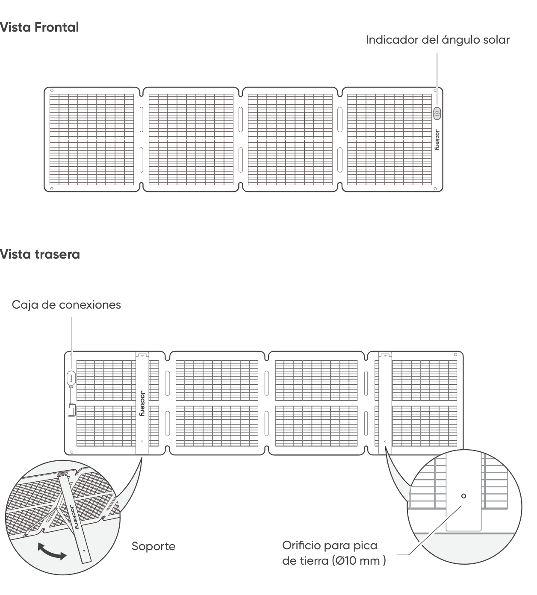

# RECOMENDACIONES DE SEGURIDAD

- Lea el manual del usuario antes de utilizar este producto.

- No doble los paneles solares.

- No coloque los paneles solares en árboles, edificios u otras áreas sombreadas para su uso.

- No sumerja los paneles solares en agua ni en ningún otro líquido durante períodos prolongados.

- Use un paño húmedo para limpiarlos con suavidad.

- No use ni almacene los paneles solares cerca de llamas o materiales inflamables.

- No raye los paneles solares con objetos afilados.

- No ponga sustancias corrosivas sobre los paneles solares.

- No pise ni coloque objetos pesados sobre los paneles solares.

- No desarme los paneles solares.

- El circuito de salida del panel solar debe conectarse adecuadamente al equipo. La conexión inversa de los polos positivo y negativo está estrictamente prohibida.

- Verifique el estado de conexión de todos los componentes, cables y enchufes antes de usar.

- No deje caer el producto, ya que esto podría causar daños internos y dejarlo inservible.

- El panel solar no está diseñado para una instalación permanente. Por favor guarde los paneles solares en caso de vientos fuertes, granizo u otras condiciones climáticas severas para evitar daños o riesgos potenciales.

- En condiciones normales, los módulos fotovoltaicos pueden estar expuestos a corrientes o voltajes más altos que en condiciones de prueba estándar. Por lo tanto, al calcular la tensión nominal del componente, la corriente nominal del conductor y el tamaño del dispositivo de control conectado a la salida fotovoltaica, es necesario multiplicar los valores de corriente de cortocircuito (Isc) y voltaje de circuito abierto (Voc) marcados en el componente por un factor de 1,25.

- Cualquier daño al producto puede provocar una descarga eléctrica o un incendio.

- No exponga los paneles solares a focos de luz artificial.

- No conecte el panel solar a otros paneles o fuentes de energía, a menos que la combinación incluya protección contra corriente inversa y sobretensión.

# CONTENIDO DEL PAQUETE

<figure aria-label="CONTENIDO DEL PAQUETE" class="hb-inbox-composition" data-card-count="5" data-component-id="HB-SPECIAL-INBOX" data-inbox-variant="responsive-card-grid"><ol class="hb-inbox-grid"><li class="hb-inbox-card" data-item-number="1">

<strong>Jackery SolarSaga 100 Air</strong>

</li><li class="hb-inbox-card" data-item-number="2">

<strong>Bolsa de almacenamiento</strong>

</li><li class="hb-inbox-card" data-item-number="3">

<strong>Cable de carga solar multifuncional (3 m)</strong>

</li><li class="hb-inbox-card" data-item-number="4">

<strong>Adaptador DC8020 a DC7909</strong>

</li><li class="hb-inbox-card" data-item-number="5">

<strong>Manual del usuario</strong>

</li></ol>

<strong>NOTA</strong>

El cable de carga solar multifuncional solo es compatible con el panel solar SolarSaga 100 Air (JS-100I). No lo utilice con otros modelos de paneles solares.

</figure>

# MODO DE EMPLEO

<figure class="manual-step-figure">

<figcaption>
Vista Frontal · Vista trasera · Indicador del ángulo solar · Caja de conexiones · Soporte · Orificio para pica de tierra (Ø10 mm )
</figcaption>
</figure>

# DESPLIEGUE DEL PANEL SOLAR

<figure class="manual-step-figure">

<figcaption aria-hidden="true">
1. Saque el panel solar de la bolsa de almacenamiento.
</figcaption>
</figure>

<figure class="manual-step-figure">

<figcaption aria-hidden="true">
2. Despliegue el panel solar paso a paso como se muestra en la ilustración.
</figcaption>
</figure>

<figure class="manual-step-figure">

<figcaption aria-hidden="true">
3. Abra los dos soportes en la parte posterior del panel solar.
</figcaption>
</figure>

<figure class="manual-step-figure">

<figcaption aria-hidden="true">
4. Ajuste el panel para que mire hacia el sol y luego conéctelo a su estación de energía portátil.
</figcaption>
</figure>

# PLEGADO DEL PANEL SOLAR

<figure class="manual-step-figure">

<figcaption aria-hidden="true">
1. Desconecte el cable de carga multifunción y pliegue los soportes.
</figcaption>
</figure>

<figure class="manual-step-figure">

<figcaption aria-hidden="true">
2. Pliegue el panel solar a lo largo de los pliegues en orden, como se muestra en la ilustración.
</figcaption>
</figure>

<figure class="manual-step-figure">

<figcaption aria-hidden="true">
3. Coloque el panel solar nuevamente en la bolsa de almacenamiento.
</figcaption>
</figure>

# CARGA DE LA ESTACIÓN DE ENERGÍA PORTÁTIL JACKERY

Conecte el cable de carga al panel o paneles solares y al puerto de entrada de CC de la central eléctrica portátil.

## CONECTOR DC8020

Compatible con estaciones de energía portátiles Jackery con puerto(s) de entrada DC8020.

<figure class="manual-step-figure">

<figcaption>
Macho DC8020
</figcaption>
</figure>

## ADAPTADOR DC8020-DC7909

Compatible con estaciones de energía portátiles Jackery con puerto(s) de entrada DC7909.

<figure class="manual-step-figure">

<figcaption>
Adaptador DC8020-DC7909
</figcaption>
</figure>

## CABLE ADAPTADOR DE DC8020 A USB-C (SE VENDE POR SEPARADO)

Compatible con estaciones de energía portátiles Jackery con puerto(s) de entrada USB-C

<figure class="manual-step-figure">

<figcaption>
Cable adaptador de DC8020 a USB-C
</figcaption>
</figure>

<table class="manual-callout-table" style="width:100%; border-collapse:collapse; margin:0 0 16px 0;"><tbody><tr><td class="manual-callout-label" style="width:16%; border:1px solid #000; padding:6px 8px; vertical-align:top;">
<strong>NOTA</strong>
</td><td class="manual-callout-body" style="border:1px solid #000; padding:6px 8px; vertical-align:top;">
El cable adaptador de DC8020 a USB-C se utiliza únicamente para cargar la estación de energía portátil Jackery. No lo utilice para cargar otros dispositivos.
</td></tr></tbody></table>

## CUANDO USE EL CONECTOR DEL PANEL SOLAR (SE VENDE POR SEPARADO)

Conectar ambos paneles solares al conector de panel solar respectivamente y luego conectar el conector de panel solar al puerto de entrada CC de la estación de energía portátil.

<figure class="manual-step-figure">

<figcaption>
Macho DC8020 · Conector para panel solar
</figcaption>
</figure>

※ Asegúrese de que solo se conecten paneles solares del mismo modelo a la entrada del conector.

# INDICADOR DEL ÁNGULO SOLAR

El producto tiene un indicador de ángulo solar. Cuando la luz del sol incide sobre su superficie, aparece una sombra en su parte inferior.

<figure class="manual-step-figure">

<figcaption>
Indicador del ángulo solar · Indicador · Sombra
</figcaption>
</figure>

Si la sombra cae sobre el círculo blanco interior en su parte inferior, significa que el panel solar está orientado directamente hacia el sol y puede obtener una generación de energía óptima; si no es así, se sugiere ajustar su ángulo hasta que lo haga.

<figure class="manual-step-figure manual-detail-figure">

<figcaption aria-hidden="true">
La sombra cae en el círculo interior blanco
</figcaption>
</figure>

<figure class="manual-step-figure manual-detail-figure">

<figcaption aria-hidden="true">
La sombra no cae en el círculo interior blanco
</figcaption>
</figure>

<table class="manual-callout-table" style="width:100%; border-collapse:collapse; margin:0 0 16px 0;"><tbody><tr><td class="manual-callout-label" style="width:16%; border:1px solid #000; padding:6px 8px; vertical-align:top;">
<strong>NOTA</strong>
</td><td class="manual-callout-body" style="border:1px solid #000; padding:6px 8px; vertical-align:top;">
Para maximizar la generación de energía, ajuste la orientación del Jackery SolarSaga 100 Air a lo largo del día para asegurar la exposición completa de la superficie del panel a la luz solar directa.
</td></tr></tbody></table>

## ALIMENTA TU DISPOSITIVO

<figure class="manual-step-figure">

<figcaption>
Jackery SolarSaga 100 Air · Adaptador Multifuncional · USB-C · LED · USB-A · Teléfono móvil · Banco de energía · Tablet
</figcaption>
</figure>

<figure class="manual-step-figure">

<figcaption>
* Inserte el tapón de goma cuando los puertos USB no estén en uso para evitar el polvo.
</figcaption>
</figure>

# PARÁMETROS TÉCNICOS

## INFORMACIÓN BÁSICA

<figure aria-label="INFORMACIÓN BÁSICA" class="hb-spec-table-composition"><table class="hb-spec-table manual-table manual-spec-table"><colgroup><col class="hb-spec-col-label"/><col class="hb-spec-col-value"/></colgroup>
<tbody>
<tr>
<th class="hb-spec-label manual-spec-label" scope="row">Nombre del producto</th>
<td class="hb-spec-value manual-spec-value">Jackery SolarSaga 100 Air</td>
</tr>
<tr>
<th class="hb-spec-label manual-spec-label" scope="row">Modelo</th>
<td class="hb-spec-value manual-spec-value">JS-100I</td>
</tr>
<tr>
<th class="hb-spec-label manual-spec-label" scope="row">Dimensiones (desplegado)</th>
<td class="hb-spec-value manual-spec-value">1630 × 423 × 17mm</td>
</tr>
<tr>
<th class="hb-spec-label manual-spec-label" scope="row">Dimensiones (plegado)</th>
<td class="hb-spec-value manual-spec-value">423,5 × 423 × 47mm</td>
</tr>
<tr>
<th class="hb-spec-label manual-spec-label" scope="row">Peso</th>
<td class="hb-spec-value manual-spec-value">3,2kg ± 0,2kg</td>
</tr>
<tr>
<th class="hb-spec-label manual-spec-label" scope="row">Clasificación IP</th>
<td class="hb-spec-value manual-spec-value">IP68</td>
</tr>
<tr>
<th class="hb-spec-label manual-spec-label" scope="row">Rango de temperatura de funcionamiento</th>
<td class="hb-spec-value manual-spec-value">-20 °C a 65 °C</td>
</tr>
</tbody>
</table></figure>

## DATOS ELÉCTRICOS

<figure aria-label="DATOS ELÉCTRICOS" class="hb-spec-table-composition"><table class="hb-spec-table manual-table manual-spec-table"><colgroup><col class="hb-spec-col-label"/><col class="hb-spec-col-value"/></colgroup>
<tbody>
<tr>
<th class="hb-spec-label manual-spec-label" scope="row">Potencia Máxima (Pmax)</th>
<td class="hb-spec-value manual-spec-value">STC*: 100W±5% / BNPI*: 110W±5%</td>
</tr>
<tr>
<th class="hb-spec-label manual-spec-label" scope="row">Voltaje de circuito abierto (Voc)</th>
<td class="hb-spec-value manual-spec-value">STC*: 26,0V±5% / BNPI*: 26,3V±5%</td>
</tr>
<tr>
<th class="hb-spec-label manual-spec-label" scope="row">Corriente de cortocircuito (Isc)</th>
<td class="hb-spec-value manual-spec-value">STC*: 4,95A±5% / BNPI*: 5,38A±5%</td>
</tr>
<tr>
<th class="hb-spec-label manual-spec-label" scope="row">Voltaje para potencia máxima (Vmp)</th>
<td class="hb-spec-value manual-spec-value">STC*: 21,7V±5% / BNPI*: 22,0V±5%</td>
</tr>
<tr>
<th class="hb-spec-label manual-spec-label" scope="row">Corriente para potencia máxima (Imp)</th>
<td class="hb-spec-value manual-spec-value">STC*: 4,67A±5% / BNPI*: 5,08A±5%</td>
</tr>
<tr>
<th class="hb-spec-label manual-spec-label" scope="row">Tensión máxima del sistema</th>
<td class="hb-spec-value manual-spec-value">80V</td>
</tr>
<tr>
<th class="hb-spec-label manual-spec-label" scope="row">Corriente máxima inversa</th>
<td class="hb-spec-value manual-spec-value">15A</td>
</tr>
<tr>
<th class="hb-spec-label manual-spec-label" scope="row">Clase de protección contra choque eléctrico</th>
<td class="hb-spec-value manual-spec-value">Clase II</td>
</tr>
<tr>
<th class="hb-spec-label manual-spec-label" scope="row">Coeficiente de bifacialidad (trasero/frente)</th>
<td class="hb-spec-value manual-spec-value">Pmax: &gt;65 %, Voc: &gt;97 %, Isc: &gt;65 %</td>
</tr>
<tr>
<th class="hb-spec-label manual-spec-label" scope="row">Coeficiente de temperatura de voltaje</th>
<td class="hb-spec-value manual-spec-value">-0,27%/°C</td>
</tr>
<tr>
<th class="hb-spec-label manual-spec-label" scope="row">Coeficiente de temperatura de potencia</th>
<td class="hb-spec-value manual-spec-value">-0,33%/°C</td>
</tr>
<tr>
<th class="hb-spec-label manual-spec-label" scope="row">Productos de consumo fotovoltaicos</th>
<td class="hb-spec-value manual-spec-value">IEC TS 63163 Categoría de producto de consumo 2</td>
</tr>
</tbody>
</table></figure>

## ADAPTADOR MULTIFUNCIONAL

<figure aria-label="ADAPTADOR MULTIFUNCIONAL" class="hb-spec-table-composition"><table class="hb-spec-table manual-table manual-spec-table"><colgroup><col class="hb-spec-col-label"/><col class="hb-spec-col-value"/></colgroup>
<tbody>
<tr>
<th class="hb-spec-label manual-spec-label" scope="row">Salida USB-A</th>
<td class="hb-spec-value manual-spec-value">5V⎓2,4A</td>
</tr>
<tr>
<th class="hb-spec-label manual-spec-label" scope="row">Salida USB-C</th>
<td class="hb-spec-value manual-spec-value">5V⎓3A</td>
</tr>
</tbody>
</table></figure>

\* STC (Condiciones de Prueba Estándar, 1000 W/m2, 25 °C, AM 1,5)

\* BNPI (Irradiancia Nominal Bifacial, Frontal 1000 W/m2, Trasera 135 W/m2, 25 °C, AM 1,5) Despliegue el soporte y colóquelo sobre una superficie plana. La carga de diseño es de 1600Pa, y el factor de seguridad es 1,5 veces.

# GARANTÍA

## Período de garantía

### 1 AÑO --- Garantía Estándar

Este producto está amparado por una garantía limitada por parte de Jackery al comprador original, la cual cubre defectos relativos al acabado y a los materiales durante 12 meses a partir de la fecha de compra (no se incluyen los daños derivados de desgaste y rotura normal, alteración, uso inadecuado, negligencia, accidente, servicio realizado por personal o centro de servicio no autorizado ni fuerza mayor. ) Durante el periodo de garantía, y una vez verificados los defectos, este producto será reemplazado cuando se devuelva con las pruebas de compra correspondientes.

### 2 AÑOS --- Ampliación de garantía

Para activar la extensión de garantía, debe registrar su producto en línea o ponerse en contacto con nuestro equipo de atención al cliente en <a href="mailto:hello.eu@jackery.com" class="reference external">hello.eu@jackery.com</a> para ampliar la duración de la garantía estándar.

## Contacto

Para cualquier consulta o comentario sobre nuestros productos, envíe un correo electrónico a <a href="mailto:hello.eu@jackery.com" class="reference external">hello.eu@jackery.com</a> y le responderemos lo antes posible. Si hay algún problema relacionado con la calidad del producto, puede solicitar un reemplazo o un reembolso enviando un formulario de solicitud en www.jackery.com.

## Atención Al Cliente

<a href="mailto:hello.eu@jackery.com" class="reference external">hello.eu@jackery.com</a> Soporte técnico de por vida

## EU Regulations

CE Declaration of Conformity Shenzhen Hello Tech Energy Co., Ltd. hereby declares that this: Jackery SolarSaga 100 Air JS-100I is in compliance with the essential requirements and other relevant provisions of the CE Directive 2014/30/EU, 2011/65/EU+2015/863. The full text of the EU declaration of conformity is available at the following internet address: <a href="https://de.jackery.com/pages/user-guides" class="reference external">https://de.jackery.com/pages/user-guides</a> MANUFACTURER: SHENZHEN HELLO TECH ENERGY CO.,LTD. Address: F2-3, Bldg. 7, Jiaanda Science and technology industrial park factory, the east side of Huafan Road, Tongsheng Community, Dalang Street, Longhua District, Shenzhen, Guangdong, China +86 400 668 9293 <a href="mailto:sales@hello-tech.com" class="reference external">sales@hello-tech.com</a> www.hello-tech.com
