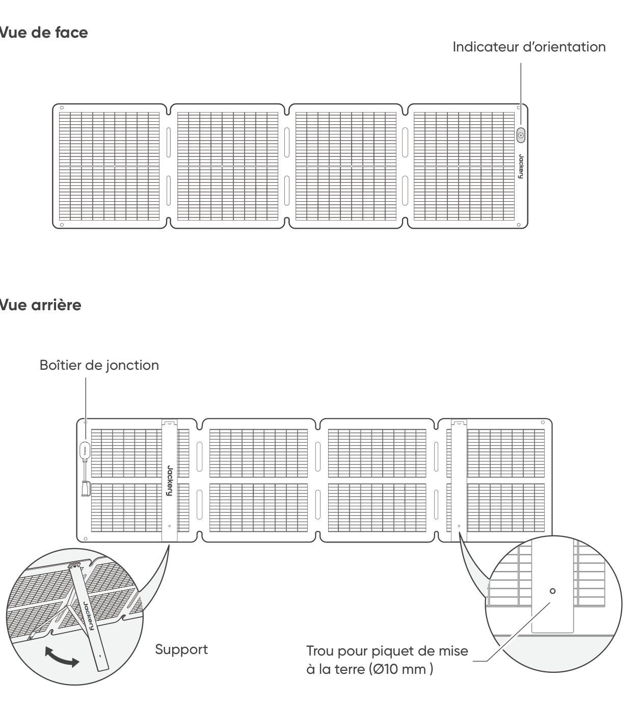

# CONSEILS DE SÉCURITÉ

- Veuillez lire le manuel d'utilisation avant d'utiliser ce produit.

- Ne tordez pas les panneaux solaires.

- Ne placez pas les panneaux solaires près d'arbres, de bâtiments ou autres zones ombragées lors de leur utilisation.

- N'immergez pas les panneaux solaires dans l'eau ou tout autre liquide pendant de longues périodes.

- Utilisez un chiffon humide pour les essuyer délicatement lors du nettoyage.

- N'utilisez pas ou ne stockez pas les panneaux solaires près de flammes nues ou de matières inflammables.

- Ne rayez pas les panneaux solaires avec des objets pointus.

- N'appliquez pas de substances corrosives sur les panneaux solaires.

- Ne marchez pas et ne placez pas d'objets lourds sur les panneaux solaires.

- Ne démontez pas les panneaux solaires.

- Le circuit de sortie du panneau solaire doit être raccordé correctement à l'équipement, et un branchement inversé des pôles positif et négatif est strictement interdit.

- Vérifiez l'état de branchement de tous les composants, câbles et fiches avant utilisation.

- Ne laissez pas tomber le produit, cela pourrait l'endommager à l'intérieur et le rendre inutilisable.

- Le panneau solaire n'est pas destiné à une installation permanente. Veuillez ranger les panneaux solaires en cas de vents violents, de grêle ou d\'autres conditions météorologiques extrêmes afin d'éviter tout dommage ou danger potentiel.

- Dans des conditions normales, les modules photovoltaïques peuvent être exposés à des tensions ou des courants plus élevés par rapport à ceux en conditions d'essai standard. Par conséquent, pour calculer la tension nominale du composant, le courant nominal du conducteur et la taille du dispositif de commande connecté à la sortie du panneau solaire, il est nécessaire de multiplier par 1,25 les valeurs de l'intensité de court-circuit (Isc) et de la tension en circuit ouvert (Voc) marquées sur le module.

- Toute détérioration du produit peut entraîner un choc électrique ou un incendie.

- N\'exposez pas les panneaux solaires à une lumière artificielle intense.

- Ne connectez pas le panneau solaire à d\'autres panneaux solaires ou sources d'alimentation, sauf si la combinaison comprend une protection contre les courants inverses et les surtensions.

# CONTENU DE LA BOÎTE

<figure aria-label="CONTENU DE LA BOÎTE" class="hb-inbox-composition" data-card-count="5" data-component-id="HB-SPECIAL-INBOX" data-inbox-variant="responsive-card-grid"><ol class="hb-inbox-grid"><li class="hb-inbox-card" data-item-number="1">

<strong>Jackery SolarSaga 100 Air</strong>

</li><li class="hb-inbox-card" data-item-number="2">

<strong>Sac de rangement</strong>

</li><li class="hb-inbox-card" data-item-number="3">

<strong>Câble de charge solaire multifonction (3 m)</strong>

</li><li class="hb-inbox-card" data-item-number="4">

<strong>Adaptateur DC8020 vers DC7909</strong>

</li><li class="hb-inbox-card" data-item-number="5">

<strong>Manuel de l’utilisateur</strong>

</li></ol>

<strong>REMARQUE</strong>

Le câble de charge solaire multifonction est uniquement compatible avec le panneau solaire SolarSaga 100 Air (JS-100I). Ne l’utilisez pas avec d’autres modèles de panneaux solaires.

</figure>

# CONSEILS D'UTILISATION

<figure class="manual-step-figure">

<figcaption>
Vue de face · Vue arrière · Indicateur d’orientation · Boîtier de jonction · Support · Trou pour piquet de mise à la terre (Ø10 mm )
</figcaption>
</figure>

# DÉPLIAGE DU PANNEAU SOLAIRE

<figure class="manual-step-figure">

<figcaption aria-hidden="true">
1. Sortez le panneau solaire du sac de rangement.
</figcaption>
</figure>

<figure class="manual-step-figure">

<figcaption aria-hidden="true">
2. Dépliez le panneau solaire étape par étape comme indiqué sur l’illustration.
</figcaption>
</figure>

<figure class="manual-step-figure">

<figcaption aria-hidden="true">
3. Ouvrez les deux supports à l’arrière du panneau solaire.
</figcaption>
</figure>

<figure class="manual-step-figure">

<figcaption aria-hidden="true">
4. Orientez le panneau face au soleil, puis connectez-le à votre station d'énergie portable.
</figcaption>
</figure>

# PLIAGE DU PANNEAU SOLAIRE

<figure class="manual-step-figure">

<figcaption aria-hidden="true">
1. Débranchez le câble de charge multifonction et repliez les supports.
</figcaption>
</figure>

<figure class="manual-step-figure">

<figcaption aria-hidden="true">
2. Pliez le panneau solaire le long des plis dans l’ordre, comme indiqué sur l’illustration.
</figcaption>
</figure>

<figure class="manual-step-figure">

<figcaption aria-hidden="true">
3. Replacez le panneau solaire dans le sac de rangement.
</figcaption>
</figure>

# CHARGEMENT DE LA STATION D\'ÉNERGIE PORTABLE JACKERY

Raccordez le câble de chargement au(x) panneau(x) solaire(s) et au port d'entrée CC de la station d'énergie portable.

## CONNECTEUR DC8020

Compatible avec les stations d\'énergie portables Jackery dotées d'un ou plusieurs ports d'entrée DC8020.

<figure class="manual-step-figure">

<figcaption>
Connecteur DC8020 mâle
</figcaption>
</figure>

## ADAPTATEUR DC8020 VERS DC7909

Compatible avec les stations d\'énergie portables Jackery dotées d'un ou plusieurs ports d'entrée DC7909.

<figure class="manual-step-figure">

<figcaption>
Adaptateur DC8020 vers DC7909
</figcaption>
</figure>

## CÂBLE ADAPTATEUR DC8020 VERS USB-C (VENDU SÉPARÉMENT)

Compatible avec les stations d\'énergie portables Jackery dotées d'un ou plusieurs ports d'entrée USB-C

<figure class="manual-step-figure">

<figcaption>
Câble adaptateur DC8020 vers USB-C
</figcaption>
</figure>

<table class="manual-callout-table" style="width:100%; border-collapse:collapse; margin:0 0 16px 0;"><tbody><tr><td class="manual-callout-label" style="width:16%; border:1px solid #000; padding:6px 8px; vertical-align:top;">
<strong>REMARQUE</strong>
</td><td class="manual-callout-body" style="border:1px solid #000; padding:6px 8px; vertical-align:top;">
Le câble adaptateur DC8020 vers USB-C est utilisé uniquement pour charger la station d'énergie portable Jackery. Ne l’utilisez pas pour charger d’autres appareils.
</td></tr></tbody></table>

## LORS DE L'UTILISATION DU CONNECTEUR DE PANNEAU SOLAIRE (VENDU SÉPARÉMENT)

Branchez les deux panneaux solaires au connecteur, puis branchez le connecteur au port d'entrée CC de la station d'alimentation portable.

<figure class="manual-step-figure">

<figcaption>
Connecteur DC8020 mâle · Connecteur du panneau solaire
</figcaption>
</figure>

※ Assurez-vous que seuls des panneaux solaires du même modèle sont connectés à l'entrée du connecteur.

# INDICATEUR D'ORIENTATION

Le produit dispose d'un indicateur d'angle solaire. Lorsque les rayons du soleil touchent la surface, une ombre apparaît sur l'indicateur.

<figure class="manual-step-figure">

<figcaption>
Indicateur d’orientation · Point d’indication · Ombre
</figcaption>
</figure>

Si elle est positionnée dans le cercle intérieur blanc, le panneau solaire est bien orienté face au soleil et il peut produire de l'énergie de façon optimale. En revanche, si elle est positionnée à un autre endroit, vous devez ajuster la position du panneau solaire jusqu'à ce que l'ombre pointe au centre.

<figure class="manual-step-figure manual-detail-figure">

<figcaption aria-hidden="true">
L’ombre est positionnée dans le cercle intérieur blanc
</figcaption>
</figure>

<figure class="manual-step-figure manual-detail-figure">

<figcaption aria-hidden="true">
L’ombre n’est pas positionnée dans le cercle intérieur blanc
</figcaption>
</figure>

<table class="manual-callout-table" style="width:100%; border-collapse:collapse; margin:0 0 16px 0;"><tbody><tr><td class="manual-callout-label" style="width:16%; border:1px solid #000; padding:6px 8px; vertical-align:top;">
<strong>REMARQUE</strong>
</td><td class="manual-callout-body" style="border:1px solid #000; padding:6px 8px; vertical-align:top;">
Pour maximiser la production d’énergie, ajustez l’orientation du Jackery SolarSaga 100 Air tout au long de la journée afin d’assurer une exposition complète de la surface du panneau à la lumière directe du soleil.
</td></tr></tbody></table>

## ALIMENTEZ VOTRE APPAREIL

<figure class="manual-step-figure">

<figcaption>
Jackery SolarSaga 100 Air · Adaptateur multifonctionnel · USB-C · LED · USB-A · Téléphone portable · Batterie externe · Tablette
</figcaption>
</figure>

<figure class="manual-step-figure">

<figcaption>
* Insérez le bouchon en caoutchouc lorsque les ports USB ne sont pas utilisés afin d’éviter la poussière.
</figcaption>
</figure>

# CARACTÉRISTIQUES TECHNIQUES

## INFORMATIONS DE BASE

<figure aria-label="INFORMATIONS DE BASE" class="hb-spec-table-composition"><table class="hb-spec-table manual-table manual-spec-table"><colgroup><col class="hb-spec-col-label"/><col class="hb-spec-col-value"/></colgroup>
<tbody>
<tr>
<th class="hb-spec-label manual-spec-label" scope="row">Nom du produit</th>
<td class="hb-spec-value manual-spec-value">Jackery SolarSaga 100 Air</td>
</tr>
<tr>
<th class="hb-spec-label manual-spec-label" scope="row">Modèle</th>
<td class="hb-spec-value manual-spec-value">JS-100I</td>
</tr>
<tr>
<th class="hb-spec-label manual-spec-label" scope="row">Dimensions (déplié)</th>
<td class="hb-spec-value manual-spec-value">1630 × 423 × 17mm</td>
</tr>
<tr>
<th class="hb-spec-label manual-spec-label" scope="row">Dimensions (plié)</th>
<td class="hb-spec-value manual-spec-value">423,5 × 423 × 47mm</td>
</tr>
<tr>
<th class="hb-spec-label manual-spec-label" scope="row">Poids</th>
<td class="hb-spec-value manual-spec-value">3,2kg ± 0,2kg</td>
</tr>
<tr>
<th class="hb-spec-label manual-spec-label" scope="row">Indice de protection IP</th>
<td class="hb-spec-value manual-spec-value">IP68</td>
</tr>
<tr>
<th class="hb-spec-label manual-spec-label" scope="row">Plage de température de fonctionnement</th>
<td class="hb-spec-value manual-spec-value">-20 °C à 65 °C</td>
</tr>
</tbody>
</table></figure>

## DONNÉES ÉLECTRIQUES

<figure aria-label="DONNÉES ÉLECTRIQUES" class="hb-spec-table-composition"><table class="hb-spec-table manual-table manual-spec-table"><colgroup><col class="hb-spec-col-label"/><col class="hb-spec-col-value"/></colgroup>
<tbody>
<tr>
<th class="hb-spec-label manual-spec-label" scope="row">Puissance maximale (Pmax)</th>
<td class="hb-spec-value manual-spec-value">STC*: 100W±5% / BNPI*: 110W±5%</td>
</tr>
<tr>
<th class="hb-spec-label manual-spec-label" scope="row">Tension en circuit ouvert (Voc)</th>
<td class="hb-spec-value manual-spec-value">STC*: 26,0V±5% / BNPI*: 26,3V±5%</td>
</tr>
<tr>
<th class="hb-spec-label manual-spec-label" scope="row">Intensité de court-circuit (Isc)</th>
<td class="hb-spec-value manual-spec-value">STC*: 4,95A±5% / BNPI*: 5,38A±5%</td>
</tr>
<tr>
<th class="hb-spec-label manual-spec-label" scope="row">Tension à puissance maximale (Vmp)</th>
<td class="hb-spec-value manual-spec-value">STC*: 21,7V±5% / BNPI*: 22,0V±5%</td>
</tr>
<tr>
<th class="hb-spec-label manual-spec-label" scope="row">Courant à puissance maximale (Imp)</th>
<td class="hb-spec-value manual-spec-value">STC*: 4,67A±5% / BNPI*: 5,08A±5%</td>
</tr>
<tr>
<th class="hb-spec-label manual-spec-label" scope="row">Tension maximale du système</th>
<td class="hb-spec-value manual-spec-value">80V</td>
</tr>
<tr>
<th class="hb-spec-label manual-spec-label" scope="row">Courant maximal inverse</th>
<td class="hb-spec-value manual-spec-value">15A</td>
</tr>
<tr>
<th class="hb-spec-label manual-spec-label" scope="row">Classe de protection contre les chocs électriques</th>
<td class="hb-spec-value manual-spec-value">Classe II</td>
</tr>
<tr>
<th class="hb-spec-label manual-spec-label" scope="row">Coefficient de bifacialité (arrière/avant)</th>
<td class="hb-spec-value manual-spec-value">Pmax: &gt;65 %, Voc : &gt;97 %, Isc : &gt;65 %</td>
</tr>
<tr>
<th class="hb-spec-label manual-spec-label" scope="row">Coefficient de température de tension</th>
<td class="hb-spec-value manual-spec-value">-0,27%/°C</td>
</tr>
<tr>
<th class="hb-spec-label manual-spec-label" scope="row">Coefficient de température de puissance</th>
<td class="hb-spec-value manual-spec-value">-0,33%/°C</td>
</tr>
<tr>
<th class="hb-spec-label manual-spec-label" scope="row">Produits photovoltaïques grand public</th>
<td class="hb-spec-value manual-spec-value">IEC TS 63163 Catégorie 2 des produits de consommation</td>
</tr>
</tbody>
</table></figure>

## ADAPTATEUR MULTIFONCTIONNEL

<figure aria-label="ADAPTATEUR MULTIFONCTIONNEL" class="hb-spec-table-composition"><table class="hb-spec-table manual-table manual-spec-table"><colgroup><col class="hb-spec-col-label"/><col class="hb-spec-col-value"/></colgroup>
<tbody>
<tr>
<th class="hb-spec-label manual-spec-label" scope="row">Sortie USB-A</th>
<td class="hb-spec-value manual-spec-value">5 V⎓2,4 A</td>
</tr>
<tr>
<th class="hb-spec-label manual-spec-label" scope="row">Sortie USB-C</th>
<td class="hb-spec-value manual-spec-value">5V⎓3A</td>
</tr>
</tbody>
</table></figure>

\* STC (conditions d'essai standard, 1000 W/m2, 25 °C, AM 1,5)

\* BNPI (Irradiance nominale bifaciale, avant 1000 W/m2, arrière 135 W/m2, 25 °C, AM 1,5) Dépliez le support et placez-le sur une surface plane. La charge supportée théorique est de 1600 Pa, et le facteur de sécurité est de 1,5.

# GARANTIE

## Période de garantie

### 1 AN --- Garantie standard

La garantie limitée de Jackery couvre le produit de l'acheteur initial contre les défauts de matériaux et de fabrication pour une durée de 12 mois à compter de la date d'achat. Les dommages résultant d'une usure normale, d'une altération, d'un usage abusif, d'une négligence, d'un accident, d'une réparation effectuée par toute entité autre que le service après-vente agréé ou de catastrophes naturelles ne sont pas inclus. Pendant la période de garantie et après vérification des défauts, ce produit pourra être remplacé une fois qu'il aura été renvoyé, accompagné de son justificatif d'achat.

### 2 ANS --- Garantie prolongée

Pour activer la prolongation de la garantie, vous devez enregistrer votre produit en ligne ou contacter le service client à l'adresse <a href="mailto:hello.eu@jackery.com" class="reference external">hello.eu@jackery.com</a>.

## Nous Contacter

Pour toutes demandes ou observations relatives à nos produits, envoyez-nous un email à l'adresse <a href="mailto:hello.eu@jackery.com" class="reference external">hello.eu@jackery.com</a>. Nous vous répondrons dans les meilleurs délais. Si vous rencontrez des problèmes relatifs à la qualité avec le produit, vous pouvez demander son remplacement ou son remboursement en remplissant et soumettant le formulaire de demande à l'adresse www.jackery.com.

## Service Client

<a href="mailto:hello.eu@jackery.com" class="reference external">hello.eu@jackery.com</a> Assistance technique à vie

## EU Regulations

CE Declaration of Conformity Shenzhen Hello Tech Energy Co., Ltd. hereby declares that this: Jackery SolarSaga 100 Air JS-100I is in compliance with the essential requirements and other relevant provisions of the CE Directive 2014/30/EU, 2011/65/EU+2015/863. The full text of the EU declaration of conformity is available at the following internet address: <a href="https://de.jackery.com/pages/user-guides" class="reference external">https://de.jackery.com/pages/user-guides</a> MANUFACTURER: SHENZHEN HELLO TECH ENERGY CO.,LTD. Address: F2-3, Bldg. 7, Jiaanda Science and technology industrial park factory, the east side of Huafan Road, Tongsheng Community, Dalang Street, Longhua District, Shenzhen, Guangdong, China +86 400 668 9293 <a href="mailto:sales@hello-tech.com" class="reference external">sales@hello-tech.com</a> www.hello-tech.com
