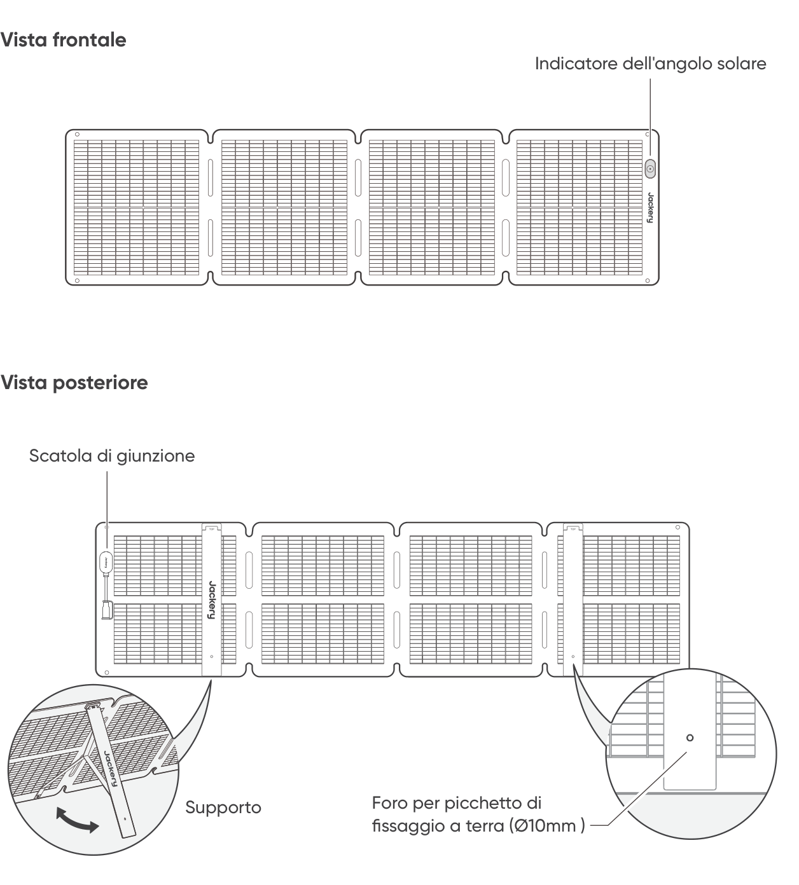

# CONSIGLI PER LA SICUREZZA

- Prima di utilizzare il prodotto, leggere il manuale d\'uso.

- Non piegare i pannelli solari.

- Non posizionare i pannelli solari su alberi, edifici o in altre zone d'ombra.

- Non immergere i pannelli solari in acqua o in altri liquidi per periodi prolungati.

- Per la pulizia, utilizzare un panno umido per pulirli delicatamente .

- Non utilizzare o conservare i pannelli solari vicino a fiamme libere o materiali infiammabili.

- Non graffiare i pannelli solari con oggetti appuntiti.

- Non applicare sostanze corrosive sui pannelli solari.

- Non calpestare o appoggiare oggetti pesanti sui pannelli solari.

- Non smontare i pannelli solari.

- Il circuito di uscita del pannello solare deve essere collegato correttamente all\'apparecchiatura ed è severamente vietato invertire il collegamento dei poli positivo e negativo.

- Prima dell'uso, verificare lo stato di connessione dei vari componenti, cavi e spine.

- Non far cadere il prodotto, poiché ciò potrebbe causare danni interni e renderlo inutilizzabile.

- Il pannello solare non è destinato a un\'installazione permanente. Conservare i pannelli solari in caso di forti venti, grandine o altre condizioni meteorologiche avverse per evitare danni o potenziali pericoli.

- In circostanze normali, i moduli fotovoltaici possono essere esposti a correnti o tensioni più elevate rispetto alle condizioni di prova standard. Pertanto, quando si calcola la tensione nominale del componente, la corrente nominale del conduttore e le dimensioni del dispositivo di controllo collegato all\'uscita fotovoltaica, è necessario moltiplicare i valori della corrente di cortocircuito (Isc) e della tensione a circuito aperto (Voc) indicati sul componente per un fattore di 1,25.

- Eventuali danni al prodotto possono causare scosse elettriche o incendi.

- Non esporre i pannelli solari a luci artificiali intense.

- Non collegare il pannello solare ad altri pannelli o fonti di energia, a meno che la combinazione non includa protezione contro la corrente inversa e la sovratensi- one.

# CONTENUTO DELLA CONFEZIONE

<figure aria-label="CONTENUTO DELLA CONFEZIONE" class="hb-inbox-composition" data-card-count="5" data-component-id="HB-SPECIAL-INBOX" data-inbox-variant="responsive-card-grid"><ol class="hb-inbox-grid"><li class="hb-inbox-card" data-item-number="1">

<strong>Jackery SolarSaga 100 Air</strong>

</li><li class="hb-inbox-card" data-item-number="2">

<strong>Custodia</strong>

</li><li class="hb-inbox-card" data-item-number="3">

<strong>Cavo di ricarica solare multifunzione (3m)</strong>

</li><li class="hb-inbox-card" data-item-number="4">

<strong>Adattatore DC8020 a DC7909</strong>

</li><li class="hb-inbox-card" data-item-number="5">

<strong>Manuale d'uso</strong>

</li></ol>

<strong>NOTA</strong>

Il cavo di ricarica solare multifunzione è compatibile solo con il pannello solare SolarSaga 100 Air (JS-100I). Non utilizzarlo con altri modelli di pannelli solari.

</figure>

# COME USARLO

<figure class="manual-step-figure">

<figcaption>
Vista frontale · Vista posteriore · Indicatore dell'angolo solare · Scatola di giunzione · Supporto · Foro per picchetto di fissaggio a terra (Ø10mm )
</figcaption>
</figure>

# APERTURA DEL PANNELLO SOLARE

<figure class="manual-step-figure">

<figcaption aria-hidden="true">
1. Estrarre il pannello solare dalla custodia.
</figcaption>
</figure>

<figure class="manual-step-figure">

<figcaption aria-hidden="true">
2. Aprire il pannello solare passo dopo passo, come mostrato nell’illustrazione.
</figcaption>
</figure>

<figure class="manual-step-figure">

<figcaption aria-hidden="true">
3. Aprire i due supporti sul retro del pannello solare.
</figcaption>
</figure>

<figure class="manual-step-figure">

<figcaption aria-hidden="true">
4. Oientare il pannello verso il sole, quindi collegarlo alla centrale elettrica portatile.
</figcaption>
</figure>

# PIEGATURA DEL PANNELLO SOLARE

<figure class="manual-step-figure">

<figcaption aria-hidden="true">
1. Scollegare il cavo di ricarica multifunzione e piegare i supporti.
</figcaption>
</figure>

<figure class="manual-step-figure">

<figcaption aria-hidden="true">
2. Piegare il pannello solare lungo le pieghe nell’ordine indicato, come mostrato nell’illustrazione.
</figcaption>
</figure>

<figure class="manual-step-figure">

<figcaption aria-hidden="true">
3. Riporre il pannello solare nella custodia.
</figcaption>
</figure>

# RICARICA DELLA CENTRALE ELETTRICA PORTATILE JACKERY

Collegare il cavo di ricarica al pannello solare e alla porta di ingresso CC della centrale elettrica portatile.

## CONNETTORE DC8020

Compatibile con le centrali elettriche portatili Jackery dotate di porta/e di ingresso DC8020.

<figure class="manual-step-figure">

<figcaption>
Maschio DC8020
</figcaption>
</figure>

## ADATTATORE DC8020-DC7909

Compatibile con le centrali elettriche portatili Jackery dotate di porta/e di ingresso DC7909.

<figure class="manual-step-figure">

<figcaption>
Adattatore DC8020-DC7909
</figcaption>
</figure>

## CAVO ADATTATORE DA DC8020 A USB-C (VENDUTO SEPARATAMENTE)

Compatibile con le centrali elettriche portatili Jackery dotate di porta/e di ingresso USB-C

<figure class="manual-step-figure">

<figcaption>
Cavo adattatore da DC8020 a USB-C
</figcaption>
</figure>

<table class="manual-callout-table" style="width:100%; border-collapse:collapse; margin:0 0 16px 0;"><tbody><tr><td class="manual-callout-label" style="width:16%; border:1px solid #000; padding:6px 8px; vertical-align:top;">
<strong>NOTA</strong>
</td><td class="manual-callout-body" style="border:1px solid #000; padding:6px 8px; vertical-align:top;">
Il cavo adattatore da DC8020 a USB-C serve esclusivamente per ricaricare la centrale elettrica portatile Jackery. Non utilizzarlo per ricaricare altri dispositivi.
</td></tr></tbody></table>

## QUANDO SI UTILIZZA IL CONNETTORE DEL PANNELLO SOLARE (VENDUTO

SEPARATAMENTE) Collegare i due pannelli solari rispettivamente al connettore del pannello solare, e poi collegare il connettore del pannello solare alla porta di ingresso DC della centrale elettrica portatile.

<figure class="manual-step-figure">

<figcaption>
Maschio DC8020 · Connettore del pannello solare
</figcaption>
</figure>

※ Assicurarsi che all\'ingresso del connettore siano collegati solo pannelli solari dello stesso modello.

# INDICATORE DELL\'ANGOLO SOLARE

Il prodotto è dotato di un indicatore dell\'angolo di incidenza del sole. Quando la luce del sole colpisce la sua superficie, sul fondo appare un\'ombra.

<figure class="manual-step-figure">

<figcaption>
Indicatore dell'angolo solare · Punto indicatore · Ombra
</figcaption>
</figure>

Se l\'ombra cade sul cerchio bianco interno alla base, significa che il pannello solare è rivolto direttamente verso il sole e che è possibile ottenere una produzione di energia ottimale; in caso contrario, si consiglia di regolare l\'angolazione fino a raggiungere tale risultato.

<figure class="manual-step-figure manual-detail-figure">

<figcaption aria-hidden="true">
L'ombra cade nel cerchio bianco interno
</figcaption>
</figure>

<figure class="manual-step-figure manual-detail-figure">

<figcaption aria-hidden="true">
L'ombra non cade nel cerchio bianco interno
</figcaption>
</figure>

<table class="manual-callout-table" style="width:100%; border-collapse:collapse; margin:0 0 16px 0;"><tbody><tr><td class="manual-callout-label" style="width:16%; border:1px solid #000; padding:6px 8px; vertical-align:top;">
<strong>NOTA</strong>
</td><td class="manual-callout-body" style="border:1px solid #000; padding:6px 8px; vertical-align:top;">
Per massimizzare la produzione di energia, regolare l’orientamento di Jackery SolarSaga 100 Air durante il giorno per garantire la piena esposizione della superficie del pannello alla luce solare diretta.
</td></tr></tbody></table>

## ALIMENTA IL TUO DISPOSITIVO

<figure class="manual-step-figure">

<figcaption>
Jackery SolarSaga 100 Air · Adattatore multifunzionale · USB-C · LED · USB-A · Cellulare · Power Bank · Tablet
</figcaption>
</figure>

<figure class="manual-step-figure">

<figcaption>
* Inserire il tappo in gomma quando le porte USB non sono in uso per evitare l'ingresso di polvere.
</figcaption>
</figure>

# PARAMETRI TECNICI

## INFORMAZIONI DI BASE

<figure aria-label="INFORMAZIONI DI BASE" class="hb-spec-table-composition"><table class="hb-spec-table manual-table manual-spec-table"><colgroup><col class="hb-spec-col-label"/><col class="hb-spec-col-value"/></colgroup>
<tbody>
<tr>
<th class="hb-spec-label manual-spec-label" scope="row">Nome del prodotto</th>
<td class="hb-spec-value manual-spec-value">Jackery SolarSaga 100 Air</td>
</tr>
<tr>
<th class="hb-spec-label manual-spec-label" scope="row">Modello</th>
<td class="hb-spec-value manual-spec-value">JS-100I</td>
</tr>
<tr>
<th class="hb-spec-label manual-spec-label" scope="row">Dimensioni (dispiegato)</th>
<td class="hb-spec-value manual-spec-value">1630 × 423 × 17mm</td>
</tr>
<tr>
<th class="hb-spec-label manual-spec-label" scope="row">Dimensioni (piegato)</th>
<td class="hb-spec-value manual-spec-value">423,5 × 423 × 47mm</td>
</tr>
<tr>
<th class="hb-spec-label manual-spec-label" scope="row">Peso</th>
<td class="hb-spec-value manual-spec-value">3,2kg ± 0,2kg</td>
</tr>
<tr>
<th class="hb-spec-label manual-spec-label" scope="row">Grado di protezione IP</th>
<td class="hb-spec-value manual-spec-value">IP68</td>
</tr>
<tr>
<th class="hb-spec-label manual-spec-label" scope="row">Gamma di Temperatura Operativa</th>
<td class="hb-spec-value manual-spec-value">Da -4℉ a 149℉ / Da -20°C a 65°C</td>
</tr>
</tbody>
</table></figure>

## DATI ELETTRICI

<figure aria-label="DATI ELETTRICI" class="hb-spec-table-composition"><table class="hb-spec-table manual-table manual-spec-table"><colgroup><col class="hb-spec-col-label"/><col class="hb-spec-col-value"/></colgroup>
<tbody>
<tr>
<th class="hb-spec-label manual-spec-label" scope="row">Potenza massima (Pmax)</th>
<td class="hb-spec-value manual-spec-value">STC*: 100W±5% / BNPI*: 110W±5%</td>
</tr>
<tr>
<th class="hb-spec-label manual-spec-label" scope="row">Tensione a circuito aperto (Voc)</th>
<td class="hb-spec-value manual-spec-value">STC*: 26,0V±5% / BNPI*: 26,3V±5%</td>
</tr>
<tr>
<th class="hb-spec-label manual-spec-label" scope="row">Corrente di corto circuito (Isc)</th>
<td class="hb-spec-value manual-spec-value">STC*: 4,95A±5% / BNPI*: 5,38A±5%</td>
</tr>
<tr>
<th class="hb-spec-label manual-spec-label" scope="row">Tensione di massima potenza (Vmp)</th>
<td class="hb-spec-value manual-spec-value">STC*: 21,7V±5% / BNPI*: 22,0V±5%</td>
</tr>
<tr>
<th class="hb-spec-label manual-spec-label" scope="row">Corrente di massima potenza (Imp)</th>
<td class="hb-spec-value manual-spec-value">STC*: 4,67A±5% / BNPI*: 5,08A±5%</td>
</tr>
<tr>
<th class="hb-spec-label manual-spec-label" scope="row">Tensione massima del sistema</th>
<td class="hb-spec-value manual-spec-value">80V</td>
</tr>
<tr>
<th class="hb-spec-label manual-spec-label" scope="row">Massima corrente inversa</th>
<td class="hb-spec-value manual-spec-value">15A</td>
</tr>
<tr>
<th class="hb-spec-label manual-spec-label" scope="row">Classe di protezione contro le scosse elettriche</th>
<td class="hb-spec-value manual-spec-value">Classe II</td>
</tr>
<tr>
<th class="hb-spec-label manual-spec-label" scope="row">Coefficiente di bifaccialità (posteriore/frontale)</th>
<td class="hb-spec-value manual-spec-value">Pmax: &gt;65%, Voc: &gt;97%, Isc: &gt;65%</td>
</tr>
<tr>
<th class="hb-spec-label manual-spec-label" scope="row">Coefficiente di temperatura della tensione</th>
<td class="hb-spec-value manual-spec-value">-0,27%/°C</td>
</tr>
<tr>
<th class="hb-spec-label manual-spec-label" scope="row">Coefficiente di temperatura della potenza</th>
<td class="hb-spec-value manual-spec-value">-0,33%/°C</td>
</tr>
<tr>
<th class="hb-spec-label manual-spec-label" scope="row">Prodotti fotovoltaici per uso domestico</th>
<td class="hb-spec-value manual-spec-value">IEC TS 63163 Categoria 2 dei prodotti per uso domestico</td>
</tr>
</tbody>
</table></figure>

## ADATTATORE MULTIFUNZIONALE

<figure aria-label="ADATTATORE MULTIFUNZIONALE" class="hb-spec-table-composition"><table class="hb-spec-table manual-table manual-spec-table"><colgroup><col class="hb-spec-col-label"/><col class="hb-spec-col-value"/></colgroup>
<tbody>
<tr>
<th class="hb-spec-label manual-spec-label" scope="row">Uscita USB-A</th>
<td class="hb-spec-value manual-spec-value">5V⎓2,4A</td>
</tr>
<tr>
<th class="hb-spec-label manual-spec-label" scope="row">Uscita USB-C</th>
<td class="hb-spec-value manual-spec-value">5V⎓3A</td>
</tr>
</tbody>
</table></figure>

\* STC (Condizioni di prova standard, 1000W/m2, 25°C, AM 1,5)

\* BNPI (Irradianza nominale bifacciale, anteriore 1000W/m2, Posteriore 135W/m2, 25°C, AM 1,5) Aprire la staffa e posizionarla su una superficie piana. Il carico di progetto è di 1600Pa, e il coefficiente di sicurezza è di 1,5 volte.

# GARANZIA

## Periodo di garanzia

### 1 ANNO --- Garanzia standard

Il prodotto è coperto da una garanzia limitata di Jackery per l\'acquirente originale, che copre il prodotto da difetti di lavorazione e di materiali per 12 mesi dalla data di acquisto (i danni dovuti a normale usura, alterazione, uso improprio, negligenza, incidente, assistenza da parte di chiunque non sia un centro di assistenza autorizzato, o a causa di forza maggiore non sono inclusi). Durante il periodo di garanzia e previa verifica dei difetti, questo prodotto sarà sostituito al momento della restituzione di apposita prova d\'acquisto.

### 2 ANNI --- Garanzia estesa

Per attivare l\'estensione della garanzia, è necessario registrare il prodotto online, oppure contattare il nostro servizio clienti all\'indirizzo <a href="mailto:hello.eu@jackery.com" class="reference external">hello.eu@jackery.com</a> per estendere il periodo di garanzia standard.

## Contatti

Per qualsiasi domanda o commento sui nostri prodotti, invia un\'e-mail a <a href="mailto:hello.eu@jackery.com" class="reference external">hello.eu@jackery.com</a> e ti risponderemo il prima possibile. Se c\'è qualche problema relativo alla qualità del prodotto, è possibile richiedere una sostituzione o un rimborso inviando un modulo di richiesta a eu.jackery.com.

## Servizio Clienti

<a href="mailto:hello.eu@jackery.com" class="reference external">hello.eu@jackery.com</a> Supporto tecnico a vita

## EU Regulations

CE Declaration of Conformity Shenzhen Hello Tech Energy Co., Ltd. hereby declares that this: Jackery SolarSaga 100 Air JS-100I is in compliance with the essential requirements and other relevant provisions of the CE Directive 2014/30/EU, 2011/65/EU+2015/863. The full text of the EU declaration of conformity is available at the following internet address: <a href="https://de.jackery.com/pages/user-guides" class="reference external">https://de.jackery.com/pages/user-guides</a> MANUFACTURER: SHENZHEN HELLO TECH ENERGY CO.,LTD. Address: F2-3, Bldg. 7, Jiaanda Science and technology industrial park factory, the east side of Huafan Road, Tongsheng Community, Dalang Street, Longhua District, Shenzhen, Guangdong, China +86 400 668 9293 <a href="mailto:sales@hello-tech.com" class="reference external">sales@hello-tech.com</a> www.hello-tech.com
