# SAFETY TIPS

- Please read the user manual first before using this product.

- Do not bend the solar panels.

- Do not place the solar panels under trees, buildings or in other shaded areas for use.

- Do not submerge the solar panels in water or any other liquid for extended periods.

- Use a damp cloth to gently wipe them clean.

- Do not use or store the solar panels near open flames or flammable materials.

- Do not scratch the solar panels with sharp objects.

- Keep corrosive substances away from the solar panels.

- Do not step on or place heavy objects on the solar panels.

- Do not disassemble the solar panels.

- The output circuit of the solar panel must be connected to the equipment properly, and reverse connection of positive and negative poles is strictly prohibited.

- Check the connection status of all components, wires, and plugs before use.

- Do not drop the product, as this may cause internal damage and render it unusable.

- The solar panel is not intended for permanent installation. Please store the solar panels during strong winds, hail or other severe weather to avoid damage or potential hazards.

- Under normal circumstances, solar panels may be exposed to higher currents or voltages than those under standard test conditions. When calculating the rated voltage of components, the rated current of conductors, and the size of the control device connected to the PV output, multiply the short-circuit current (Iₛ꜀) and open-circuit voltage (Vₒ꜀) values indicated on the panel nameplate by a factor of 1.25.

- Any damage to the product may lead to electric shock or fire.

- Do not expose the solar panels to artificial spotlight.

- Do not connect the solar panel to other solar panels or power sources unless the combination includes protection against reverse current and overvoltage.

# WHAT\'S IN THE BOX

<figure aria-label="WHAT'S IN THE BOX" class="hb-inbox-composition" data-card-count="5" data-component-id="HB-SPECIAL-INBOX" data-inbox-variant="responsive-card-grid"><ol class="hb-inbox-grid"><li class="hb-inbox-card" data-item-number="1">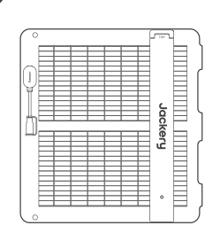

<strong>Jackery SolarSaga 100 Air</strong>

</li><li class="hb-inbox-card" data-item-number="2">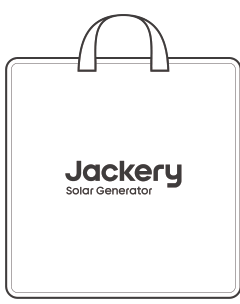

<strong>Storage Bag</strong>

</li><li class="hb-inbox-card" data-item-number="3">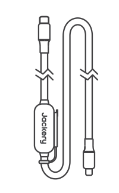

<strong>Multifunctional Solar Charging Cable (3m)</strong>

</li><li class="hb-inbox-card" data-item-number="4">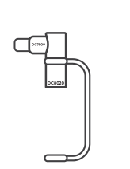

<strong>DC8020 to DC7909 Adapter</strong>

</li><li class="hb-inbox-card" data-item-number="5">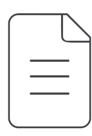

<strong>User Manual</strong>

</li></ol>

<strong>NOTE</strong>

The multifunctional solar charging cable is only compatible with the SolarSaga 100 Air (JS-100I) solar panel. Do not use it with other solar panel models.

</figure>

# HOW TO USE

The front view identifies the **Sun Angle Indicator**. The rear view identifies the **Junction Box**, **Stand**, and **Hole for Ground Stake (Ø10mm)**.

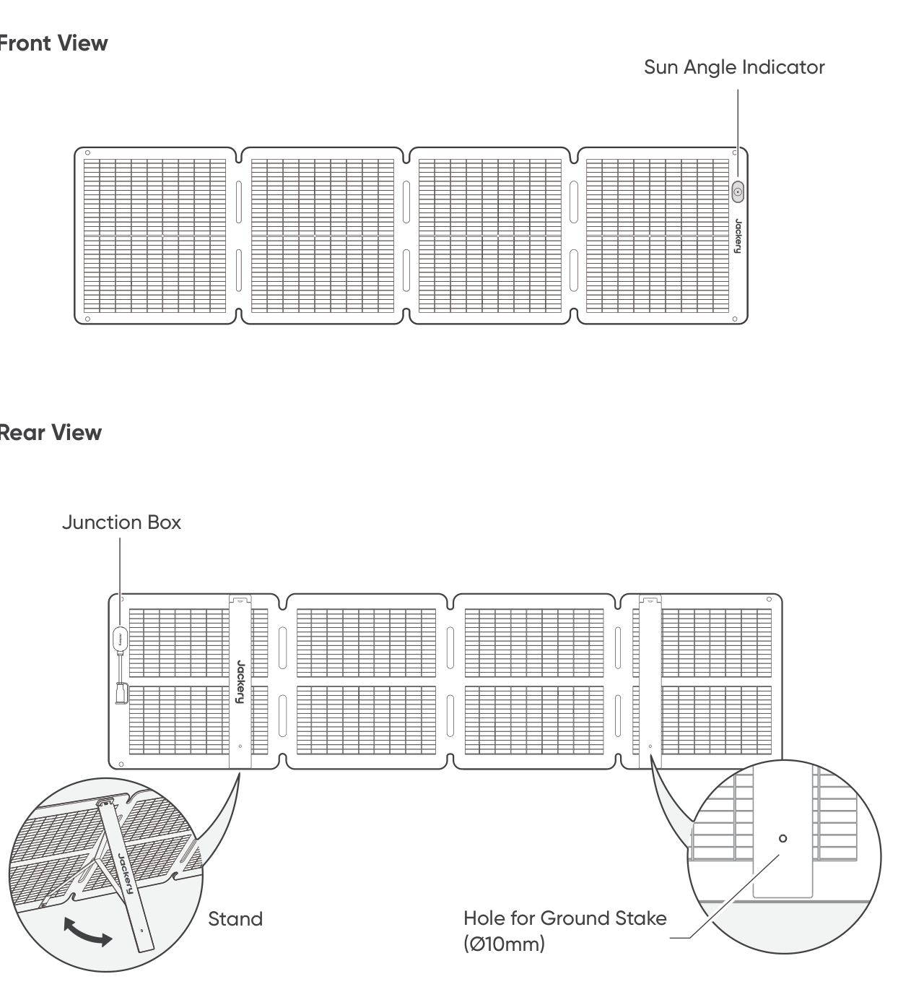

# UNFOLDING THE SOLAR PANEL

1.  Take the solar panel out of the storage bag.

2.  Unfold the solar panel step by step as shown in the illustration.

3.  Open the two support stands on the back of the solar panel.

4.  Adjust the panel to face the sun, then connect it to your portable power station.

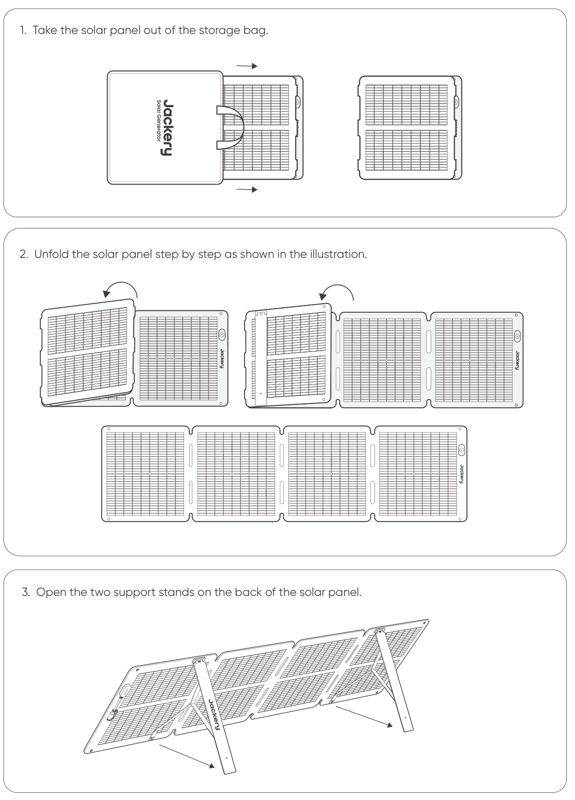 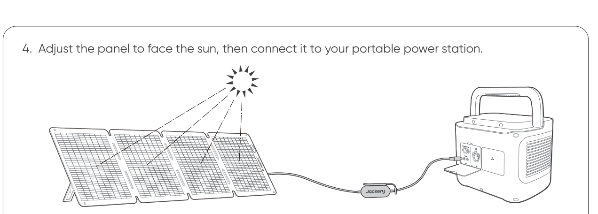

# FOLDING THE SOLAR PANEL

1.  Unplug the multifunctional charging cable and fold the support stands.

2.  Fold the solar panel along the creases in order, as shown in the illustration.

3.  Place the solar panel back into the storage bag.

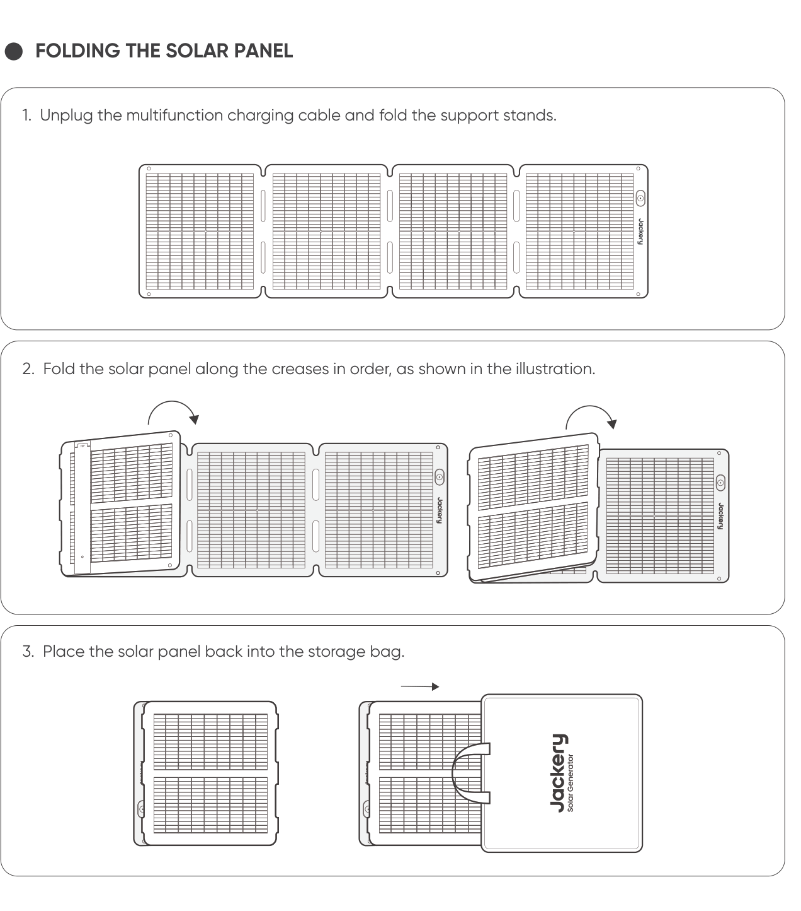

# CHARGING JACKERY PORTABLE POWER STATION

Connect the charging cable to the solar panel and the DC input port of the portable power station.

## DC8020 Connector

Compatible with Jackery portable power stations with DC8020 input port(s). Connect the **DC8020 Male** plug as shown.

## DC8020--DC7909 Adapter

Compatible with Jackery portable power stations with DC7909 input port(s). Fit the **DC8020--DC7909 Adapter** between the solar charging cable and the power station.

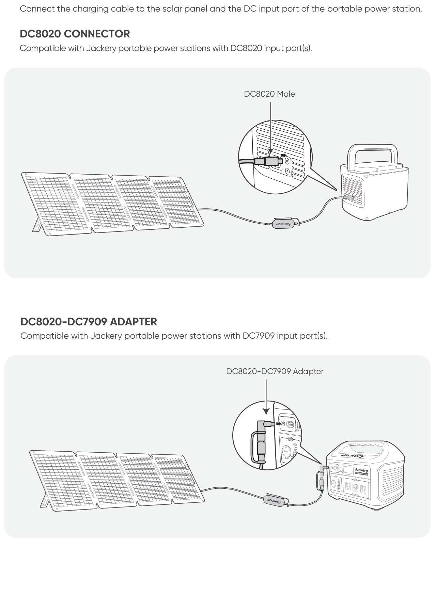

## DC8020 to USB-C Adapter Cable (Sold Separately)

Compatible with Jackery portable power stations with USB-C input port(s).

Note

The DC8020 to USB-C Adapter Cable is used to charge Jackery portable power station only. Do not use it to charge any other devices.

## When Using the Solar Panel Connector (Sold Separately)

Connect the two solar panels to the solar panel connector respectively and then connect the solar panel connector to the DC input port of the portable power station.

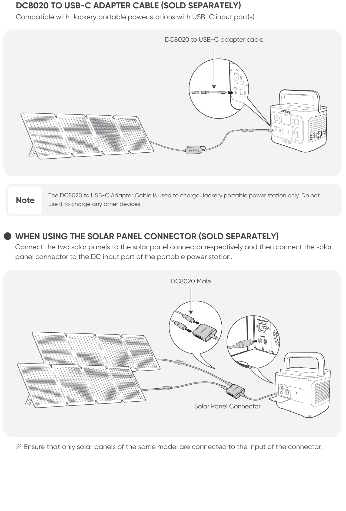

- Ensure that only solar panels of the same model are connected to the input of the connector.

# SUN ANGLE INDICATOR

The product has a sun angle indicator. When sunlight hits its surface, a shadow will appear at its bottom.

If the shadow falls on the white inner circle at its bottom, it means that the solar panel is facing directly towards the sun and you can get optimal power generation; if not, it is suggested to adjust its angle until it does.

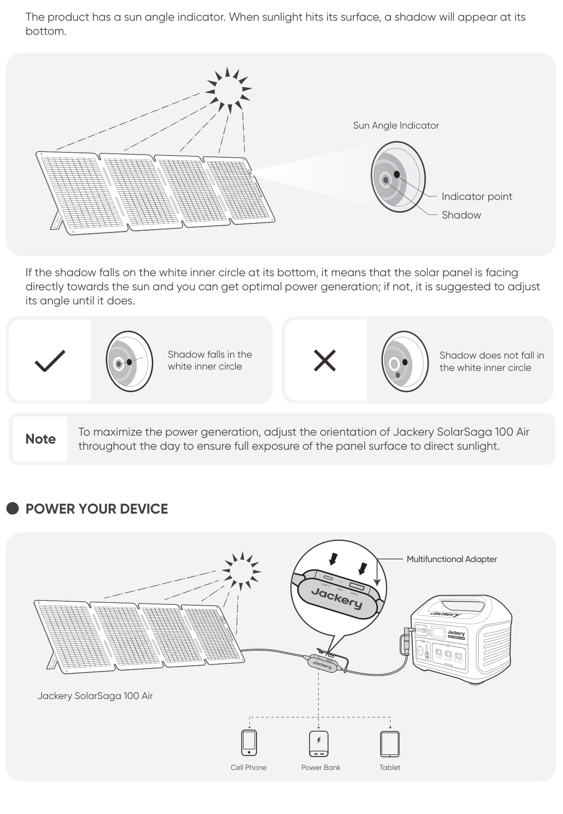

Note

To maximize the power generation, adjust the orientation of Jackery SolarSaga 100 Air throughout the day to ensure full exposure of the panel surface to direct sunlight.

## POWER YOUR DEVICE

Use the multifunctional adapter\'s USB-C, LED and USB-A interfaces to power a cell phone, power bank or tablet as shown.

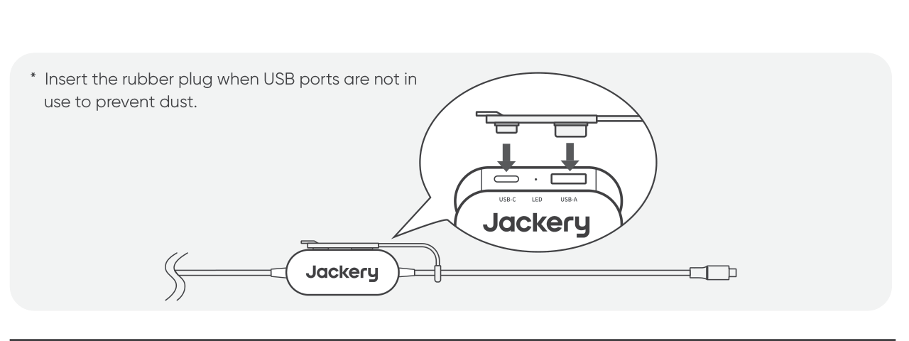

- Insert the rubber plug when USB ports are not in use to prevent dust.

# SPECIFICATIONS

## BASIC INFORMATION

<figure aria-label="BASIC INFORMATION" class="hb-spec-table-composition"><table class="hb-spec-table manual-table manual-spec-table"><colgroup><col class="hb-spec-col-label"/><col class="hb-spec-col-value"/></colgroup>
<tbody>
<tr>
<th class="hb-spec-label manual-spec-label" scope="row">Product Name</th>
<td class="hb-spec-value manual-spec-value">Jackery SolarSaga 100 Air</td>
</tr>
<tr>
<th class="hb-spec-label manual-spec-label" scope="row">Model</th>
<td class="hb-spec-value manual-spec-value">JS-100I</td>
</tr>
<tr>
<th class="hb-spec-label manual-spec-label" scope="row">Dimensions (unfolded)</th>
<td class="hb-spec-value manual-spec-value">1630 × 423 × 17 mm</td>
</tr>
<tr>
<th class="hb-spec-label manual-spec-label" scope="row">Dimensions (folded)</th>
<td class="hb-spec-value manual-spec-value">423.5 × 423 × 47 mm</td>
</tr>
<tr>
<th class="hb-spec-label manual-spec-label" scope="row">Weight</th>
<td class="hb-spec-value manual-spec-value">3.2 kg ± 0.2 kg</td>
</tr>
<tr>
<th class="hb-spec-label manual-spec-label" scope="row">IP Rating</th>
<td class="hb-spec-value manual-spec-value">IP68</td>
</tr>
<tr>
<th class="hb-spec-label manual-spec-label" scope="row">Operating Temperature Range</th>
<td class="hb-spec-value manual-spec-value">-20°C to 65°C</td>
</tr>
</tbody>
</table></figure>

## ELECTRICAL DATA

<figure aria-label="ELECTRICAL DATA" class="hb-spec-table-composition"><table class="hb-spec-table manual-table manual-spec-table"><colgroup><col class="hb-spec-col-label"/><col class="hb-spec-col-value"/></colgroup>
<tbody>
<tr>
<th class="hb-spec-label manual-spec-label" scope="row">Maximum Power (Pₘₐₓ)</th>
<td class="hb-spec-value manual-spec-value">STC*: 100 W ± 5% / BNPI*: 110 W ± 5%</td>
</tr>
<tr>
<th class="hb-spec-label manual-spec-label" scope="row">Open-Circuit Voltage (Vₒ꜀)</th>
<td class="hb-spec-value manual-spec-value">STC*: 26.0 V ± 5% / BNPI*: 26.3 V ± 5%</td>
</tr>
<tr>
<th class="hb-spec-label manual-spec-label" scope="row">Short-Circuit Current (Iₛ꜀)</th>
<td class="hb-spec-value manual-spec-value">STC*: 4.95 A ± 5% / BNPI*: 5.38 A ± 5%</td>
</tr>
<tr>
<th class="hb-spec-label manual-spec-label" scope="row">Maximum Power Voltage (Vₘₚ)</th>
<td class="hb-spec-value manual-spec-value">STC*: 21.7 V ± 5% / BNPI*: 22.0 V ± 5%</td>
</tr>
<tr>
<th class="hb-spec-label manual-spec-label" scope="row">Maximum Power Current (Iₘₚ)</th>
<td class="hb-spec-value manual-spec-value">STC*: 4.67 A ± 5% / BNPI*: 5.08 A ± 5%</td>
</tr>
<tr>
<th class="hb-spec-label manual-spec-label" scope="row">Maximum System Voltage</th>
<td class="hb-spec-value manual-spec-value">80 V</td>
</tr>
<tr>
<th class="hb-spec-label manual-spec-label" scope="row">Maximum Reverse Current</th>
<td class="hb-spec-value manual-spec-value">15 A</td>
</tr>
<tr>
<th class="hb-spec-label manual-spec-label" scope="row">Protection Class Against Electric Shock</th>
<td class="hb-spec-value manual-spec-value">Class II</td>
</tr>
<tr>
<th class="hb-spec-label manual-spec-label" scope="row">Bifaciality Coefficient (back/front)</th>
<td class="hb-spec-value manual-spec-value">Pₘₐₓ &gt;65%, Vₒ꜀ &gt;97%, Iₛ꜀ &gt;65%</td>
</tr>
<tr>
<th class="hb-spec-label manual-spec-label" scope="row">Voltage Temperature Coefficient</th>
<td class="hb-spec-value manual-spec-value">-0.27%/°C</td>
</tr>
<tr>
<th class="hb-spec-label manual-spec-label" scope="row">Power Temperature Coefficient</th>
<td class="hb-spec-value manual-spec-value">-0.33%/°C</td>
</tr>
<tr>
<th class="hb-spec-label manual-spec-label" scope="row">Photovoltaic Consumer Products</th>
<td class="hb-spec-value manual-spec-value">IEC TS 63163 Consumer Product Category 2</td>
</tr>
</tbody>
</table></figure>

## MULTIFUNCTIONAL ADAPTER

<figure aria-label="MULTIFUNCTIONAL ADAPTER" class="hb-spec-table-composition"><table class="hb-spec-table manual-table manual-spec-table"><colgroup><col class="hb-spec-col-label"/><col class="hb-spec-col-value"/></colgroup>
<tbody>
<tr>
<th class="hb-spec-label manual-spec-label" scope="row">USB-A Output</th>
<td class="hb-spec-value manual-spec-value">5 V⎓2.4 A</td>
</tr>
<tr>
<th class="hb-spec-label manual-spec-label" scope="row">USB-C Output</th>
<td class="hb-spec-value manual-spec-value">5 V⎓3 A</td>
</tr>
</tbody>
</table></figure>

\* STC (Standard Test Conditions, 1000 W/m², 25°C, AM1.5).

\* BNPI (Bifacial Nameplate Irradiance, Front 1000 W/m², Rear 135 W/m², 25°C, AM1.5).

Unfold the bracket and place it on a flat surface. The design load is 1600 Pa, and the safety factor is 1.5 times.

# WARRANTY

## Warranty Period

### 1 YEAR --- Standard Warranty

The product is covered by a limited warranty from Jackery for the original purchaser that covers the product from defects in workmanship and materials for 12 months from the date of purchase (damages from normal wear and tear, alteration, misuse, neglect, accident, service by anyone other than authorized service center, or act of God are not included). During the warranty period and upon verification of defects, this product will be replaced when returned with proper proof of purchase.

### 2 YEARS --- Extended Warranty

To activate the Warranty Extension, you must register your product online or contact our customer service team at <a href="mailto:hello.eu@jackery.com" class="reference external">hello.eu@jackery.com</a> to extend the standard warranty runtime.

## Contact Us

For any inquiries or comments concerning our products, please send an email to <a href="mailto:hello.eu@jackery.com" class="reference external">hello.eu@jackery.com</a>, and we will respond to you as soon as possible. If there is any quality-related issue with the product, you may request a replacement or refund by submitting a request form at www.jackery.com.

## Customer Service

**hello.eu@jackery.com** --- Lifetime technical support
