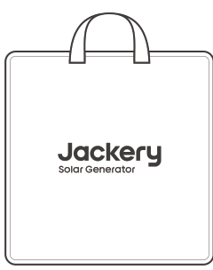
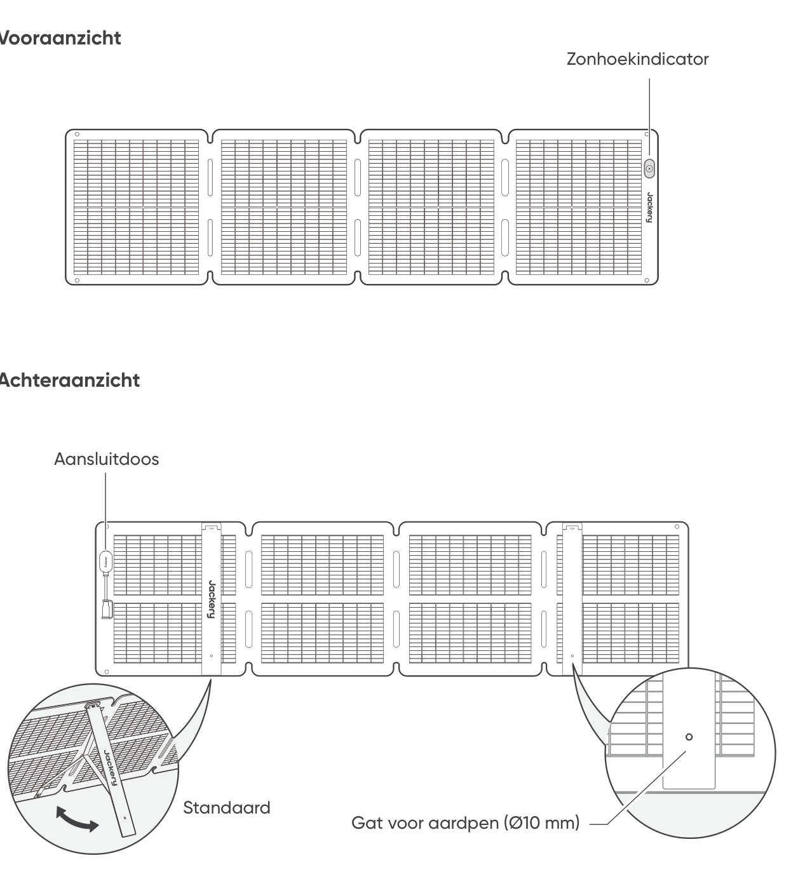
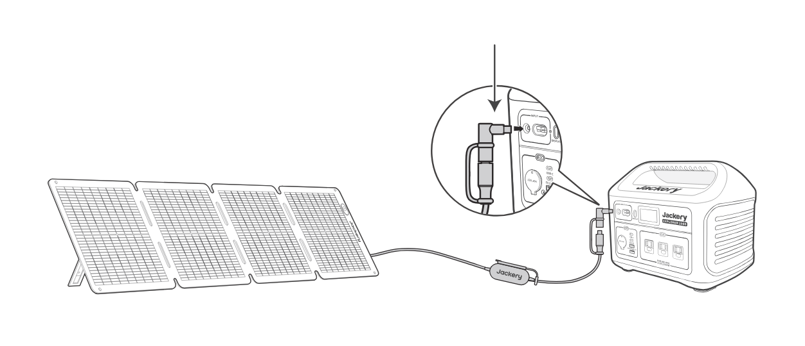

# VEILIGHEIDSTIPS

- Lees eerst de handleiding voordat u dit product gebruikt.

- Buig de zonnepanelen niet.

- Plaats de zonnepanelen niet onder bomen, gebouwen of in andere schaduwrijke gebieden.

- Dompel de zonnepanelen niet gedurende langere tijd onder in water of een andere vloeistof.

- Gebruik een vochtige doek om ze voorzichtig schoon te vegen.

- Gebruik of bewaar de zonnepanelen niet in de buurt van open vuur of brandbare materialen.

- Kras niet op de zonnepanelen met scherpe voorwerpen.

- Houd corrosieve stoffen uit de buurt van de zonnepanelen.

- Ga niet op de zonnepanelen staan of plaats er geen zware voorwerpen op.

- Demonteer de zonnepanelen niet.

- Het uitgangscircuit van het zonnepaneel moet correct op het apparaat worden aangesloten en een omgekeerde aansluiting van de plus- en minpool is streng verboden.

- Controleer vóór gebruik de verbindingsstatus van alle onderdelen, draden en stekkers.

- Laat het product niet vallen, omdat dit interne schade kan veroorzaken en het onbruikbaar kan maken.

- Het zonnepaneel is niet bedoeld voor permanente installatie. Berg de zonnepanelen op bij harde wind, hagel of ander extreem weer om schade of mogelijke gevaren te voorkomen.

- Onder normale omstandigheden kunnen zonnepanelen worden blootgesteld aan hogere stromen of spanningen dan die onder standaard testomstandigheden. Wanneer u de nominale spanning van componenten, de nominale stroom van geleiders en de grootte van het regelapparaat die op de PV-uitgang is aangesloten, berekent, vermenigvuldigt u de op het typeplaatje aangegeven kortsluitstroom (Isc) en openklemspanning (Voc) met een factor 1,25.

- Elke schade aan het product kan leiden tot een elektrische schok of brand.

- Stel de zonnepanelen niet bloot aan kunstlicht.

- Sluit het zonnepaneel niet aan op andere zonnepanelen of stroombronnen, tenzij de combinatie bescherming tegen terugstroom en overspanning omvat.

# WAT ZIT ER IN DE DOOS

<figure aria-label="WAT ZIT ER IN DE DOOS" class="hb-inbox-composition" data-card-count="5" data-component-id="HB-SPECIAL-INBOX" data-inbox-variant="responsive-card-grid"><ol class="hb-inbox-grid"><li class="hb-inbox-card" data-item-number="1">

<strong>Jackery SolarSaga 100 Air</strong>

</li><li class="hb-inbox-card" data-item-number="2">

<strong>Opbergtas</strong>

</li><li class="hb-inbox-card" data-item-number="3">

<strong>Multifunctionele zonne-oplaadkabel (3 m)</strong>

</li><li class="hb-inbox-card" data-item-number="4">

<strong>DC8020-naar-DC7909-adapter</strong>

</li><li class="hb-inbox-card" data-item-number="5">

<strong>Gebruikershandleiding</strong>

</li></ol>

<strong>OPMERKING</strong>

De multifunctionele zonne-oplaadkabel is alleen compatibel met het SolarSaga 100 Air (JS-100I) zonnepaneel. Gebruik deze niet met andere zonnepaneelmodellen.

</figure>

# HOE TE GEBRUIKEN

<figure class="manual-step-figure">

<figcaption>
Vooraanzicht · Achteraanzicht · Zonhoekindicator · Aansluitdoos · Standaard · Gat voor aardpen (Ø10 mm)
</figcaption>
</figure>

# HET ZONNEPANEEL UITVOUWEN

<figure class="manual-step-figure">

<figcaption aria-hidden="true">
1. Haal het zonnepaneel uit de opbergtas.
</figcaption>
</figure>

<figure class="manual-step-figure">

<figcaption aria-hidden="true">
2. Vouw het zonnepaneel stap voor stap uit zoals weergegeven in de afbeelding.
</figcaption>
</figure>

<figure class="manual-step-figure">

<figcaption aria-hidden="true">
3. Open de twee steunpoten aan de achterkant van het zonnepaneel.
</figcaption>
</figure>

<figure class="manual-step-figure">

<figcaption aria-hidden="true">
4. Richt het paneel naar de zon en sluit het vervolgens aan op uw draagbare powerstation.
</figcaption>
</figure>

# HET ZONNEPANEEL OPVOUWEN

<figure class="manual-step-figure">

<figcaption aria-hidden="true">
1. Koppel de multifunctionele oplaadkabel los en vouw de steunpoten in.
</figcaption>
</figure>

<figure class="manual-step-figure">

<figcaption aria-hidden="true">
2. Vouw het zonnepaneel langs de vouwlijnen in volgorde, zoals weergegeven in de afbeelding.
</figcaption>
</figure>

<figure class="manual-step-figure">

<figcaption aria-hidden="true">
3. Plaats het zonnepaneel terug in de opbergtas.
</figcaption>
</figure>

# JACKERY DRAAGBARE POWERSTATION OPLADEN

Sluit de oplaadkabel aan op het zonnepaneel en de DC-ingang van de draagbare powerstation.

## DC8020-AANSLUITING

Compatibel met Jackery draagbare powerstations met DC8020-ingang(en).

<figure class="manual-step-figure">

<figcaption>
DC8020 mannelijk
</figcaption>
</figure>

## DC8020-DC7909-ADAPTER

Compatibel met Jackery draagbare powerstations met DC7909-ingang(en).

<figure class="manual-step-figure">

<figcaption>
DC8020-DC7909-adapter
</figcaption>
</figure>

## DC8020 NAAR USB-C ADAPTERKABEL (APART VERKRIJGBAAR)

Compatibel met Jackery draagbare powerstations met USB-C-ingang(en)

<figure class="manual-step-figure">

<figcaption>
DC8020-naar-USB-C-adapterkabel
</figcaption>
</figure>

<table class="manual-callout-table" style="width:100%; border-collapse:collapse; margin:0 0 16px 0;"><tbody><tr><td class="manual-callout-label" style="width:16%; border:1px solid #000; padding:6px 8px; vertical-align:top;">
<strong>OPMERKING</strong>
</td><td class="manual-callout-body" style="border:1px solid #000; padding:6px 8px; vertical-align:top;">
De DC8020-naar-USB-C-adapterkabel wordt alleen gebruikt om Jackery draagbare powerstation op te laden. Gebruik deze niet om andere apparaten op te laden.
</td></tr></tbody></table>

## BIJ GEBRUIK VAN DE ZONNEPANEELAANSLUITING (APART VERKRIJGBAAR)

Sluit de twee zonnepanelen afzonderlijk aan op de zonnepaneelaansluiting en sluit vervolgens de zonnepaneelaansluiting aan op de DC-ingang van het draagbare powerstation.

<figure class="manual-step-figure">

<figcaption>
DC8020 mannelijk · Zonnepaneelaansluiting
</figcaption>
</figure>

※ Zorg ervoor dat alleen zonnepanelen van hetzelfde model worden aangesloten op de ingang van de aansluiting.

# ZONHOEKINDICATOR

Het product beschikt over een zonhoekindicator. Wanneer er zonlicht op het oppervlak valt, verschijnt er onderaan een schaduw.

<figure class="manual-step-figure">

<figcaption>
Zonhoekindicator · Indicatorpunt · Schaduw
</figcaption>
</figure>

Wanneer de schaduw onderaan op de witte binnenste cirkel valt, betekent dit dat het zonnepaneel rechtstreeks naar de zon is gericht en u een optimale stroomopbrengst kunt behalen; indien dit niet het geval is, wordt aangeraden de hoek aan te passen totdat dit wel zo is.

<figure class="manual-step-figure manual-detail-figure">

<figcaption aria-hidden="true">
De schaduw valt in de witte binnenste cirkel
</figcaption>
</figure>

<figure class="manual-step-figure manual-detail-figure">

<figcaption aria-hidden="true">
De schaduw valt niet in de witte binnenste cirkel
</figcaption>
</figure>

<table class="manual-callout-table" style="width:100%; border-collapse:collapse; margin:0 0 16px 0;"><tbody><tr><td class="manual-callout-label" style="width:16%; border:1px solid #000; padding:6px 8px; vertical-align:top;">
<strong>OPMERKING</strong>
</td><td class="manual-callout-body" style="border:1px solid #000; padding:6px 8px; vertical-align:top;">
Om de stroomopbrengst te maximaliseren, past u gedurende de dag de oriëntatie van de Jackery SolarSaga 100 Air aan, zodat het paneeloppervlak volledig wordt blootgesteld aan direct zonlicht.
</td></tr></tbody></table>

## UW APPARAAT OPLADEN

<figure class="manual-step-figure">

<figcaption>
Jackery SolarSaga 100 Air · Multifunctionele adapter · USB-C · LED · USB-A · Mobiele telefoon · Powerbank · Tablet
</figcaption>
</figure>

<figure class="manual-step-figure">

<figcaption>
* Plaats de rubberen dop wanneer de USB-poorten niet worden gebruikt om stof te voorkomen.
</figcaption>
</figure>

# TECHNISCHE PARAMETERS

## BASISINFORMATIE

<figure aria-label="BASISINFORMATIE" class="hb-spec-table-composition"><table class="hb-spec-table manual-table manual-spec-table"><colgroup><col class="hb-spec-col-label"/><col class="hb-spec-col-value"/></colgroup>
<tbody>
<tr>
<th class="hb-spec-label manual-spec-label" scope="row">Productnaam</th>
<td class="hb-spec-value manual-spec-value">Jackery SolarSaga 100 Air</td>
</tr>
<tr>
<th class="hb-spec-label manual-spec-label" scope="row">Model</th>
<td class="hb-spec-value manual-spec-value">JS-100I</td>
</tr>
<tr>
<th class="hb-spec-label manual-spec-label" scope="row">Afmetingen (uitgevouwen)</th>
<td class="hb-spec-value manual-spec-value">1630 × 423 × 17 mm</td>
</tr>
<tr>
<th class="hb-spec-label manual-spec-label" scope="row">Afmetingen (opgevouwen)</th>
<td class="hb-spec-value manual-spec-value">423,5 × 423 × 47 mm</td>
</tr>
<tr>
<th class="hb-spec-label manual-spec-label" scope="row">Gewicht</th>
<td class="hb-spec-value manual-spec-value">3,2 kg ± 0,2 kg</td>
</tr>
<tr>
<th class="hb-spec-label manual-spec-label" scope="row">IP-classificatie</th>
<td class="hb-spec-value manual-spec-value">IP68</td>
</tr>
<tr>
<th class="hb-spec-label manual-spec-label" scope="row">Bedrijfstemperatuurbereik</th>
<td class="hb-spec-value manual-spec-value">-20°C tot 65°C</td>
</tr>
</tbody>
</table></figure>

## ELEKTRISCHE GEGEVENS

<figure aria-label="ELEKTRISCHE GEGEVENS" class="hb-spec-table-composition"><table class="hb-spec-table manual-table manual-spec-table"><colgroup><col class="hb-spec-col-label"/><col class="hb-spec-col-value"/></colgroup>
<tbody>
<tr>
<th class="hb-spec-label manual-spec-label" scope="row">Maximaal vermogen (Pmax)</th>
<td class="hb-spec-value manual-spec-value">STC*: 100 W ± 5% / BNPI*: 110W ± 5%</td>
</tr>
<tr>
<th class="hb-spec-label manual-spec-label" scope="row">Openklemspanning (Voc)</th>
<td class="hb-spec-value manual-spec-value">STC*: 26,0V ± 5% / BNPI*: 26,3V ± 5%</td>
</tr>
<tr>
<th class="hb-spec-label manual-spec-label" scope="row">Kortsluitstroom (Isc)</th>
<td class="hb-spec-value manual-spec-value">STC*: 4,95A ± 5% / BNPI*: 5,38A ± 5%</td>
</tr>
<tr>
<th class="hb-spec-label manual-spec-label" scope="row">Maximale vermogensspanning – Vmp</th>
<td class="hb-spec-value manual-spec-value">STC*: 21,7V ± 5% / BNPI*: 22,0V ± 5%</td>
</tr>
<tr>
<th class="hb-spec-label manual-spec-label" scope="row">Maximale vermogensstroom (Imp)</th>
<td class="hb-spec-value manual-spec-value">STC*: 4,67A ± 5% / BNPI*: 5,08A ± 5%</td>
</tr>
<tr>
<th class="hb-spec-label manual-spec-label" scope="row">Maximale systeemspanning</th>
<td class="hb-spec-value manual-spec-value">80 V</td>
</tr>
<tr>
<th class="hb-spec-label manual-spec-label" scope="row">Maximale terugstroom</th>
<td class="hb-spec-value manual-spec-value">15A</td>
</tr>
<tr>
<th class="hb-spec-label manual-spec-label" scope="row">Beschermingsklasse tegen elektrische schokken</th>
<td class="hb-spec-value manual-spec-value">Klasse II</td>
</tr>
<tr>
<th class="hb-spec-label manual-spec-label" scope="row">Bifaciale coëfficiënt (achterzijde/voorzijde)</th>
<td class="hb-spec-value manual-spec-value">Pmax: &gt;65%, Voc: &gt;97%, Isc: &gt;65%</td>
</tr>
<tr>
<th class="hb-spec-label manual-spec-label" scope="row">Temperatuurcoëfficiënt van spanning</th>
<td class="hb-spec-value manual-spec-value">-0,27%/°C</td>
</tr>
<tr>
<th class="hb-spec-label manual-spec-label" scope="row">Temperatuurcoëfficiënt van het vermogen</th>
<td class="hb-spec-value manual-spec-value">-0,33%/°C</td>
</tr>
<tr>
<th class="hb-spec-label manual-spec-label" scope="row">Fotovoltaïsche consumentenproducten</th>
<td class="hb-spec-value manual-spec-value">IEC TS 63163 Consumentenproductcategorie 2</td>
</tr>
</tbody>
</table></figure>

## MULTIFUNCTIONELE ADAPTER

<figure aria-label="MULTIFUNCTIONELE ADAPTER" class="hb-spec-table-composition"><table class="hb-spec-table manual-table manual-spec-table"><colgroup><col class="hb-spec-col-label"/><col class="hb-spec-col-value"/></colgroup>
<tbody>
<tr>
<th class="hb-spec-label manual-spec-label" scope="row">USB-A-uitgang</th>
<td class="hb-spec-value manual-spec-value">5 V⎓2,4 A</td>
</tr>
<tr>
<th class="hb-spec-label manual-spec-label" scope="row">USB-C-uitgang</th>
<td class="hb-spec-value manual-spec-value">5V⎓3A</td>
</tr>
</tbody>
</table></figure>

\* STC (Standaard testcondities, 1000W/m2, 25°C, AM 1,5)

\* BNPI (bifaciale nominale instraling, voorzijde 1000 W/m2, achterzijde 135 W/m2, 25 °C, AM 1,5) Vouw het frame uit en plaats het op een vlak oppervlak. De ontwerplast is 1600Pa en de veiligheidsfactor is 1,5 keer.

# GARANTIE

## Garantieperiode

### 1 JAAR --- Standaardgarantie

Het product wordt gedekt door een beperkte garantie van Jackery voor de oorspronkelijke koper, die het product dekt tegen fabricage- en materiaalfouten gedurende 12 maanden na de datum van aankoop (schade door normale slijtage, wijziging, misbruik, nalatigheid, ongeval, service door anderen dan een erkend servicecentrum of overmacht is uitgesloten). Tijdens de garantieperiode en na verificatie van gebreken, zal dit product worden vervangen wanneer het wordt geretourneerd met een geldig aankoopbewijs.

### 2 JAAR --- Verlengde garantie

Om de garantieverlenging te activeren, moet u uw product online registreren of contact opnemen met onze klantenservice via <a href="mailto:hello.eu@jackery.com" class="reference external">hello.eu@jackery.com</a> om de duur van de standaardgarantie te verlengen.

## NEEM CONTACT MET ONS OP

Stuur uw vragen of opmerkingen over onze producten naar <a href="mailto:hello.eu@jackery.com" class="reference external">hello.eu@jackery.com</a>, we zullen u zo snel mogelijk beantwoorden. Als er sprake is van een kwaliteitsprobleem met het product, kunt u een vervangend product of terugbetaling aanvragen door een aanvraagformulier in te vullen op www.jackery.com.

## KLANTENSERVICE

<a href="mailto:hello.eu@jackery.com" class="reference external">hello.eu@jackery.com</a> Levenslange technische ondersteuning

## EU Regulations

CE Declaration of Conformity Shenzhen Hello Tech Energy Co., Ltd. hereby declares that this: Jackery SolarSaga 100 Air JS-100I is in compliance with the essential requirements and other relevant provisions of the CE Directive 2014/30/EU, 2011/65/EU+2015/863. The full text of the EU declaration of conformity is available at the following internet address: <a href="https://de.jackery.com/pages/user-guides" class="reference external">https://de.jackery.com/pages/user-guides</a> MANUFACTURER: SHENZHEN HELLO TECH ENERGY CO.,LTD. Address: F2-3, Bldg. 7, Jiaanda Science and technology industrial park factory, the east side of Huafan Road, Tongsheng Community, Dalang Street, Longhua District, Shenzhen, Guangdong, China +86 400 668 9293 <a href="mailto:sales@hello-tech.com" class="reference external">sales@hello-tech.com</a> www.hello-tech.com
