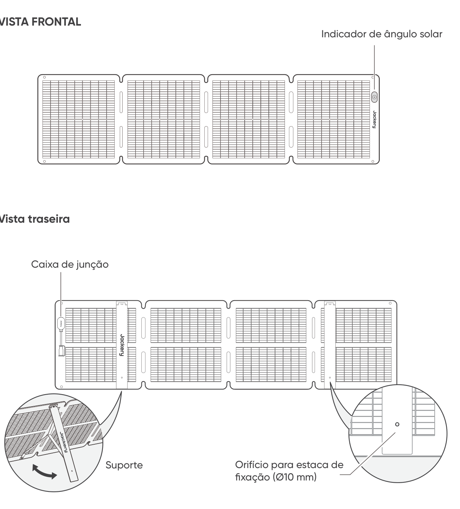

# DICAS DE SEGURANÇA

- Leia o manual do usuário antes de usar este produto.

- Não dobre os painéis solares.

- Não utilize os painéis solares sob árvores, edifícios ou em outras áreas sombreadas.

- Não mergulhe os painéis solares em água ou qualquer outro líquido por períodos prolongados.

- Use um pano úmido para limpá-los suavemente.

- Não use nem armazene os painéis solares próximo de chamas abertas ou materiais inflamáveis.

- Não risque os painéis solares com objetos pontiagudos.

- Mantenha substâncias corrosivas afastadas dos painéis solares.

- Não pise nem coloque objetos pesados sobre os painéis solares.

- Não desmonte os painéis solares.

- O circuito de saída do painel solar deve ser conectado corretamente ao equipamento, sendo estritamente proibida a conexão invertida dos polos positivo e negativo.

- Verifique o estado da conexão de todos os componentes, fios e plugues antes do uso.

- Não deixe o produto cair, pois isso pode causar danos internos e torná-lo inutilizável.

- O painel solar não foi projetado para instalação permanente. Guarde os painéis solares durante ventos fortes, tempestades de granizo ou outras condições climáticas severas para evitar danos ou possíveis riscos.

- Em condições normais de uso, os painéis solares podem ser expostos a correntes ou tensões mais elevadas do que as especificadas nas condições padrão de teste. Ao calcular a tensão nominal dos componentes, a corrente nominal dos condutores e a capacidade do dispositivo de controle conectado à saída fotovoltaica (PV), multiplique os valores da corrente de curto-circuito (Isc) e da tensão de circuito aberto (Voc) indicados na placa de identificação do painel por um fator de 1,25.

- Qualquer dano ao produto pode causar choque elétrico ou incêndio.

- Não exponha os painéis solares a luz artificial de holofotes.

- Não conecte o painel solar a outros painéis solares ou fontes de energia, a menos que a combinação inclua proteção contra corrente reversa e sobretensão.

# CONTEÚDO DA EMBALAGEM

<figure aria-label="CONTEÚDO DA EMBALAGEM" class="hb-inbox-composition" data-card-count="5" data-component-id="HB-SPECIAL-INBOX" data-inbox-variant="responsive-card-grid"><ol class="hb-inbox-grid"><li class="hb-inbox-card" data-item-number="1">

<strong>Jackery SolarSaga 100 Air</strong>

</li><li class="hb-inbox-card" data-item-number="2">

<strong>Bolsa de armazenamento</strong>

</li><li class="hb-inbox-card" data-item-number="3">

<strong>Cabo de carregamento solar multifuncional (3 m)</strong>

</li><li class="hb-inbox-card" data-item-number="4">

<strong>Adaptador DC8020 para DC7909</strong>

</li><li class="hb-inbox-card" data-item-number="5">

<strong>Manual do usuário</strong>

</li></ol>

<strong>NOTA</strong>

O cabo de carregamento solar multifuncional é compatível apenas com o painel solar SolarSaga 100 Air (JS-100I). Não o utilize com outros modelos de painel solar.

</figure>

# COMO USAR

<figure class="manual-step-figure">

<figcaption>
VISTA FRONTAL · Vista traseira · Indicador de ângulo solar · Caixa de junção · Suporte · Orifício para estaca de fixação (Ø10 mm)
</figcaption>
</figure>

# DESDOBRANDO O PAINEL SOLAR

<figure class="manual-step-figure">

<figcaption aria-hidden="true">
1. Retire o painel solar da bolsa de armazenamento.
</figcaption>
</figure>

<figure class="manual-step-figure">

<figcaption aria-hidden="true">
2. Desdobre o painel solar passo a passo, conforme mostrado na ilustração.
</figcaption>
</figure>

<figure class="manual-step-figure">

<figcaption aria-hidden="true">
3. Abra os dois suportes localizados na parte traseira do painel solar.
</figcaption>
</figure>

<figure class="manual-step-figure">

<figcaption aria-hidden="true">
4. Ajuste o painel para que fique voltado para o sol e depois conecte-o à sua estação de energia portátil.
</figcaption>
</figure>

# DOBRANDO O PAINEL SOLAR

<figure class="manual-step-figure">

<figcaption aria-hidden="true">
1. Desconecte o cabo de carregamento multifuncional e dobre os suportes de apoio.
</figcaption>
</figure>

<figure class="manual-step-figure">

<figcaption aria-hidden="true">
2. Dobre o painel solar ao longo das dobras, seguindo a ordem indicada na ilustração.
</figcaption>
</figure>

<figure class="manual-step-figure">

<figcaption aria-hidden="true">
3. Coloque o painel solar de volta na bolsa de armazenamento.
</figcaption>
</figure>

# CARREGAMENTO DA ESTAÇÃO DE ENERGIA PORTÁTIL JACKERY

Conecte o cabo de carregamento ao painel solar e à porta de entrada CC da estação de energia portátil.

## CONECTOR DC8020

Compatível com estações de energia portáteis Jackery com porta(s) de entrada DC8020.

<figure class="manual-step-figure">

<figcaption>
DC8020 Macho
</figcaption>
</figure>

## ADAPTADOR DC8020-DC7909

Compatível com estações de energia portáteis Jackery com porta(s) de entrada DC7909.

<figure class="manual-step-figure">

<figcaption>
Adaptador DC8020-DC7909
</figcaption>
</figure>

## CABO ADAPTADOR DC8020 PARA USB-C (VENDIDO SEPARADAMENTE)

Compatível com estações de energia portáteis Jackery com porta(s) de entrada USB-C.

<figure class="manual-step-figure">

<figcaption>
Cabo adaptador DC8020 para USB-C
</figcaption>
</figure>

<table class="manual-callout-table" style="width:100%; border-collapse:collapse; margin:0 0 16px 0;"><tbody><tr><td class="manual-callout-label" style="width:16%; border:1px solid #000; padding:6px 8px; vertical-align:top;">
<strong>NOTA</strong>
</td><td class="manual-callout-body" style="border:1px solid #000; padding:6px 8px; vertical-align:top;">
O cabo adaptador DC8020 para USB-C destina-se apenas a carregar a estação de energia portátil Jackery. Não o utilize para carregar outros dispositivos.
</td></tr></tbody></table>

## AO USAR O CONECTOR PARA PAINEL SOLAR (VENDIDO SEPARADAMENTE)

Conecte os dois painéis solares ao conector para painel solar, respectivamente, e depois conecte o conector à porta de entrada CC da estação de energia portátil.

<figure class="manual-step-figure">

<figcaption>
DC8020 Macho · Conector para painel solar
</figcaption>
</figure>

※ Certifique-se de que apenas painéis solares do mesmo modelo sejam conectados à entrada do conector.

# INDICADOR DE ÂNGULO SOLAR

O produto possui um indicador de ângulo solar. Quando a luz solar atinge a superfície do indicador, uma sombra aparece na parte inferior.

<figure class="manual-step-figure">

<figcaption>
Indicador de ângulo solar · Ponto indicador · Sombra
</figcaption>
</figure>

Se a sombra cair sobre o círculo branco interno na parte inferior, isso significa que o painel solar está diretamente voltado para o sol, e você obterá a geração ideal de energia; caso contrário, ajuste o ângulo até que isso aconteça.

<figure class="manual-step-figure manual-detail-figure">

<figcaption aria-hidden="true">
A sombra cai no círculo interno branco
</figcaption>
</figure>

<figure class="manual-step-figure manual-detail-figure">

<figcaption aria-hidden="true">
A sombra não cai no círculo interno branco
</figcaption>
</figure>

<table class="manual-callout-table" style="width:100%; border-collapse:collapse; margin:0 0 16px 0;"><tbody><tr><td class="manual-callout-label" style="width:16%; border:1px solid #000; padding:6px 8px; vertical-align:top;">
<strong>NOTA</strong>
</td><td class="manual-callout-body" style="border:1px solid #000; padding:6px 8px; vertical-align:top;">
Para maximizar a geração de energia, ajuste a orientação do Jackery SolarSaga 100 Air ao longo do dia para garantir a exposição total da superfície do painel à luz solar direta.
</td></tr></tbody></table>

## ALIMENTE SEU DISPOSITIVO

<figure class="manual-step-figure">

<figcaption>
Jackery SolarSaga 100 Air · Adaptador Multifuncional · USB-C · LED · USB-A · Celular · Power bank · Tablet
</figcaption>
</figure>

<figure class="manual-step-figure">

<figcaption>
* Insira a tampa de borracha quando as portas USB não estiverem em uso para evitar a entrada de poeira.
</figcaption>
</figure>

# PARÂMETROS TÉCNICOS

## INFORMAÇÕES BÁSICAS

<figure aria-label="INFORMAÇÕES BÁSICAS" class="hb-spec-table-composition"><table class="hb-spec-table manual-table manual-spec-table"><colgroup><col class="hb-spec-col-label"/><col class="hb-spec-col-value"/></colgroup>
<tbody>
<tr>
<th class="hb-spec-label manual-spec-label" scope="row">Nome do produto</th>
<td class="hb-spec-value manual-spec-value">Jackery SolarSaga 100 Air</td>
</tr>
<tr>
<th class="hb-spec-label manual-spec-label" scope="row">Modelo</th>
<td class="hb-spec-value manual-spec-value">JS-100I</td>
</tr>
<tr>
<th class="hb-spec-label manual-spec-label" scope="row">Dimensões (desdobradas)</th>
<td class="hb-spec-value manual-spec-value">1630 × 423 × 17 mm</td>
</tr>
<tr>
<th class="hb-spec-label manual-spec-label" scope="row">Dimensões (dobradas)</th>
<td class="hb-spec-value manual-spec-value">423,5 × 423 × 47 mm</td>
</tr>
<tr>
<th class="hb-spec-label manual-spec-label" scope="row">Peso</th>
<td class="hb-spec-value manual-spec-value">3,2 kg ± 0,2 kg</td>
</tr>
<tr>
<th class="hb-spec-label manual-spec-label" scope="row">Índice de proteção (IP)</th>
<td class="hb-spec-value manual-spec-value">IP68</td>
</tr>
<tr>
<th class="hb-spec-label manual-spec-label" scope="row">Faixa de temperatura de operação</th>
<td class="hb-spec-value manual-spec-value">-20°C a 65°C</td>
</tr>
</tbody>
</table></figure>

## DADOS ELÉTRICOS

<figure aria-label="DADOS ELÉTRICOS" class="hb-spec-table-composition"><table class="hb-spec-table manual-table manual-spec-table"><colgroup><col class="hb-spec-col-label"/><col class="hb-spec-col-value"/></colgroup>
<tbody>
<tr>
<th class="hb-spec-label manual-spec-label" scope="row">Potência Máxima (Pmax)</th>
<td class="hb-spec-value manual-spec-value">STC*: 100 W±5% / BNPI*: 110 W±5%</td>
</tr>
<tr>
<th class="hb-spec-label manual-spec-label" scope="row">Tensão de circuito aberto (Voc)</th>
<td class="hb-spec-value manual-spec-value">STC*: 26,0 V±5% / BNPI*: 26,3 V±5%</td>
</tr>
<tr>
<th class="hb-spec-label manual-spec-label" scope="row">Corrente de curto-circuito (Isc)</th>
<td class="hb-spec-value manual-spec-value">STC*: 4,95 A±5% / BNPI*: 5,38 A±5%</td>
</tr>
<tr>
<th class="hb-spec-label manual-spec-label" scope="row">Tensão de máxima potência (Vmp)</th>
<td class="hb-spec-value manual-spec-value">STC*: 21,7 V±5% / BNPI*: 22,0 V±5%</td>
</tr>
<tr>
<th class="hb-spec-label manual-spec-label" scope="row">Corrente de máxima potência (Imp)</th>
<td class="hb-spec-value manual-spec-value">STC*: 4,67 A±5% / BNPI*: 5,08 A±5%</td>
</tr>
<tr>
<th class="hb-spec-label manual-spec-label" scope="row">Tensão máxima do sistema</th>
<td class="hb-spec-value manual-spec-value">80 V</td>
</tr>
<tr>
<th class="hb-spec-label manual-spec-label" scope="row">Corrente reversa máxima</th>
<td class="hb-spec-value manual-spec-value">15 A</td>
</tr>
<tr>
<th class="hb-spec-label manual-spec-label" scope="row">Classe de proteção contra choque elétrico</th>
<td class="hb-spec-value manual-spec-value">Classe II</td>
</tr>
<tr>
<th class="hb-spec-label manual-spec-label" scope="row">Coeficiente de bifacialidade (traseira/frente)</th>
<td class="hb-spec-value manual-spec-value">Pmax: &gt;65%, Voc: &gt;97%, Isc: &gt;65%</td>
</tr>
<tr>
<th class="hb-spec-label manual-spec-label" scope="row">Coeficiente de temperatura de tensão</th>
<td class="hb-spec-value manual-spec-value">-0,27%/°C</td>
</tr>
<tr>
<th class="hb-spec-label manual-spec-label" scope="row">Coeficiente de temperatura de potência</th>
<td class="hb-spec-value manual-spec-value">-0,33%/°C</td>
</tr>
<tr>
<th class="hb-spec-label manual-spec-label" scope="row">Produtos fotovoltaicos de consumo</th>
<td class="hb-spec-value manual-spec-value">IEC TS 63163, Categoria 2 de produtos de consumo</td>
</tr>
</tbody>
</table></figure>

## ADAPTADOR MULTIFUNCIONAL

<figure aria-label="ADAPTADOR MULTIFUNCIONAL" class="hb-spec-table-composition"><table class="hb-spec-table manual-table manual-spec-table"><colgroup><col class="hb-spec-col-label"/><col class="hb-spec-col-value"/></colgroup>
<tbody>
<tr>
<th class="hb-spec-label manual-spec-label" scope="row">Saída USB-A</th>
<td class="hb-spec-value manual-spec-value">5 V⎓2,4 A</td>
</tr>
<tr>
<th class="hb-spec-label manual-spec-label" scope="row">Saída USB-C</th>
<td class="hb-spec-value manual-spec-value">5 V⎓3 A</td>
</tr>
</tbody>
</table></figure>

\* STC (Condições Padrão de Teste, 1000 W/m2, 25°C, AM 1.5)

\* BNPI (Irradiância nominal da placa bifacial, face frontal: 1000 W/m2; face traseira: 135 W/m2; 25 °C; AM 1.5) Desdobre o suporte e coloque-o em uma superfície plana. A carga de projeto é de 1600 Pa e o fator de segurança é de 1,5.

# GARANTIA

## Período de Garantia

### 1 ANO --- Garantia Padrão

O produto é coberto por uma garantia limitada da Jackery para o comprador original, que cobre defeitos de fabricação e de materiais por 12 meses a partir da data da compra (danos decorrentes de desgaste normal, alteração, uso indevido, negligência, acidente, serviços realizados por qualquer pessoa que não seja de um centro de assistência autorizado ou eventos de força maior não estão incluídos). Durante o período de garantia e mediante verificação de defeitos, este produto será substituído quando for devolvido com comprovante de compra adequado.

### 2 ANOS --- Garantia Estendida

Para ativar a extensão da garantia, registre seu produto online ou entre em contato com nossa equipe de atendimento ao cliente em <a href="mailto:hello.eu@jackery.com" class="reference external">hello.eu@jackery.com</a> para estender o período de garantia padrão.

## Fale Conosco

Para quaisquer dúvidas ou comentários sobre nossos produtos, envie um e-mail para <a href="mailto:hello.eu@jackery.com" class="reference external">hello.eu@jackery.com</a> e responderemos o mais breve possível. Se houver qualquer problema relacionado à qualidade do produto, você pode solicitar uma substituição ou reembolso enviando um formulário de solicitação em www.jackery.com.

## Atendimento ao Cliente

<a href="mailto:hello.eu@jackery.com" class="reference external">hello.eu@jackery.com</a> Suporte técnico vitalício

## EU Regulations

CE Declaration of Conformity Shenzhen Hello Tech Energy Co., Ltd. hereby declares that this: Jackery SolarSaga 100 Air JS-100I is in compliance with the essential requirements and other relevant provisions of the CE Directive 2014/30/EU, 2011/65/EU+2015/863. The full text of the EU declaration of conformity is available at the following internet address: <a href="https://de.jackery.com/pages/user-guides" class="reference external">https://de.jackery.com/pages/user-guides</a> MANUFACTURER: SHENZHEN HELLO TECH ENERGY CO.,LTD. Address: F2-3, Bldg. 7, Jiaanda Science and technology industrial park factory, the east side of Huafan Road, Tongsheng Community, Dalang Street, Longhua District, Shenzhen, Guangdong, China +86 400 668 9293 <a href="mailto:sales@hello-tech.com" class="reference external">sales@hello-tech.com</a> www.hello-tech.com
