# SAFETY TIPS

- Please read the user manual first before using this product.

- Do not bend the solar panels.

- Do not place the solar panels under trees, buildings or in other shaded areas for use.

- Do not submerge the solar panels in water or any other liquid for extended periods.

- Use a damp cloth to gently wipe them clean.

- Do not use or store the solar panels near open flames or flammable materials.

- Do not scratch the solar panels with sharp objects.

- Keep corrosive substances away from the solar panels.

- Do not step on or place heavy objects on the solar panels.

- Do not disassemble the solar panels.

- The output circuit of the solar panel must be connected to the equipment properly, and reverse connection of positive and negative poles is strictly prohibited.

- Check the connection status of all components, wires, and plugs before use.

- Do not drop the product, as this may cause internal damage and render it unusable.

- The solar panel is not intended for permanent installation. Please store the solar panels during strong winds, hail or other severe weather to avoid damage or potential hazards.

- Under normal circumstances, solar panels may be exposed to higher currents or voltages than those under standard test conditions. When calculating the rated voltage of components, the rated current of conductors, and the size of the control device connected to the PV output, multiply the short-circuit current (Iₛ꜀) and open-circuit voltage (Vₒ꜀) values indicated on the panel nameplate by a factor of 1.25.

- Any damage to the product may lead to electric shock or fire.

- Do not expose the solar panels to artificial spotlight.

- Do not connect the solar panel to other solar panels or power sources unless the combination includes protection against reverse current and overvoltage.

# WHAT\'S IN THE BOX

<figure aria-label="WHAT'S IN THE BOX" class="hb-inbox-composition" data-card-count="7" data-component-id="HB-SPECIAL-INBOX" data-inbox-variant="responsive-card-grid"><ol class="hb-inbox-grid"><li class="hb-inbox-card" data-item-number="1">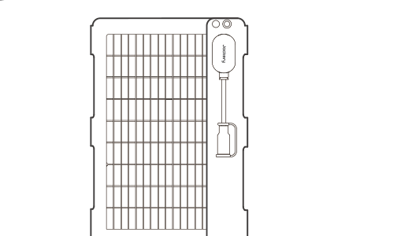

<strong>Jackery SolarSaga 40 Air</strong>

</li><li class="hb-inbox-card" data-item-number="2">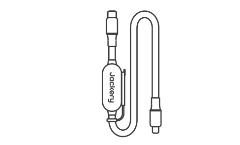

<strong>Multifunctional Solar Charging Cable (1.8 m)</strong>

</li><li class="hb-inbox-card" data-item-number="3">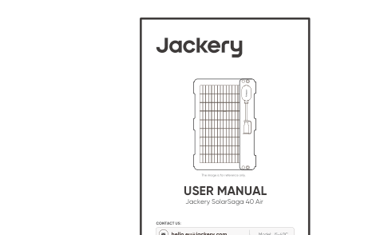

<strong>User Manual</strong>

</li><li class="hb-inbox-card" data-item-number="4">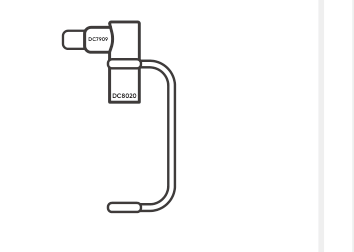

<strong>DC8020 to DC7909 Adapter</strong>

</li><li class="hb-inbox-card" data-item-number="5">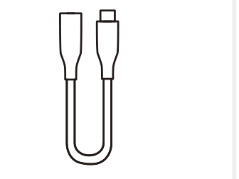

<strong>DC8020 to USB-C Adapter Cable (17 cm)</strong>

</li><li class="hb-inbox-card" data-item-number="6">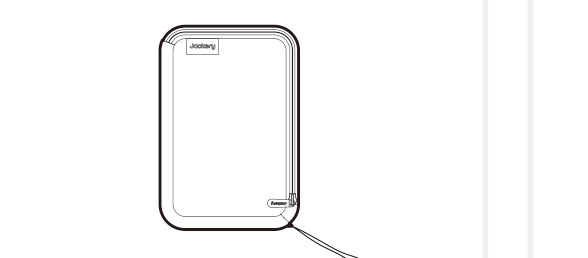

<strong>Accessories Bag</strong>

</li><li class="hb-inbox-card" data-item-number="7">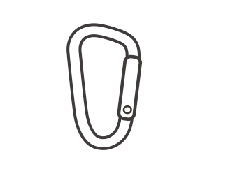

<strong>Carabiner ×2</strong>

</li></ol>

<strong>NOTE</strong>

The cables are only compatible with the SolarSaga 40 Air (JS-40C) solar panel. Do not use them with other solar panel models.

</figure>

# HOW TO USE

Connect the charging cable to the solar panel and the DC input port of the portable power station.

## Front View and Rear View

The front view identifies the **Sun Angle Indicator**. The rear view identifies the **Junction Box**.

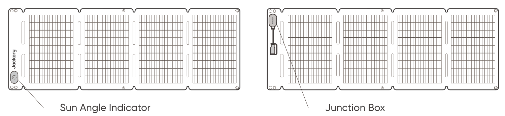

The product comes with adapters that allow it to connect to different Jackery portable power stations via their DC input ports.

# CHARGING CONNECTIONS

## DC8020 Connector

Compatible with Jackery portable power stations with DC8020 input port(s).

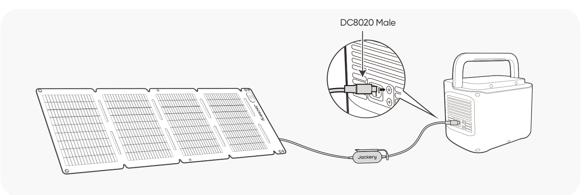

## DC8020--DC7909 Adapter

Compatible with Jackery portable power stations with DC7909 input port(s).

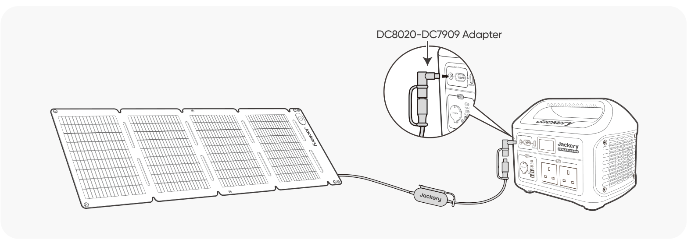

## DC8020 to USB-C Adapter Cable

Compatible with Jackery portable power stations with USB-C input port(s).

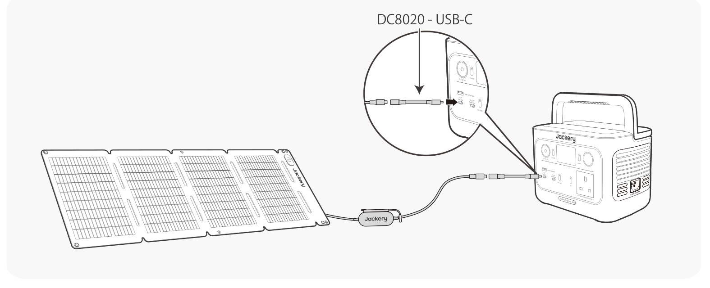

Note

The DC8020 to USB-C Adapter Cable is used to charge Jackery portable power station only. Do not use it to charge any other devices.

# SUN ANGLE INDICATOR

The carry handle has a sun angle indicator. When sunlight hits its surface, a shadow will appear at its bottom.

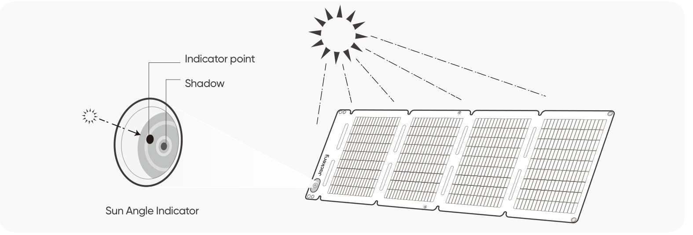

If the shadow falls on the white inner circle at its bottom, it means that the solar panel is facing directly towards the sun and you can get optimal power generation; if not, it is suggested to adjust its angle until it does.

Note

To maximize the power generation, adjust the orientation of SolarSaga 40 Air throughout the day to ensure full exposure of the panel surface to direct sunlight.

## POWER YOUR DEVICE

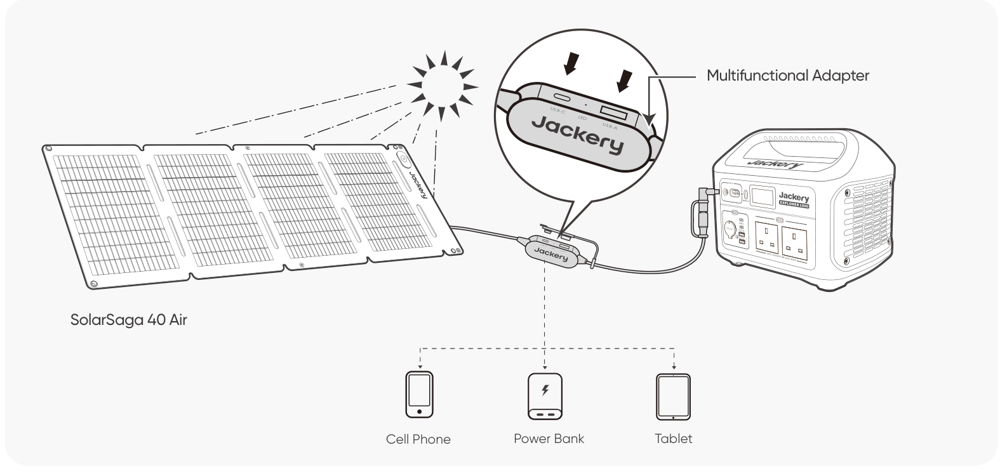 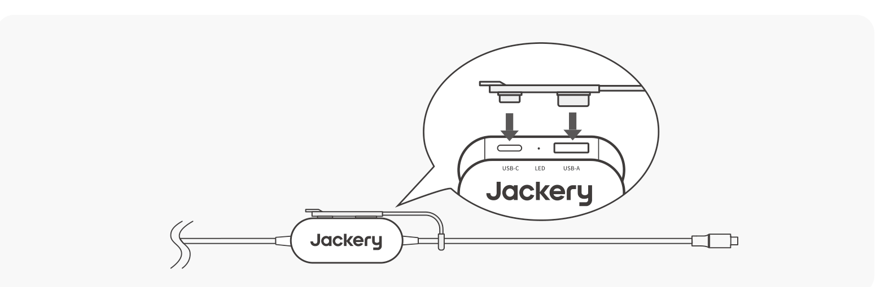

- Insert the rubber plug when USB ports are not in use to prevent dust.

# SOLAR PANEL STORAGE

1.  Keep the front side of the solar panel facing up.

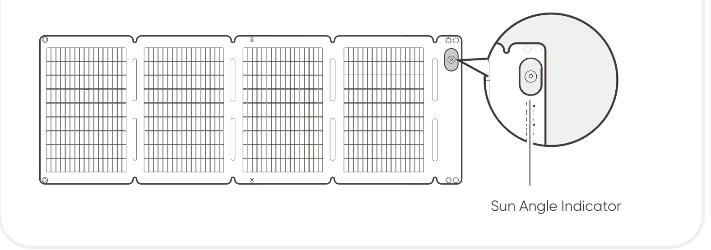

2.  Fold the solar panel along the creases from left to right as shown in the figure. Handle with care. Do not pull or apply excessive force to the solar panel.

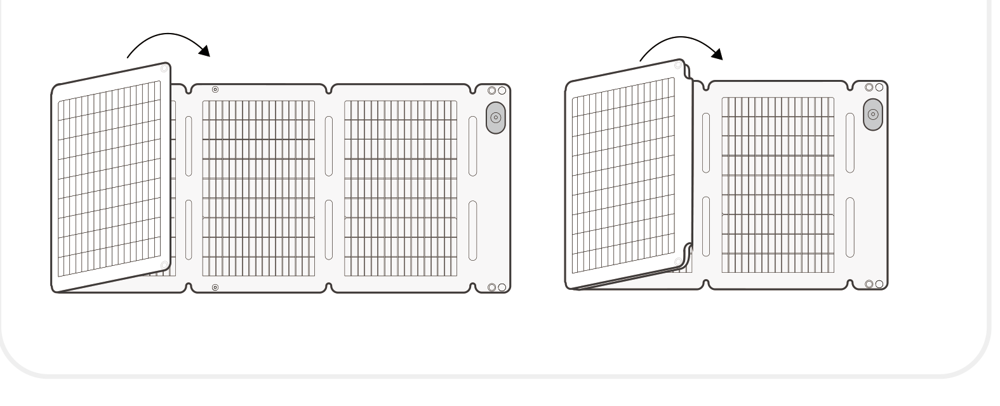

3.  After folding is complete, fasten the snap buttons to secure the solar panel.

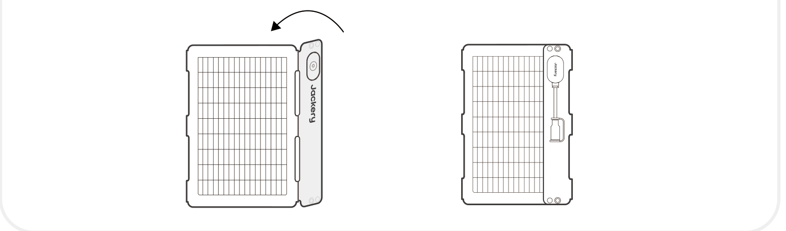

# SPECIFICATIONS

## BASIC INFORMATION

<figure aria-label="BASIC INFORMATION" class="hb-spec-table-composition"><table class="hb-spec-table manual-table manual-spec-table"><colgroup><col class="hb-spec-col-label"/><col class="hb-spec-col-value"/></colgroup>
<tbody>
<tr>
<th class="hb-spec-label manual-spec-label" scope="row">Product Name</th>
<td class="hb-spec-value manual-spec-value">Jackery SolarSaga 40 Air</td>
</tr>
<tr>
<th class="hb-spec-label manual-spec-label" scope="row">Model</th>
<td class="hb-spec-value manual-spec-value">JS-40C</td>
</tr>
<tr>
<th class="hb-spec-label manual-spec-label" scope="row">Dimensions (unfolded, excluding junction box)</th>
<td class="hb-spec-value manual-spec-value">962 × 339 × 2.5 mm</td>
</tr>
<tr>
<th class="hb-spec-label manual-spec-label" scope="row">Dimensions (folded, excluding junction box)</th>
<td class="hb-spec-value manual-spec-value">232 × 339 × 20 mm</td>
</tr>
<tr>
<th class="hb-spec-label manual-spec-label" scope="row">Weight</th>
<td class="hb-spec-value manual-spec-value">0.9 kg ± 0.2 kg</td>
</tr>
<tr>
<th class="hb-spec-label manual-spec-label" scope="row">IP Rating</th>
<td class="hb-spec-value manual-spec-value">IP68</td>
</tr>
<tr>
<th class="hb-spec-label manual-spec-label" scope="row">Operating Temperature Range</th>
<td class="hb-spec-value manual-spec-value">-20°C to 65°C</td>
</tr>
</tbody>
</table></figure>

## ELECTRICAL DATA

<figure aria-label="ELECTRICAL DATA" class="hb-spec-table-composition"><table class="hb-spec-table manual-table manual-spec-table"><colgroup><col class="hb-spec-col-label"/><col class="hb-spec-col-value"/></colgroup>
<tbody>
<tr>
<th class="hb-spec-label manual-spec-label" scope="row">Maximum Power (Pₘₐₓ)</th>
<td class="hb-spec-value manual-spec-value">STC*: 42 W ± 5% / BNPI*: 47 W ± 5%</td>
</tr>
<tr>
<th class="hb-spec-label manual-spec-label" scope="row">Open-Circuit Voltage (Vₒ꜀)</th>
<td class="hb-spec-value manual-spec-value">STC*: 26 V ± 5% / BNPI*: 26 V ± 5%</td>
</tr>
<tr>
<th class="hb-spec-label manual-spec-label" scope="row">Short-Circuit Current (Iₛ꜀)</th>
<td class="hb-spec-value manual-spec-value">STC*: 2.1 A ± 5% / BNPI*: 2.3 A ± 5%</td>
</tr>
<tr>
<th class="hb-spec-label manual-spec-label" scope="row">Maximum Power Voltage (Vₘₚ)</th>
<td class="hb-spec-value manual-spec-value">STC*: 22.5 V ± 5% / BNPI*: 22.5 V ± 5%</td>
</tr>
<tr>
<th class="hb-spec-label manual-spec-label" scope="row">Maximum Power Current (Iₘₚ)</th>
<td class="hb-spec-value manual-spec-value">STC*: 1.9 A ± 5% / BNPI*: 2.12 A ± 5%</td>
</tr>
<tr>
<th class="hb-spec-label manual-spec-label" scope="row">Maximum System Voltage</th>
<td class="hb-spec-value manual-spec-value">30 V</td>
</tr>
<tr>
<th class="hb-spec-label manual-spec-label" scope="row">Maximum Reverse Current</th>
<td class="hb-spec-value manual-spec-value">6 A</td>
</tr>
<tr>
<th class="hb-spec-label manual-spec-label" scope="row">Protection Class Against Electric Shock</th>
<td class="hb-spec-value manual-spec-value">Class III</td>
</tr>
<tr>
<th class="hb-spec-label manual-spec-label" scope="row">Bifaciality Coefficient (back/front)</th>
<td class="hb-spec-value manual-spec-value">Pₘₐₓ &gt; 75%, Vₒ꜀ &gt; 95%, Iₛ꜀ &gt; 70%</td>
</tr>
<tr>
<th class="hb-spec-label manual-spec-label" scope="row">Voltage Temperature Coefficient</th>
<td class="hb-spec-value manual-spec-value">-0.3%/°C</td>
</tr>
<tr>
<th class="hb-spec-label manual-spec-label" scope="row">Power Temperature Coefficient</th>
<td class="hb-spec-value manual-spec-value">-0.39%/°C</td>
</tr>
<tr>
<th class="hb-spec-label manual-spec-label" scope="row">Photovoltaic Consumer Products</th>
<td class="hb-spec-value manual-spec-value">IEC TS 63163 Consumer Product Category 1</td>
</tr>
</tbody>
</table></figure>

## MULTIFUNCTIONAL ADAPTER

<figure aria-label="MULTIFUNCTIONAL ADAPTER" class="hb-spec-table-composition"><table class="hb-spec-table manual-table manual-spec-table"><colgroup><col class="hb-spec-col-label"/><col class="hb-spec-col-value"/></colgroup>
<tbody>
<tr>
<th class="hb-spec-label manual-spec-label" scope="row">USB-A Output</th>
<td class="hb-spec-value manual-spec-value">5 V⎓2.4 A</td>
</tr>
<tr>
<th class="hb-spec-label manual-spec-label" scope="row">USB-C Output</th>
<td class="hb-spec-value manual-spec-value">5 V⎓3 A</td>
</tr>
</tbody>
</table></figure>

\* STC (Standard Test Conditions): 1000 W/m², 25°C, AM 1.5.

\* BNPI (Bifacial Nameplate Irradiance): Front 1000 W/m², Rear 135 W/m², 25°C, AM 1.5.

# WARRANTY

<figure aria-label="WARRANTY" class="hb-warranty-intro-composition" data-component-id="HB-WARRANTY-LEAD">

The product is covered by a limited warranty from Jackery for the original purchaser.

During the warranty period and upon verification of defects, this product will be replaced when returned with proper proof of purchase.

</figure>

## Warranty Period

<figure aria-label="Warranty Period" class="hb-warranty-period-card" data-component-id="HB-WARRANTY-YEARS">

1
<strong class="hb-warranty-years-unit">YEAR</strong><strong class="hb-warranty-period-label">— Standard Warranty</strong>

The standard warranty covers defects in workmanship and materials for 12 months from the date of purchase. Damages from normal wear and tear, alteration, misuse, neglect, accident, service by anyone other than an authorized service center, or act of God are not included.

2
<strong class="hb-warranty-years-unit">YEARS</strong><strong class="hb-warranty-period-label">— Extended Warranty</strong>

To activate the Warranty Extension, you must register your product online or contact our customer service team at <a class="reference external" href="mailto:hello.eu@jackery.com">hello.eu@jackery.com</a> to extend the standard warranty runtime.

</figure>

## Contact Us

<figure aria-label="Contact Us" class="hb-warranty-card" data-component-id="HB-WARRANTY-SECTION" data-warranty-card-index="2">
For any inquiries or comments concerning our products, please send an email to <a class="reference external" href="mailto:hello.eu@jackery.com">hello.eu@jackery.com</a>, and we will respond to you as soon as possible. If there is any quality-related issue with the product, you may request a replacement or refund by submitting a request form at www.jackery.com.
</figure>

## Customer Service

<figure aria-label="Customer Service" class="hb-warranty-card" data-component-id="HB-WARRANTY-SECTION" data-warranty-card-index="3"><ul class="simple">
<li>
1-year limited warranty
</li>
<li>
<a class="reference external" href="mailto:hello.eu@jackery.com">hello.eu@jackery.com</a>
</li>
<li>
Lifetime technical support
</li>
</ul></figure>

